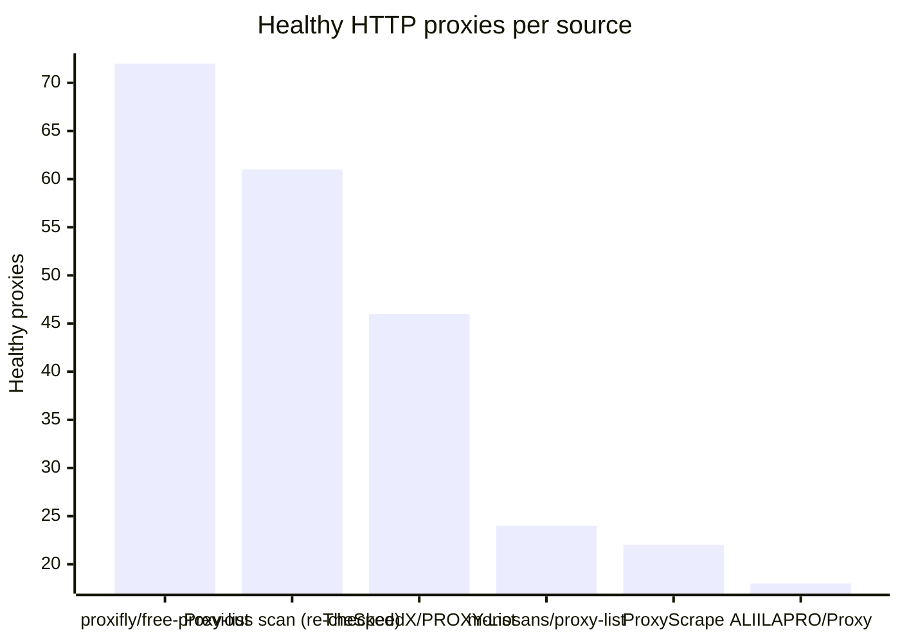
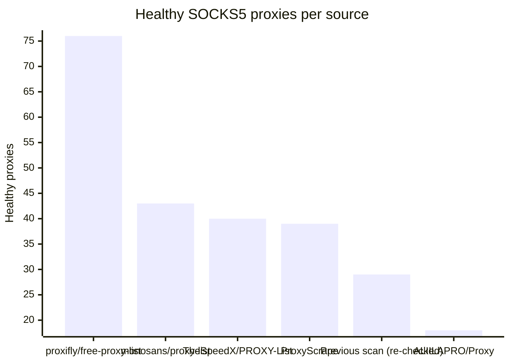

# Proxy Configs

<!-- dynamic timestamp placeholders for workflow sed script -->
channel_stats_chart.svg?v=1790596912
performance_report.html?v=1790596912

### Performance Chart

### Performance Report
[View Report](assets/performance_report.html?v=1790596912)

## HTTP

<!-- STATS:HTTP:START -->

_Last updated: 2026-09-28 06:19 UTC_

```mermaid
xychart-beta
    title "Healthy HTTP proxies per source"
    x-axis ["proxifly/free-proxy-list", "Previous scan (re-checked)", "TheSpeedX/PROXY-List", "monosans/proxy-list", "ProxyScrape", "ALIILAPRO/Proxy"]
    y-axis "Healthy proxies"
    bar [72, 61, 46, 24, 22, 18]
```

| Source | Healthy proxies |
|---|---|
| proxifly/free-proxy-list | 72 |
| Previous scan (re-checked) | 61 |
| TheSpeedX/PROXY-List | 46 |
| monosans/proxy-list | 24 |
| ProxyScrape | 22 |
| ALIILAPRO/Proxy | 18 |
| **Total unique** | **243** |

<!-- STATS:HTTP:END -->

## SOCKS5

<!-- STATS:SOCKS5:START -->

_Last updated: 2026-09-28 06:19 UTC_

```mermaid
xychart-beta
    title "Healthy SOCKS5 proxies per source"
    x-axis ["proxifly/free-proxy-list", "monosans/proxy-list", "TheSpeedX/PROXY-List", "ProxyScrape", "Previous scan (re-checked)", "ALIILAPRO/Proxy"]
    y-axis "Healthy proxies"
    bar [76, 43, 40, 39, 29, 18]
```

| Source | Healthy proxies |
|---|---|
| proxifly/free-proxy-list | 76 |
| monosans/proxy-list | 43 |
| TheSpeedX/PROXY-List | 40 |
| ProxyScrape | 39 |
| Previous scan (re-checked) | 29 |
| ALIILAPRO/Proxy | 18 |
| **Total unique** | **245** |

<!-- STATS:SOCKS5:END -->
