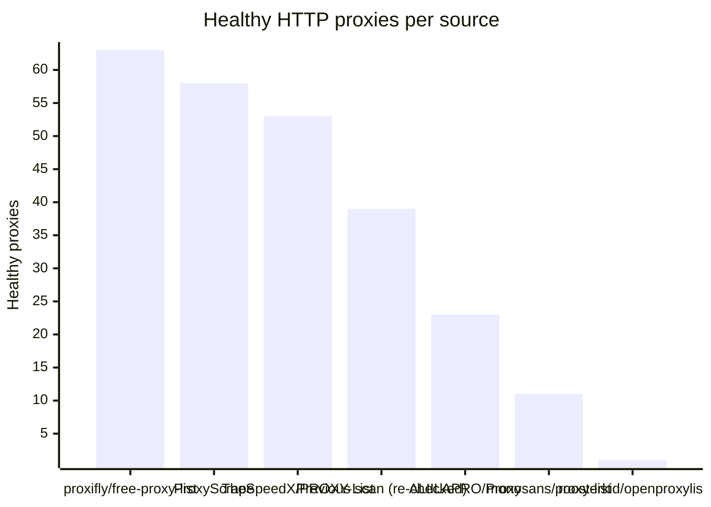
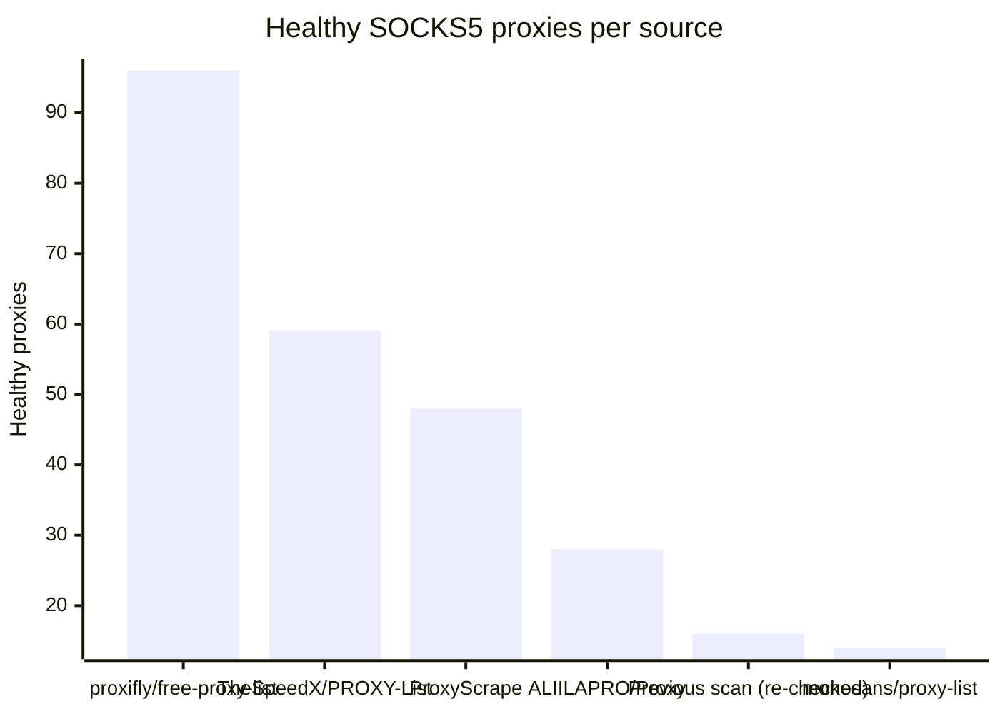

# Proxy Configs

<!-- dynamic timestamp placeholders for workflow sed script -->
channel_stats_chart.svg?v=1791136914
performance_report.html?v=1791136914

### Performance Chart

### Performance Report
[View Report](assets/performance_report.html?v=1791136914)

## HTTP

<!-- STATS:HTTP:START -->

_Last updated: 2026-10-03 12:22 UTC_

```mermaid
xychart-beta
    title "Healthy HTTP proxies per source"
    x-axis ["proxifly/free-proxy-list", "ProxyScrape", "TheSpeedX/PROXY-List", "Previous scan (re-checked)", "ALIILAPRO/Proxy", "monosans/proxy-list", "roosterkid/openproxylist"]
    y-axis "Healthy proxies"
    bar [63, 58, 53, 39, 23, 11, 1]
```

| Source | Healthy proxies |
|---|---|
| proxifly/free-proxy-list | 63 |
| ProxyScrape | 58 |
| TheSpeedX/PROXY-List | 53 |
| Previous scan (re-checked) | 39 |
| ALIILAPRO/Proxy | 23 |
| monosans/proxy-list | 11 |
| roosterkid/openproxylist | 1 |
| **Total unique** | **248** |

<!-- STATS:HTTP:END -->

## SOCKS5

<!-- STATS:SOCKS5:START -->

_Last updated: 2026-10-03 12:22 UTC_

```mermaid
xychart-beta
    title "Healthy SOCKS5 proxies per source"
    x-axis ["proxifly/free-proxy-list", "TheSpeedX/PROXY-List", "ProxyScrape", "ALIILAPRO/Proxy", "Previous scan (re-checked)", "monosans/proxy-list"]
    y-axis "Healthy proxies"
    bar [96, 59, 48, 28, 16, 14]
```

| Source | Healthy proxies |
|---|---|
| proxifly/free-proxy-list | 96 |
| TheSpeedX/PROXY-List | 59 |
| ProxyScrape | 48 |
| ALIILAPRO/Proxy | 28 |
| Previous scan (re-checked) | 16 |
| monosans/proxy-list | 14 |
| **Total unique** | **261** |

<!-- STATS:SOCKS5:END -->
