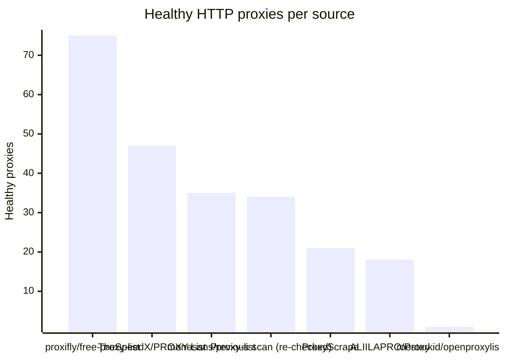

# Proxy Configs

<!-- dynamic timestamp placeholders for workflow sed script -->
channel_stats_chart.svg?v=1790791311
performance_report.html?v=1790791311

### Performance Chart

### Performance Report
[View Report](assets/performance_report.html?v=1790791311)

## HTTP

<!-- STATS:HTTP:START -->

_Last updated: 2026-10-01 00:21 UTC_

```mermaid
xychart-beta
    title "Healthy HTTP proxies per source"
    x-axis ["proxifly/free-proxy-list", "TheSpeedX/PROXY-List", "monosans/proxy-list", "Previous scan (re-checked)", "ProxyScrape", "ALIILAPRO/Proxy", "roosterkid/openproxylist"]
    y-axis "Healthy proxies"
    bar [75, 47, 35, 34, 21, 18, 1]
```

| Source | Healthy proxies |
|---|---|
| proxifly/free-proxy-list | 75 |
| TheSpeedX/PROXY-List | 47 |
| monosans/proxy-list | 35 |
| Previous scan (re-checked) | 34 |
| ProxyScrape | 21 |
| ALIILAPRO/Proxy | 18 |
| roosterkid/openproxylist | 1 |
| **Total unique** | **231** |

<!-- STATS:HTTP:END -->

## SOCKS5

<!-- STATS:SOCKS5:START -->

_Last updated: 2026-10-01 00:21 UTC_

```mermaid
xychart-beta
    title "Healthy SOCKS5 proxies per source"
    x-axis ["proxifly/free-proxy-list", "TheSpeedX/PROXY-List", "ALIILAPRO/Proxy", "ProxyScrape", "Previous scan (re-checked)", "monosans/proxy-list"]
    y-axis "Healthy proxies"
    bar [93, 50, 36, 36, 21, 19]
```

| Source | Healthy proxies |
|---|---|
| proxifly/free-proxy-list | 93 |
| TheSpeedX/PROXY-List | 50 |
| ALIILAPRO/Proxy | 36 |
| ProxyScrape | 36 |
| Previous scan (re-checked) | 21 |
| monosans/proxy-list | 19 |
| **Total unique** | **255** |

<!-- STATS:SOCKS5:END -->
