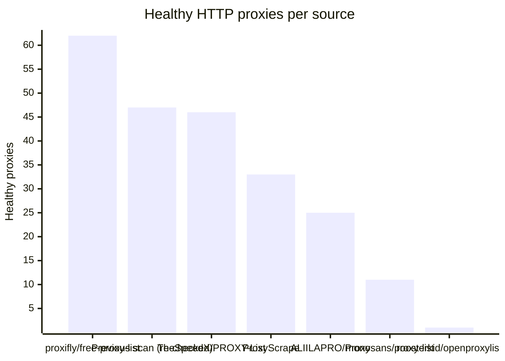
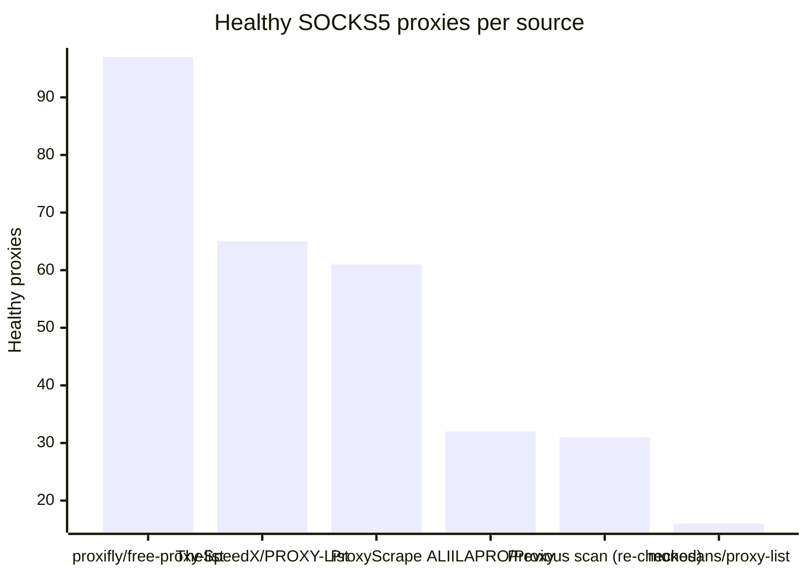

# Proxy Configs

<!-- dynamic timestamp placeholders for workflow sed script -->
channel_stats_chart.svg?v=1790532084
performance_report.html?v=1790532084

### Performance Chart

### Performance Report
[View Report](assets/performance_report.html?v=1790532084)

## HTTP

<!-- STATS:HTTP:START -->

_Last updated: 2026-09-27 12:21 UTC_

```mermaid
xychart-beta
    title "Healthy HTTP proxies per source"
    x-axis ["proxifly/free-proxy-list", "Previous scan (re-checked)", "TheSpeedX/PROXY-List", "ProxyScrape", "ALIILAPRO/Proxy", "monosans/proxy-list", "roosterkid/openproxylist"]
    y-axis "Healthy proxies"
    bar [62, 47, 46, 33, 25, 11, 1]
```

| Source | Healthy proxies |
|---|---|
| proxifly/free-proxy-list | 62 |
| Previous scan (re-checked) | 47 |
| TheSpeedX/PROXY-List | 46 |
| ProxyScrape | 33 |
| ALIILAPRO/Proxy | 25 |
| monosans/proxy-list | 11 |
| roosterkid/openproxylist | 1 |
| **Total unique** | **225** |

<!-- STATS:HTTP:END -->

## SOCKS5

<!-- STATS:SOCKS5:START -->

_Last updated: 2026-09-27 12:21 UTC_

```mermaid
xychart-beta
    title "Healthy SOCKS5 proxies per source"
    x-axis ["proxifly/free-proxy-list", "TheSpeedX/PROXY-List", "ProxyScrape", "ALIILAPRO/Proxy", "Previous scan (re-checked)", "monosans/proxy-list"]
    y-axis "Healthy proxies"
    bar [97, 65, 61, 32, 31, 16]
```

| Source | Healthy proxies |
|---|---|
| proxifly/free-proxy-list | 97 |
| TheSpeedX/PROXY-List | 65 |
| ProxyScrape | 61 |
| ALIILAPRO/Proxy | 32 |
| Previous scan (re-checked) | 31 |
| monosans/proxy-list | 16 |
| **Total unique** | **302** |

<!-- STATS:SOCKS5:END -->
