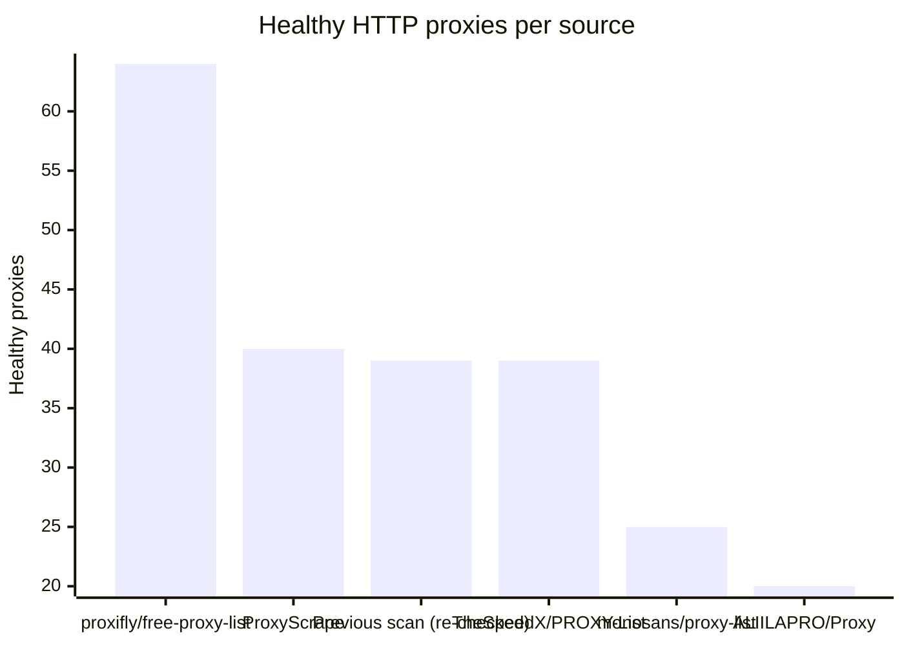
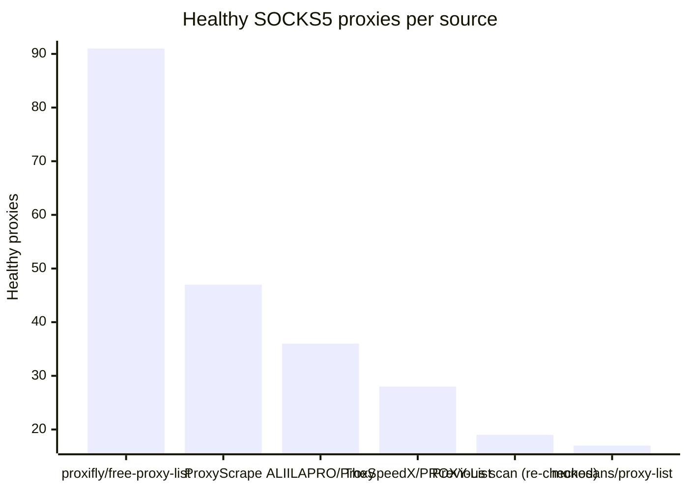

# Proxy Configs

<!-- dynamic timestamp placeholders for workflow sed script -->
channel_stats_chart.svg?v=1791374567
performance_report.html?v=1791374567

### Performance Chart

### Performance Report
[View Report](assets/performance_report.html?v=1791374567)

## HTTP

<!-- STATS:HTTP:START -->

_Last updated: 2026-10-07 06:22 UTC_

```mermaid
xychart-beta
    title "Healthy HTTP proxies per source"
    x-axis ["proxifly/free-proxy-list", "ProxyScrape", "Previous scan (re-checked)", "TheSpeedX/PROXY-List", "monosans/proxy-list", "ALIILAPRO/Proxy"]
    y-axis "Healthy proxies"
    bar [64, 40, 39, 39, 25, 20]
```

| Source | Healthy proxies |
|---|---|
| proxifly/free-proxy-list | 64 |
| ProxyScrape | 40 |
| Previous scan (re-checked) | 39 |
| TheSpeedX/PROXY-List | 39 |
| monosans/proxy-list | 25 |
| ALIILAPRO/Proxy | 20 |
| **Total unique** | **227** |

<!-- STATS:HTTP:END -->

## SOCKS5

<!-- STATS:SOCKS5:START -->

_Last updated: 2026-10-07 06:22 UTC_

```mermaid
xychart-beta
    title "Healthy SOCKS5 proxies per source"
    x-axis ["proxifly/free-proxy-list", "ProxyScrape", "ALIILAPRO/Proxy", "TheSpeedX/PROXY-List", "Previous scan (re-checked)", "monosans/proxy-list"]
    y-axis "Healthy proxies"
    bar [91, 47, 36, 28, 19, 17]
```

| Source | Healthy proxies |
|---|---|
| proxifly/free-proxy-list | 91 |
| ProxyScrape | 47 |
| ALIILAPRO/Proxy | 36 |
| TheSpeedX/PROXY-List | 28 |
| Previous scan (re-checked) | 19 |
| monosans/proxy-list | 17 |
| **Total unique** | **238** |

<!-- STATS:SOCKS5:END -->
