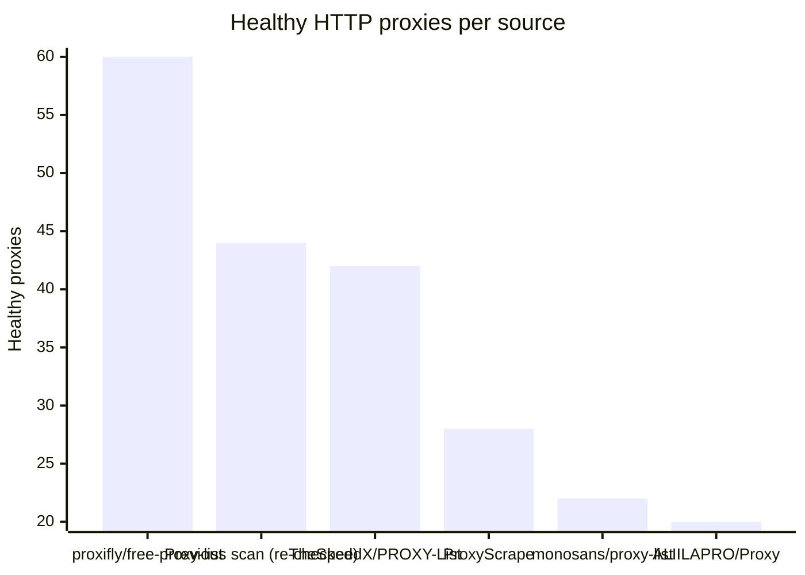
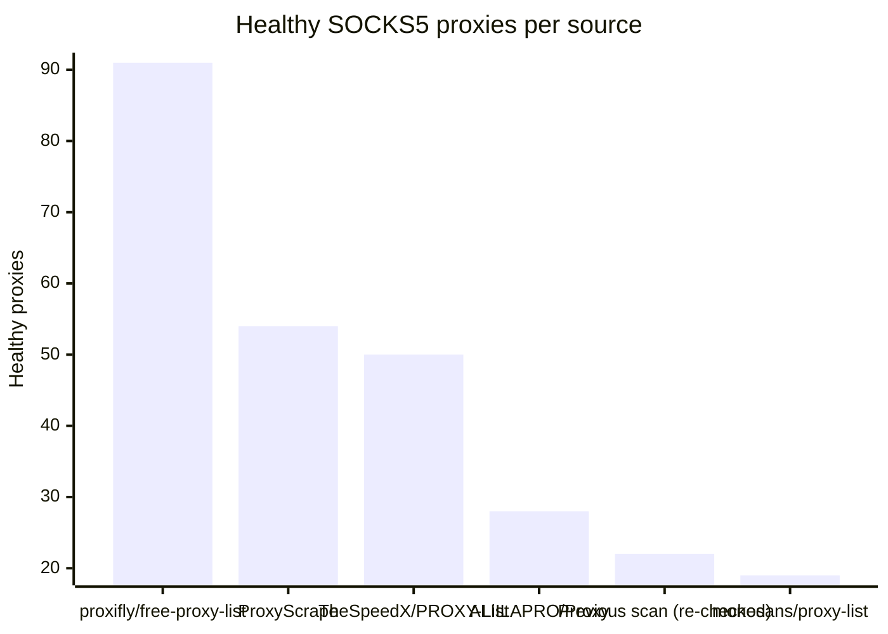

# Proxy Configs

<!-- dynamic timestamp placeholders for workflow sed script -->
channel_stats_chart.svg?v=1791309724
performance_report.html?v=1791309724

### Performance Chart

### Performance Report
[View Report](assets/performance_report.html?v=1791309724)

## HTTP

<!-- STATS:HTTP:START -->

_Last updated: 2026-10-06 20:20 UTC_

```mermaid
xychart-beta
    title "Healthy HTTP proxies per source"
    x-axis ["proxifly/free-proxy-list", "Previous scan (re-checked)", "TheSpeedX/PROXY-List", "ProxyScrape", "monosans/proxy-list", "ALIILAPRO/Proxy"]
    y-axis "Healthy proxies"
    bar [60, 44, 42, 28, 22, 20]
```

| Source | Healthy proxies |
|---|---|
| proxifly/free-proxy-list | 60 |
| Previous scan (re-checked) | 44 |
| TheSpeedX/PROXY-List | 42 |
| ProxyScrape | 28 |
| monosans/proxy-list | 22 |
| ALIILAPRO/Proxy | 20 |
| **Total unique** | **216** |

<!-- STATS:HTTP:END -->

## SOCKS5

<!-- STATS:SOCKS5:START -->

_Last updated: 2026-10-06 20:20 UTC_

```mermaid
xychart-beta
    title "Healthy SOCKS5 proxies per source"
    x-axis ["proxifly/free-proxy-list", "ProxyScrape", "TheSpeedX/PROXY-List", "ALIILAPRO/Proxy", "Previous scan (re-checked)", "monosans/proxy-list"]
    y-axis "Healthy proxies"
    bar [91, 54, 50, 28, 22, 19]
```

| Source | Healthy proxies |
|---|---|
| proxifly/free-proxy-list | 91 |
| ProxyScrape | 54 |
| TheSpeedX/PROXY-List | 50 |
| ALIILAPRO/Proxy | 28 |
| Previous scan (re-checked) | 22 |
| monosans/proxy-list | 19 |
| **Total unique** | **264** |

<!-- STATS:SOCKS5:END -->
