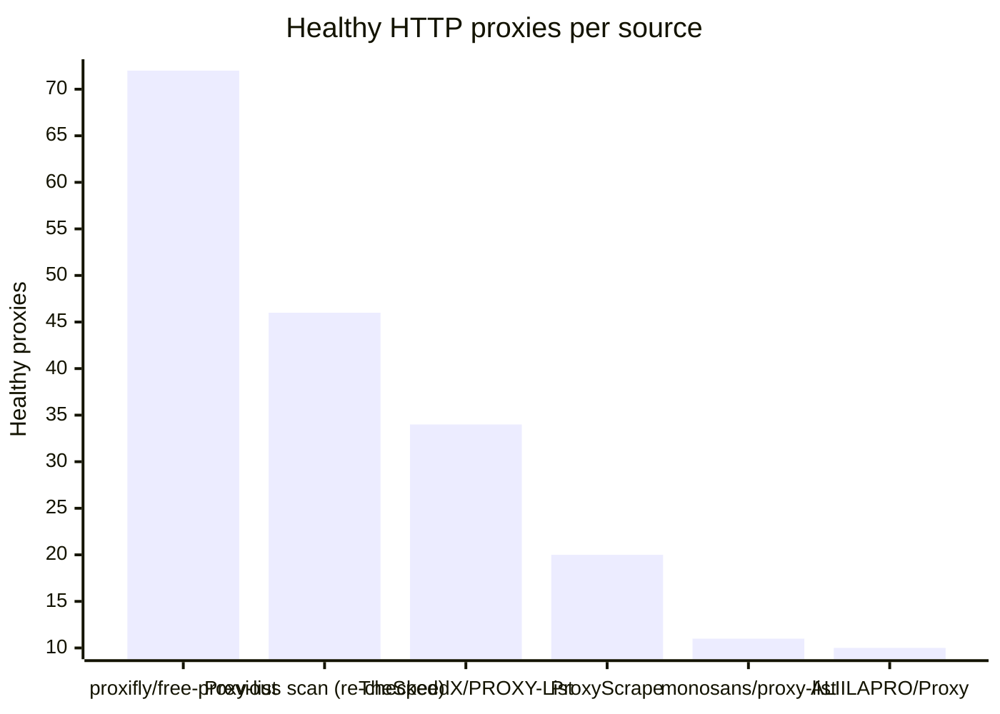
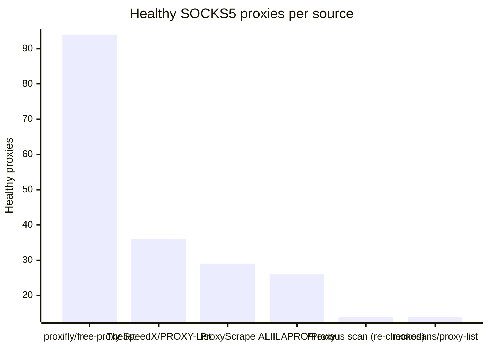

# Proxy Configs

<!-- dynamic timestamp placeholders for workflow sed script -->
channel_stats_chart.svg?v=1790899322
performance_report.html?v=1790899322

### Performance Chart

### Performance Report
[View Report](assets/performance_report.html?v=1790899322)

## HTTP

<!-- STATS:HTTP:START -->

_Last updated: 2026-10-01 18:21 UTC_

```mermaid
xychart-beta
    title "Healthy HTTP proxies per source"
    x-axis ["proxifly/free-proxy-list", "Previous scan (re-checked)", "TheSpeedX/PROXY-List", "ProxyScrape", "monosans/proxy-list", "ALIILAPRO/Proxy"]
    y-axis "Healthy proxies"
    bar [72, 46, 34, 20, 11, 10]
```

| Source | Healthy proxies |
|---|---|
| proxifly/free-proxy-list | 72 |
| Previous scan (re-checked) | 46 |
| TheSpeedX/PROXY-List | 34 |
| ProxyScrape | 20 |
| monosans/proxy-list | 11 |
| ALIILAPRO/Proxy | 10 |
| **Total unique** | **193** |

<!-- STATS:HTTP:END -->

## SOCKS5

<!-- STATS:SOCKS5:START -->

_Last updated: 2026-10-01 18:21 UTC_

```mermaid
xychart-beta
    title "Healthy SOCKS5 proxies per source"
    x-axis ["proxifly/free-proxy-list", "TheSpeedX/PROXY-List", "ProxyScrape", "ALIILAPRO/Proxy", "Previous scan (re-checked)", "monosans/proxy-list"]
    y-axis "Healthy proxies"
    bar [94, 36, 29, 26, 14, 14]
```

| Source | Healthy proxies |
|---|---|
| proxifly/free-proxy-list | 94 |
| TheSpeedX/PROXY-List | 36 |
| ProxyScrape | 29 |
| ALIILAPRO/Proxy | 26 |
| Previous scan (re-checked) | 14 |
| monosans/proxy-list | 14 |
| **Total unique** | **213** |

<!-- STATS:SOCKS5:END -->
