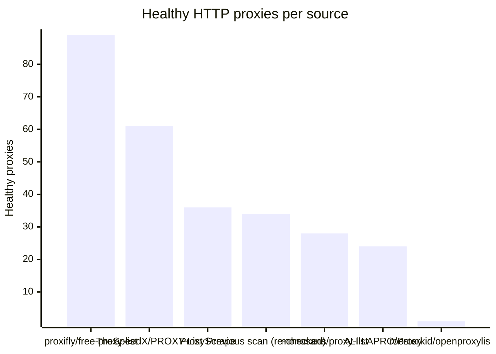
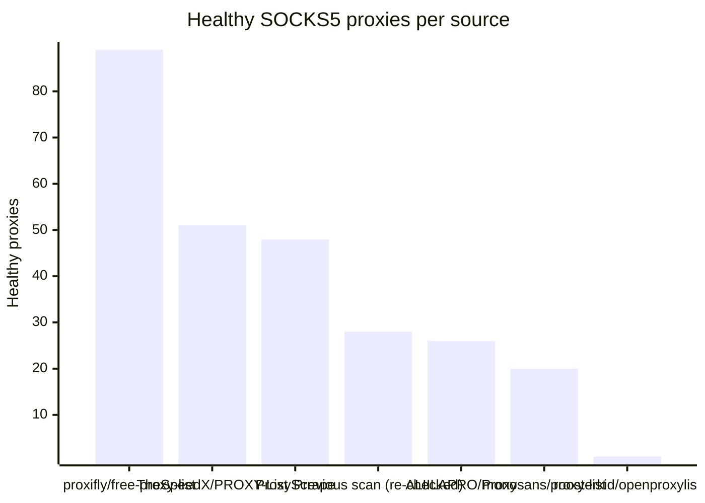

# Proxy Configs

<!-- dynamic timestamp placeholders for workflow sed script -->
channel_stats_chart.svg?v=1790769707
performance_report.html?v=1790769707

### Performance Chart

### Performance Report
[View Report](assets/performance_report.html?v=1790769707)

## HTTP

<!-- STATS:HTTP:START -->

_Last updated: 2026-09-30 11:18 UTC_

```mermaid
xychart-beta
    title "Healthy HTTP proxies per source"
    x-axis ["proxifly/free-proxy-list", "TheSpeedX/PROXY-List", "ProxyScrape", "Previous scan (re-checked)", "monosans/proxy-list", "ALIILAPRO/Proxy", "roosterkid/openproxylist"]
    y-axis "Healthy proxies"
    bar [89, 61, 36, 34, 28, 24, 1]
```

| Source | Healthy proxies |
|---|---|
| proxifly/free-proxy-list | 89 |
| TheSpeedX/PROXY-List | 61 |
| ProxyScrape | 36 |
| Previous scan (re-checked) | 34 |
| monosans/proxy-list | 28 |
| ALIILAPRO/Proxy | 24 |
| roosterkid/openproxylist | 1 |
| **Total unique** | **273** |

<!-- STATS:HTTP:END -->

## SOCKS5

<!-- STATS:SOCKS5:START -->

_Last updated: 2026-09-30 11:18 UTC_

```mermaid
xychart-beta
    title "Healthy SOCKS5 proxies per source"
    x-axis ["proxifly/free-proxy-list", "TheSpeedX/PROXY-List", "ProxyScrape", "Previous scan (re-checked)", "ALIILAPRO/Proxy", "monosans/proxy-list", "roosterkid/openproxylist"]
    y-axis "Healthy proxies"
    bar [89, 51, 48, 28, 26, 20, 1]
```

| Source | Healthy proxies |
|---|---|
| proxifly/free-proxy-list | 89 |
| TheSpeedX/PROXY-List | 51 |
| ProxyScrape | 48 |
| Previous scan (re-checked) | 28 |
| ALIILAPRO/Proxy | 26 |
| monosans/proxy-list | 20 |
| roosterkid/openproxylist | 1 |
| **Total unique** | **263** |

<!-- STATS:SOCKS5:END -->
