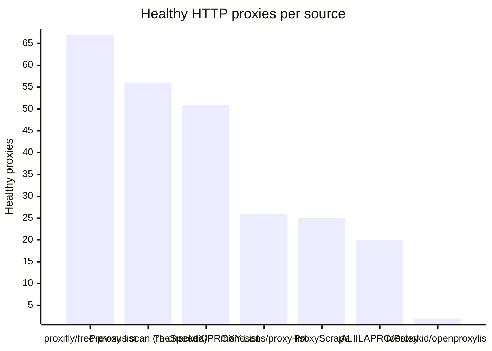
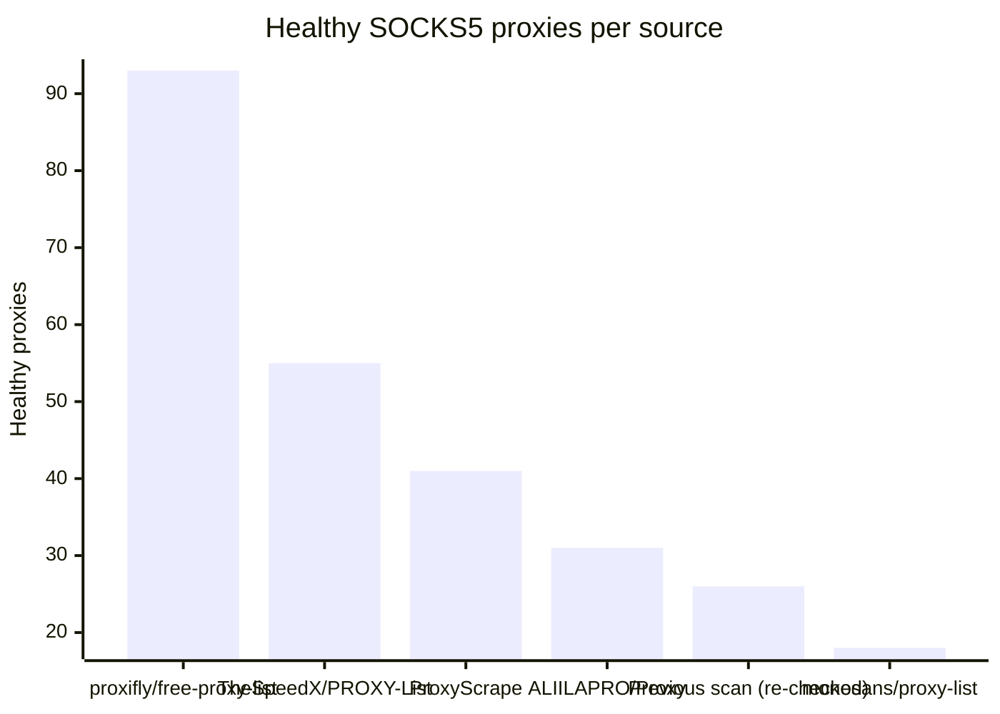

# Proxy Configs

<!-- dynamic timestamp placeholders for workflow sed script -->
channel_stats_chart.svg?v=1790856163
performance_report.html?v=1790856163

### Performance Chart

### Performance Report
[View Report](assets/performance_report.html?v=1790856163)

## HTTP

<!-- STATS:HTTP:START -->

_Last updated: 2026-10-02 00:21 UTC_

```mermaid
xychart-beta
    title "Healthy HTTP proxies per source"
    x-axis ["proxifly/free-proxy-list", "Previous scan (re-checked)", "TheSpeedX/PROXY-List", "monosans/proxy-list", "ProxyScrape", "ALIILAPRO/Proxy", "roosterkid/openproxylist"]
    y-axis "Healthy proxies"
    bar [67, 56, 51, 26, 25, 20, 2]
```

| Source | Healthy proxies |
|---|---|
| proxifly/free-proxy-list | 67 |
| Previous scan (re-checked) | 56 |
| TheSpeedX/PROXY-List | 51 |
| monosans/proxy-list | 26 |
| ProxyScrape | 25 |
| ALIILAPRO/Proxy | 20 |
| roosterkid/openproxylist | 2 |
| **Total unique** | **247** |

<!-- STATS:HTTP:END -->

## SOCKS5

<!-- STATS:SOCKS5:START -->

_Last updated: 2026-10-02 00:21 UTC_

```mermaid
xychart-beta
    title "Healthy SOCKS5 proxies per source"
    x-axis ["proxifly/free-proxy-list", "TheSpeedX/PROXY-List", "ProxyScrape", "ALIILAPRO/Proxy", "Previous scan (re-checked)", "monosans/proxy-list"]
    y-axis "Healthy proxies"
    bar [93, 55, 41, 31, 26, 18]
```

| Source | Healthy proxies |
|---|---|
| proxifly/free-proxy-list | 93 |
| TheSpeedX/PROXY-List | 55 |
| ProxyScrape | 41 |
| ALIILAPRO/Proxy | 31 |
| Previous scan (re-checked) | 26 |
| monosans/proxy-list | 18 |
| **Total unique** | **264** |

<!-- STATS:SOCKS5:END -->
