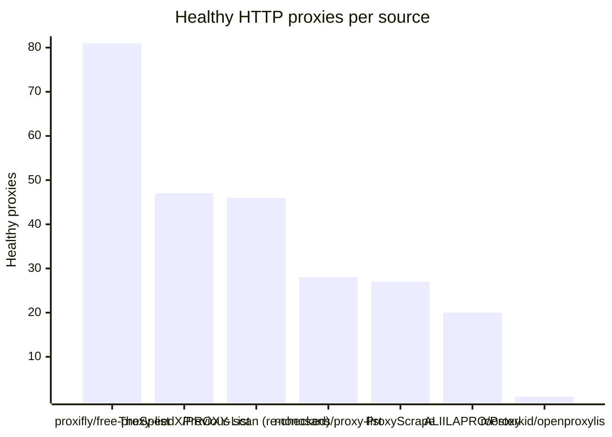
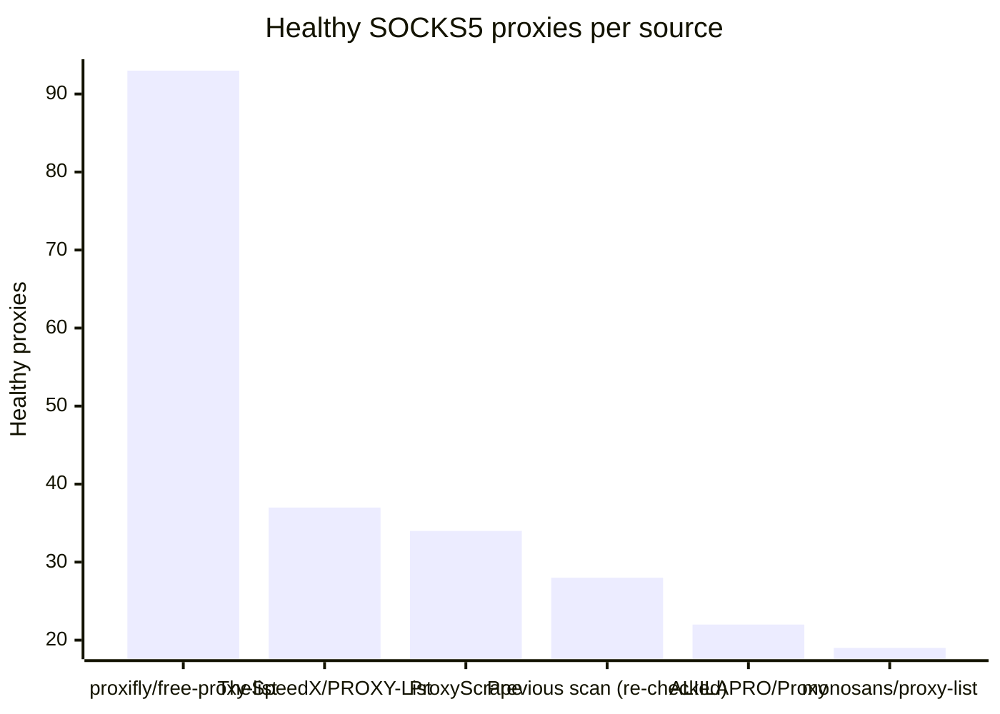

# Proxy Configs

<!-- dynamic timestamp placeholders for workflow sed script -->
channel_stats_chart.svg?v=1788030873
performance_report.html?v=1788030873

### Performance Chart

### Performance Report
[View Report](assets/performance_report.html?v=1788030873)

## HTTP

<!-- STATS:HTTP:START -->

_Last updated: 2026-09-29 00:20 UTC_

```mermaid
xychart-beta
    title "Healthy HTTP proxies per source"
    x-axis ["proxifly/free-proxy-list", "TheSpeedX/PROXY-List", "Previous scan (re-checked)", "monosans/proxy-list", "ProxyScrape", "ALIILAPRO/Proxy", "roosterkid/openproxylist"]
    y-axis "Healthy proxies"
    bar [81, 47, 46, 28, 27, 20, 1]
```

| Source | Healthy proxies |
|---|---|
| proxifly/free-proxy-list | 81 |
| TheSpeedX/PROXY-List | 47 |
| Previous scan (re-checked) | 46 |
| monosans/proxy-list | 28 |
| ProxyScrape | 27 |
| ALIILAPRO/Proxy | 20 |
| roosterkid/openproxylist | 1 |
| **Total unique** | **250** |

<!-- STATS:HTTP:END -->

## SOCKS5

<!-- STATS:SOCKS5:START -->

_Last updated: 2026-09-29 00:20 UTC_

```mermaid
xychart-beta
    title "Healthy SOCKS5 proxies per source"
    x-axis ["proxifly/free-proxy-list", "TheSpeedX/PROXY-List", "ProxyScrape", "Previous scan (re-checked)", "ALIILAPRO/Proxy", "monosans/proxy-list"]
    y-axis "Healthy proxies"
    bar [93, 37, 34, 28, 22, 19]
```

| Source | Healthy proxies |
|---|---|
| proxifly/free-proxy-list | 93 |
| TheSpeedX/PROXY-List | 37 |
| ProxyScrape | 34 |
| Previous scan (re-checked) | 28 |
| ALIILAPRO/Proxy | 22 |
| monosans/proxy-list | 19 |
| **Total unique** | **233** |

<!-- STATS:SOCKS5:END -->
