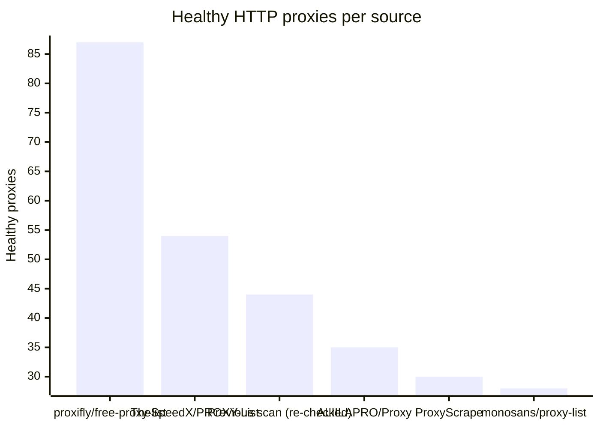
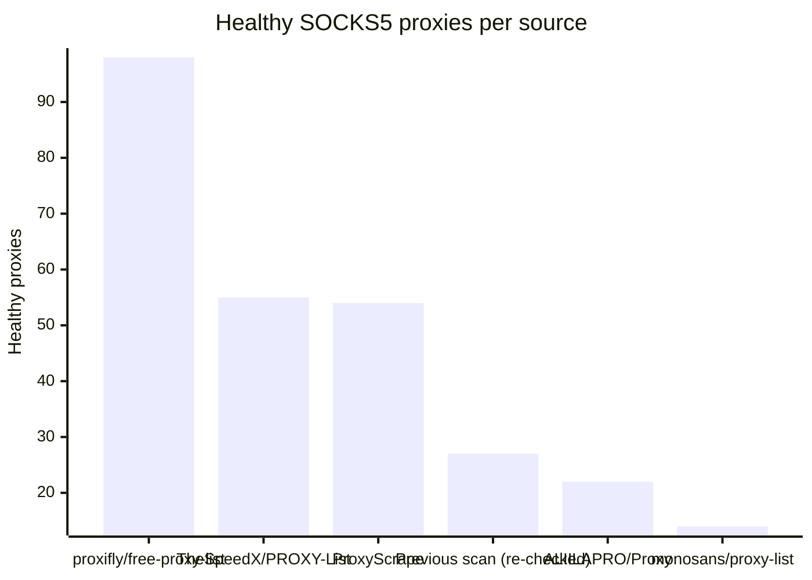

# Proxy Configs

<!-- dynamic timestamp placeholders for workflow sed script -->
channel_stats_chart.svg?v=1791309724
performance_report.html?v=1791309724

### Performance Chart

### Performance Report
[View Report](assets/performance_report.html?v=1791309724)

## HTTP

<!-- STATS:HTTP:START -->

_Last updated: 2026-10-11 00:21 UTC_

```mermaid
xychart-beta
    title "Healthy HTTP proxies per source"
    x-axis ["proxifly/free-proxy-list", "TheSpeedX/PROXY-List", "Previous scan (re-checked)", "ALIILAPRO/Proxy", "ProxyScrape", "monosans/proxy-list"]
    y-axis "Healthy proxies"
    bar [87, 54, 44, 35, 30, 28]
```

| Source | Healthy proxies |
|---|---|
| proxifly/free-proxy-list | 87 |
| TheSpeedX/PROXY-List | 54 |
| Previous scan (re-checked) | 44 |
| ALIILAPRO/Proxy | 35 |
| ProxyScrape | 30 |
| monosans/proxy-list | 28 |
| **Total unique** | **278** |

<!-- STATS:HTTP:END -->

## SOCKS5

<!-- STATS:SOCKS5:START -->

_Last updated: 2026-10-11 00:21 UTC_

```mermaid
xychart-beta
    title "Healthy SOCKS5 proxies per source"
    x-axis ["proxifly/free-proxy-list", "TheSpeedX/PROXY-List", "ProxyScrape", "Previous scan (re-checked)", "ALIILAPRO/Proxy", "monosans/proxy-list"]
    y-axis "Healthy proxies"
    bar [98, 55, 54, 27, 22, 14]
```

| Source | Healthy proxies |
|---|---|
| proxifly/free-proxy-list | 98 |
| TheSpeedX/PROXY-List | 55 |
| ProxyScrape | 54 |
| Previous scan (re-checked) | 27 |
| ALIILAPRO/Proxy | 22 |
| monosans/proxy-list | 14 |
| **Total unique** | **270** |

<!-- STATS:SOCKS5:END -->
