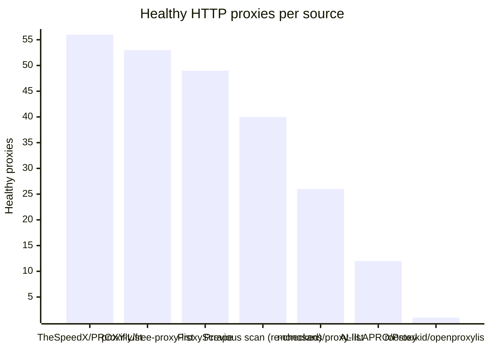
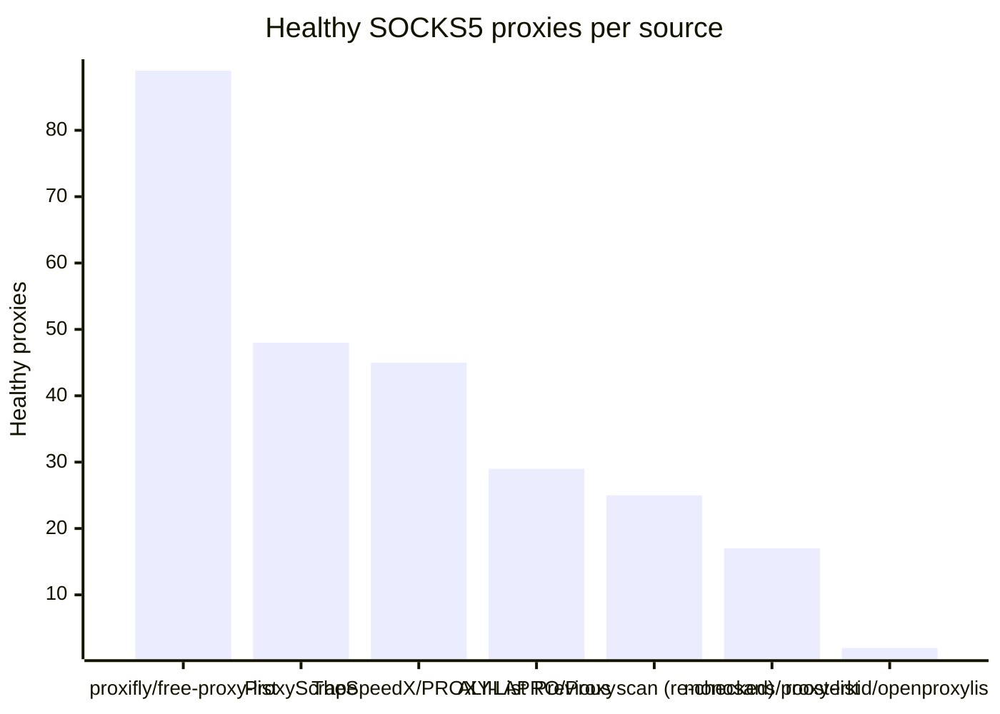

# Proxy Configs

<!-- dynamic timestamp placeholders for workflow sed script -->
channel_stats_chart.svg?v=1788030873
performance_report.html?v=1788030873

### Performance Chart

### Performance Report
[View Report](assets/performance_report.html?v=1788030873)

## HTTP

<!-- STATS:HTTP:START -->

_Last updated: 2026-09-29 06:20 UTC_

```mermaid
xychart-beta
    title "Healthy HTTP proxies per source"
    x-axis ["TheSpeedX/PROXY-List", "proxifly/free-proxy-list", "ProxyScrape", "Previous scan (re-checked)", "monosans/proxy-list", "ALIILAPRO/Proxy", "roosterkid/openproxylist"]
    y-axis "Healthy proxies"
    bar [56, 53, 49, 40, 26, 12, 1]
```

| Source | Healthy proxies |
|---|---|
| TheSpeedX/PROXY-List | 56 |
| proxifly/free-proxy-list | 53 |
| ProxyScrape | 49 |
| Previous scan (re-checked) | 40 |
| monosans/proxy-list | 26 |
| ALIILAPRO/Proxy | 12 |
| roosterkid/openproxylist | 1 |
| **Total unique** | **237** |

<!-- STATS:HTTP:END -->

## SOCKS5

<!-- STATS:SOCKS5:START -->

_Last updated: 2026-09-29 06:20 UTC_

```mermaid
xychart-beta
    title "Healthy SOCKS5 proxies per source"
    x-axis ["proxifly/free-proxy-list", "ProxyScrape", "TheSpeedX/PROXY-List", "ALIILAPRO/Proxy", "Previous scan (re-checked)", "monosans/proxy-list", "roosterkid/openproxylist"]
    y-axis "Healthy proxies"
    bar [89, 48, 45, 29, 25, 17, 2]
```

| Source | Healthy proxies |
|---|---|
| proxifly/free-proxy-list | 89 |
| ProxyScrape | 48 |
| TheSpeedX/PROXY-List | 45 |
| ALIILAPRO/Proxy | 29 |
| Previous scan (re-checked) | 25 |
| monosans/proxy-list | 17 |
| roosterkid/openproxylist | 2 |
| **Total unique** | **255** |

<!-- STATS:SOCKS5:END -->
