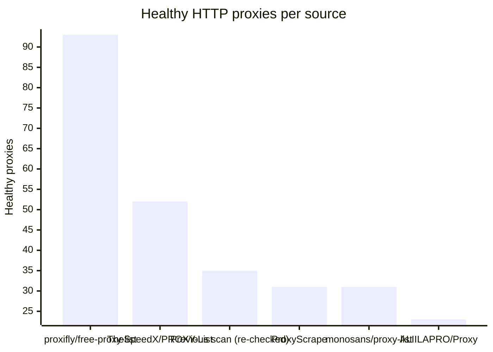
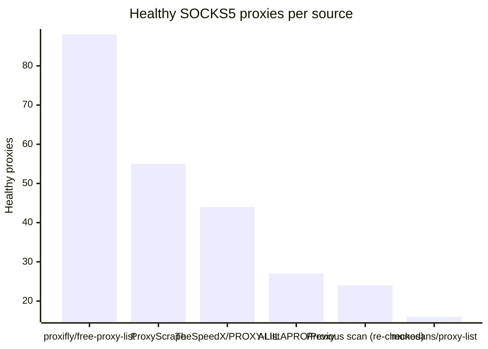

# Proxy Configs

<!-- dynamic timestamp placeholders for workflow sed script -->
channel_stats_chart.svg?v=1790856163
performance_report.html?v=1790856163

### Performance Chart

### Performance Report
[View Report](assets/performance_report.html?v=1790856163)

## HTTP

<!-- STATS:HTTP:START -->

_Last updated: 2026-10-02 12:21 UTC_

```mermaid
xychart-beta
    title "Healthy HTTP proxies per source"
    x-axis ["proxifly/free-proxy-list", "TheSpeedX/PROXY-List", "Previous scan (re-checked)", "ProxyScrape", "monosans/proxy-list", "ALIILAPRO/Proxy"]
    y-axis "Healthy proxies"
    bar [93, 52, 35, 31, 31, 23]
```

| Source | Healthy proxies |
|---|---|
| proxifly/free-proxy-list | 93 |
| TheSpeedX/PROXY-List | 52 |
| Previous scan (re-checked) | 35 |
| ProxyScrape | 31 |
| monosans/proxy-list | 31 |
| ALIILAPRO/Proxy | 23 |
| **Total unique** | **265** |

<!-- STATS:HTTP:END -->

## SOCKS5

<!-- STATS:SOCKS5:START -->

_Last updated: 2026-10-02 12:21 UTC_

```mermaid
xychart-beta
    title "Healthy SOCKS5 proxies per source"
    x-axis ["proxifly/free-proxy-list", "ProxyScrape", "TheSpeedX/PROXY-List", "ALIILAPRO/Proxy", "Previous scan (re-checked)", "monosans/proxy-list"]
    y-axis "Healthy proxies"
    bar [88, 55, 44, 27, 24, 16]
```

| Source | Healthy proxies |
|---|---|
| proxifly/free-proxy-list | 88 |
| ProxyScrape | 55 |
| TheSpeedX/PROXY-List | 44 |
| ALIILAPRO/Proxy | 27 |
| Previous scan (re-checked) | 24 |
| monosans/proxy-list | 16 |
| **Total unique** | **254** |

<!-- STATS:SOCKS5:END -->
