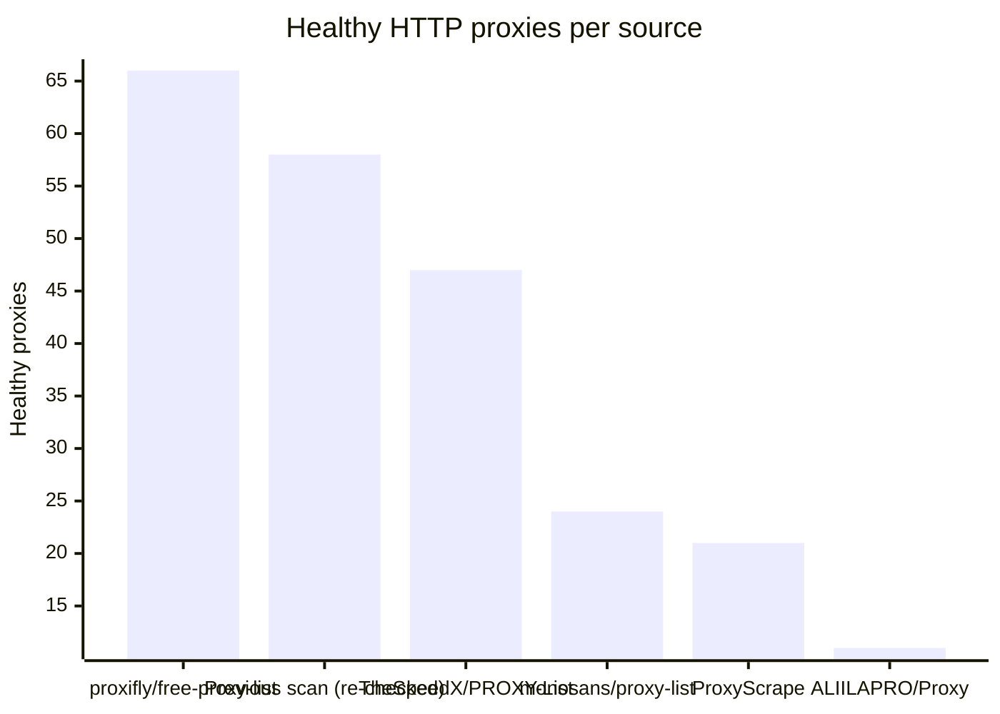
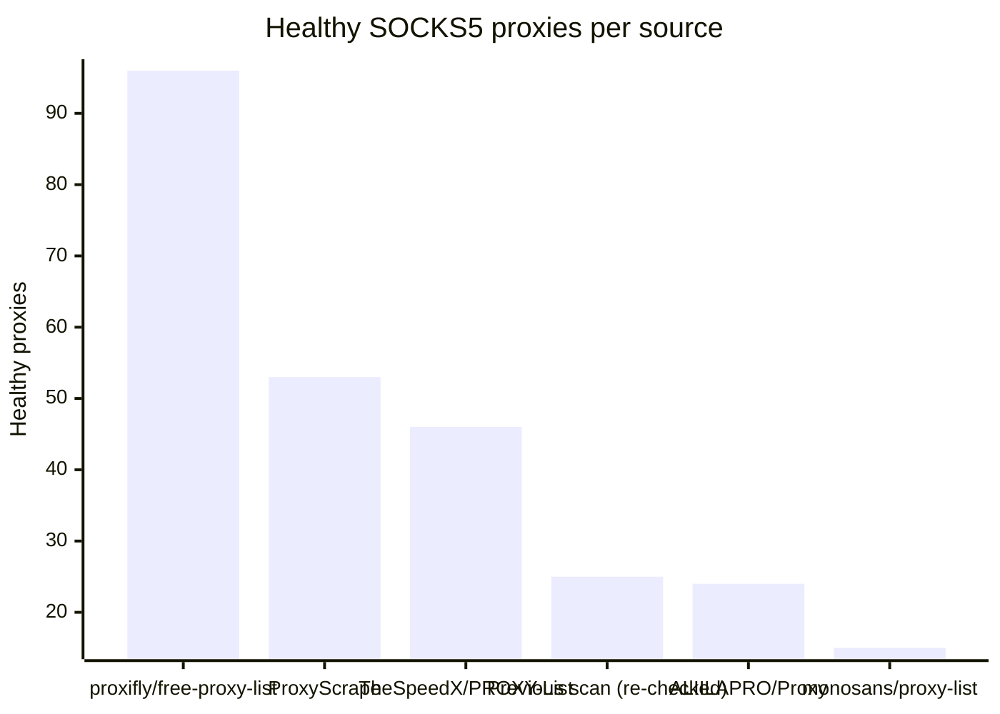

# Proxy Configs

<!-- dynamic timestamp placeholders for workflow sed script -->
channel_stats_chart.svg?v=1790575323
performance_report.html?v=1790575323

### Performance Chart

### Performance Report
[View Report](assets/performance_report.html?v=1790575323)

## HTTP

<!-- STATS:HTTP:START -->

_Last updated: 2026-09-28 00:19 UTC_

```mermaid
xychart-beta
    title "Healthy HTTP proxies per source"
    x-axis ["proxifly/free-proxy-list", "Previous scan (re-checked)", "TheSpeedX/PROXY-List", "monosans/proxy-list", "ProxyScrape", "ALIILAPRO/Proxy"]
    y-axis "Healthy proxies"
    bar [66, 58, 47, 24, 21, 11]
```

| Source | Healthy proxies |
|---|---|
| proxifly/free-proxy-list | 66 |
| Previous scan (re-checked) | 58 |
| TheSpeedX/PROXY-List | 47 |
| monosans/proxy-list | 24 |
| ProxyScrape | 21 |
| ALIILAPRO/Proxy | 11 |
| **Total unique** | **227** |

<!-- STATS:HTTP:END -->

## SOCKS5

<!-- STATS:SOCKS5:START -->

_Last updated: 2026-09-28 00:19 UTC_

```mermaid
xychart-beta
    title "Healthy SOCKS5 proxies per source"
    x-axis ["proxifly/free-proxy-list", "ProxyScrape", "TheSpeedX/PROXY-List", "Previous scan (re-checked)", "ALIILAPRO/Proxy", "monosans/proxy-list"]
    y-axis "Healthy proxies"
    bar [96, 53, 46, 25, 24, 15]
```

| Source | Healthy proxies |
|---|---|
| proxifly/free-proxy-list | 96 |
| ProxyScrape | 53 |
| TheSpeedX/PROXY-List | 46 |
| Previous scan (re-checked) | 25 |
| ALIILAPRO/Proxy | 24 |
| monosans/proxy-list | 15 |
| **Total unique** | **259** |

<!-- STATS:SOCKS5:END -->
