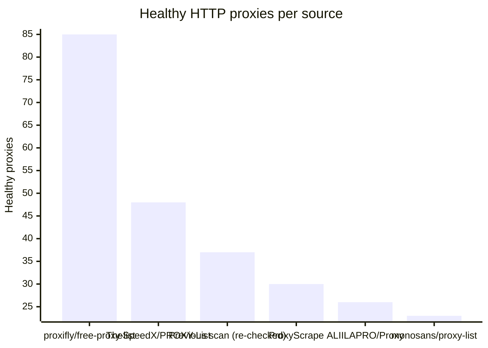
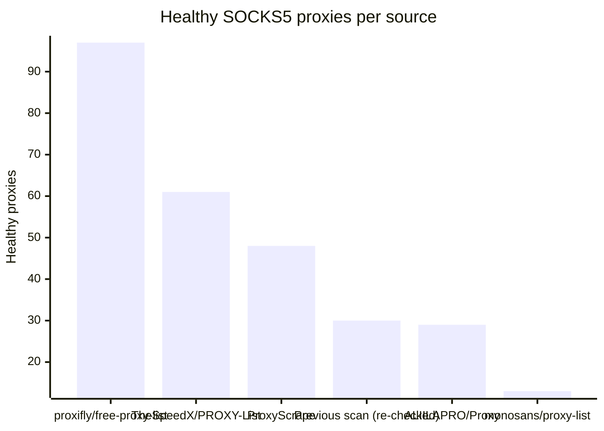

# Proxy Configs

<!-- dynamic timestamp placeholders for workflow sed script -->
channel_stats_chart.svg?v=1791676954
performance_report.html?v=1791676954

### Performance Chart

### Performance Report
[View Report](assets/performance_report.html?v=1791676954)

## HTTP

<!-- STATS:HTTP:START -->

_Last updated: 2026-10-10 18:21 UTC_

```mermaid
xychart-beta
    title "Healthy HTTP proxies per source"
    x-axis ["proxifly/free-proxy-list", "TheSpeedX/PROXY-List", "Previous scan (re-checked)", "ProxyScrape", "ALIILAPRO/Proxy", "monosans/proxy-list"]
    y-axis "Healthy proxies"
    bar [85, 48, 37, 30, 26, 23]
```

| Source | Healthy proxies |
|---|---|
| proxifly/free-proxy-list | 85 |
| TheSpeedX/PROXY-List | 48 |
| Previous scan (re-checked) | 37 |
| ProxyScrape | 30 |
| ALIILAPRO/Proxy | 26 |
| monosans/proxy-list | 23 |
| **Total unique** | **249** |

<!-- STATS:HTTP:END -->

## SOCKS5

<!-- STATS:SOCKS5:START -->

_Last updated: 2026-10-10 18:21 UTC_

```mermaid
xychart-beta
    title "Healthy SOCKS5 proxies per source"
    x-axis ["proxifly/free-proxy-list", "TheSpeedX/PROXY-List", "ProxyScrape", "Previous scan (re-checked)", "ALIILAPRO/Proxy", "monosans/proxy-list"]
    y-axis "Healthy proxies"
    bar [97, 61, 48, 30, 29, 13]
```

| Source | Healthy proxies |
|---|---|
| proxifly/free-proxy-list | 97 |
| TheSpeedX/PROXY-List | 61 |
| ProxyScrape | 48 |
| Previous scan (re-checked) | 30 |
| ALIILAPRO/Proxy | 29 |
| monosans/proxy-list | 13 |
| **Total unique** | **278** |

<!-- STATS:SOCKS5:END -->
