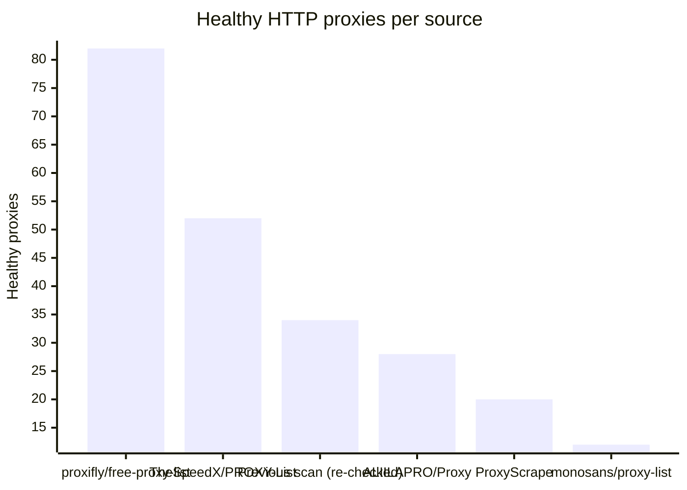
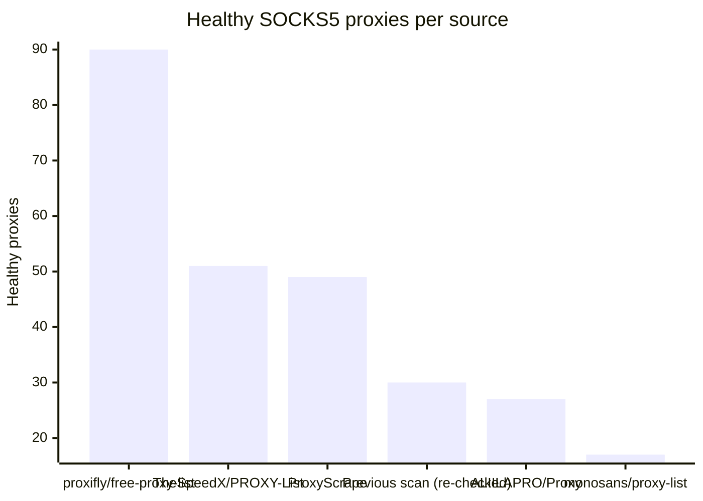

# Proxy Configs

<!-- dynamic timestamp placeholders for workflow sed script -->
channel_stats_chart.svg?v=1791309724
performance_report.html?v=1791309724

### Performance Chart

### Performance Report
[View Report](assets/performance_report.html?v=1791309724)

## HTTP

<!-- STATS:HTTP:START -->

_Last updated: 2026-10-10 12:21 UTC_

```mermaid
xychart-beta
    title "Healthy HTTP proxies per source"
    x-axis ["proxifly/free-proxy-list", "TheSpeedX/PROXY-List", "Previous scan (re-checked)", "ALIILAPRO/Proxy", "ProxyScrape", "monosans/proxy-list"]
    y-axis "Healthy proxies"
    bar [82, 52, 34, 28, 20, 12]
```

| Source | Healthy proxies |
|---|---|
| proxifly/free-proxy-list | 82 |
| TheSpeedX/PROXY-List | 52 |
| Previous scan (re-checked) | 34 |
| ALIILAPRO/Proxy | 28 |
| ProxyScrape | 20 |
| monosans/proxy-list | 12 |
| **Total unique** | **228** |

<!-- STATS:HTTP:END -->

## SOCKS5

<!-- STATS:SOCKS5:START -->

_Last updated: 2026-10-10 12:21 UTC_

```mermaid
xychart-beta
    title "Healthy SOCKS5 proxies per source"
    x-axis ["proxifly/free-proxy-list", "TheSpeedX/PROXY-List", "ProxyScrape", "Previous scan (re-checked)", "ALIILAPRO/Proxy", "monosans/proxy-list"]
    y-axis "Healthy proxies"
    bar [90, 51, 49, 30, 27, 17]
```

| Source | Healthy proxies |
|---|---|
| proxifly/free-proxy-list | 90 |
| TheSpeedX/PROXY-List | 51 |
| ProxyScrape | 49 |
| Previous scan (re-checked) | 30 |
| ALIILAPRO/Proxy | 27 |
| monosans/proxy-list | 17 |
| **Total unique** | **264** |

<!-- STATS:SOCKS5:END -->
