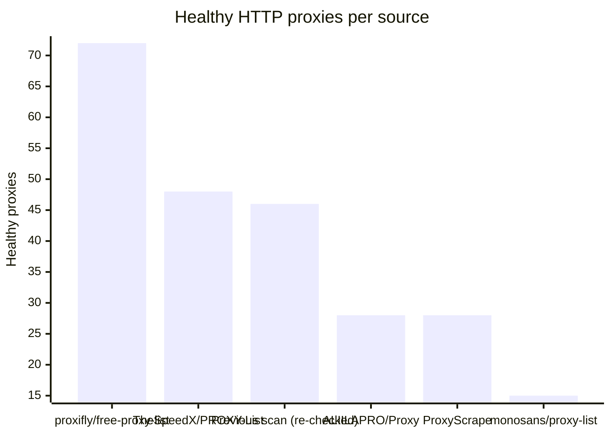
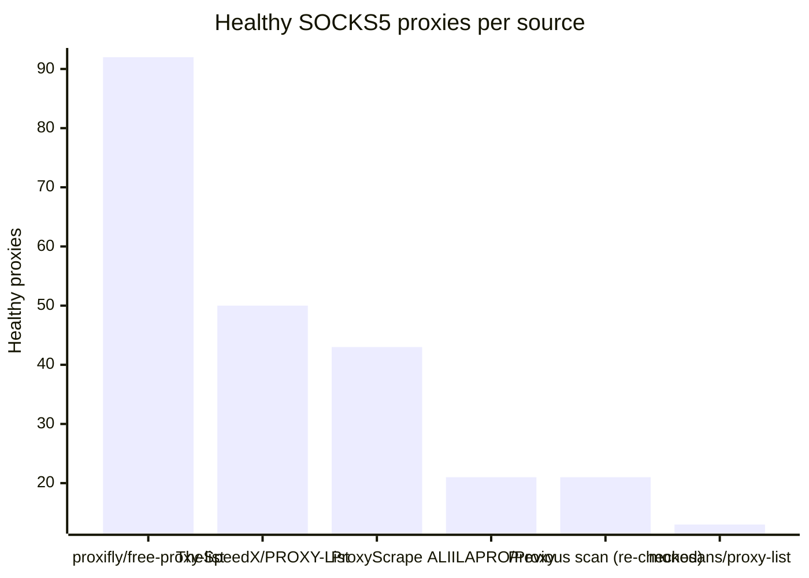

# Proxy Configs

<!-- dynamic timestamp placeholders for workflow sed script -->
channel_stats_chart.svg?v=1791396193
performance_report.html?v=1791396193

### Performance Chart

### Performance Report
[View Report](assets/performance_report.html?v=1791396193)

## HTTP

<!-- STATS:HTTP:START -->

_Last updated: 2026-10-07 12:22 UTC_

```mermaid
xychart-beta
    title "Healthy HTTP proxies per source"
    x-axis ["proxifly/free-proxy-list", "TheSpeedX/PROXY-List", "Previous scan (re-checked)", "ALIILAPRO/Proxy", "ProxyScrape", "monosans/proxy-list"]
    y-axis "Healthy proxies"
    bar [72, 48, 46, 28, 28, 15]
```

| Source | Healthy proxies |
|---|---|
| proxifly/free-proxy-list | 72 |
| TheSpeedX/PROXY-List | 48 |
| Previous scan (re-checked) | 46 |
| ALIILAPRO/Proxy | 28 |
| ProxyScrape | 28 |
| monosans/proxy-list | 15 |
| **Total unique** | **237** |

<!-- STATS:HTTP:END -->

## SOCKS5

<!-- STATS:SOCKS5:START -->

_Last updated: 2026-10-07 12:22 UTC_

```mermaid
xychart-beta
    title "Healthy SOCKS5 proxies per source"
    x-axis ["proxifly/free-proxy-list", "TheSpeedX/PROXY-List", "ProxyScrape", "ALIILAPRO/Proxy", "Previous scan (re-checked)", "monosans/proxy-list"]
    y-axis "Healthy proxies"
    bar [92, 50, 43, 21, 21, 13]
```

| Source | Healthy proxies |
|---|---|
| proxifly/free-proxy-list | 92 |
| TheSpeedX/PROXY-List | 50 |
| ProxyScrape | 43 |
| ALIILAPRO/Proxy | 21 |
| Previous scan (re-checked) | 21 |
| monosans/proxy-list | 13 |
| **Total unique** | **240** |

<!-- STATS:SOCKS5:END -->
