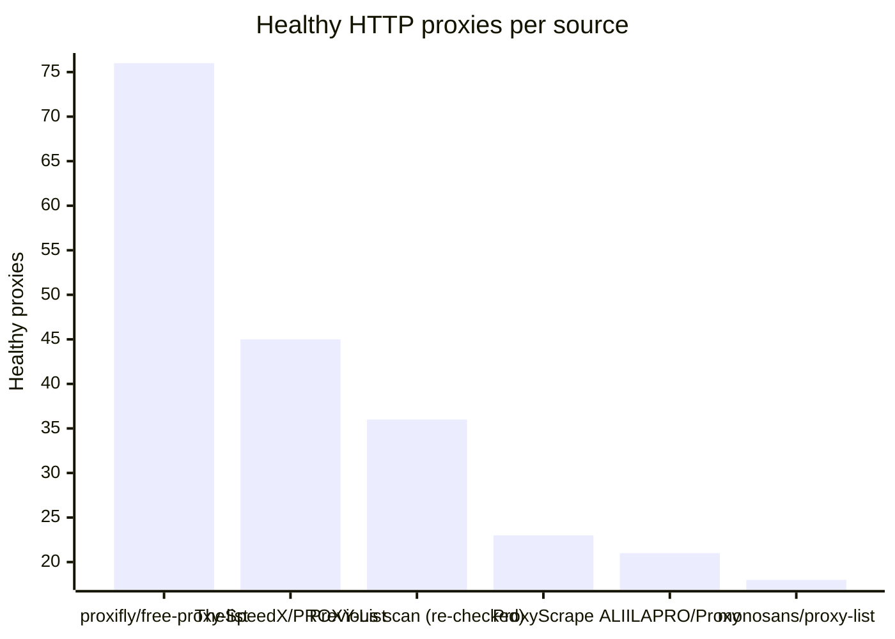
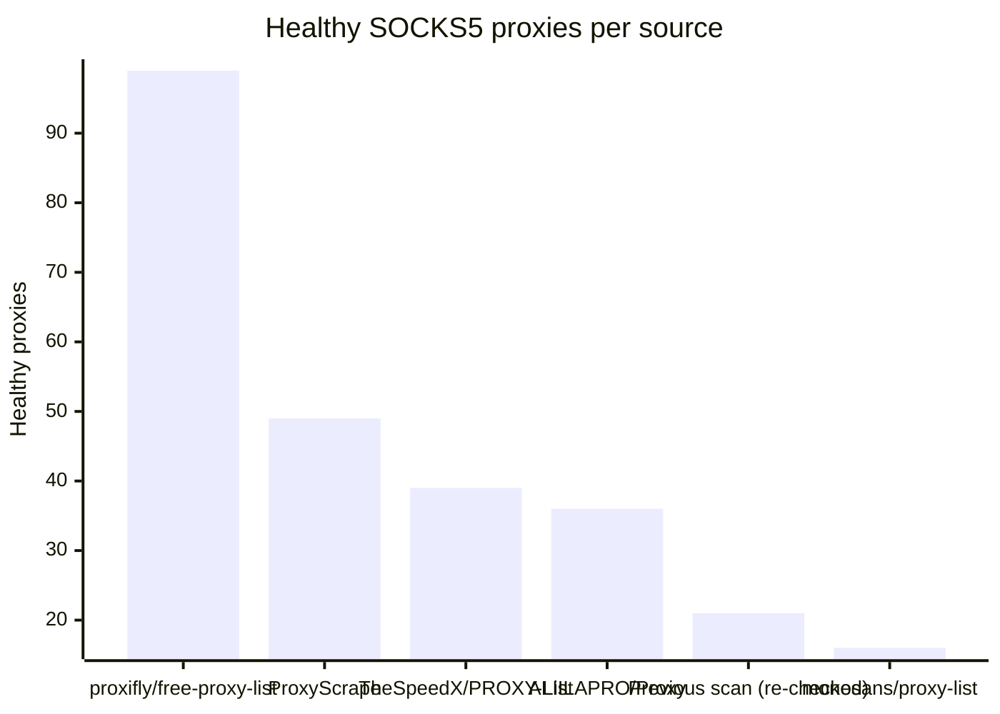

# Proxy Configs

<!-- dynamic timestamp placeholders for workflow sed script -->
channel_stats_chart.svg?v=1791309724
performance_report.html?v=1791309724

### Performance Chart

### Performance Report
[View Report](assets/performance_report.html?v=1791309724)

## HTTP

<!-- STATS:HTTP:START -->

_Last updated: 2026-10-07 18:22 UTC_

```mermaid
xychart-beta
    title "Healthy HTTP proxies per source"
    x-axis ["proxifly/free-proxy-list", "TheSpeedX/PROXY-List", "Previous scan (re-checked)", "ProxyScrape", "ALIILAPRO/Proxy", "monosans/proxy-list"]
    y-axis "Healthy proxies"
    bar [76, 45, 36, 23, 21, 18]
```

| Source | Healthy proxies |
|---|---|
| proxifly/free-proxy-list | 76 |
| TheSpeedX/PROXY-List | 45 |
| Previous scan (re-checked) | 36 |
| ProxyScrape | 23 |
| ALIILAPRO/Proxy | 21 |
| monosans/proxy-list | 18 |
| **Total unique** | **219** |

<!-- STATS:HTTP:END -->

## SOCKS5

<!-- STATS:SOCKS5:START -->

_Last updated: 2026-10-07 18:22 UTC_

```mermaid
xychart-beta
    title "Healthy SOCKS5 proxies per source"
    x-axis ["proxifly/free-proxy-list", "ProxyScrape", "TheSpeedX/PROXY-List", "ALIILAPRO/Proxy", "Previous scan (re-checked)", "monosans/proxy-list"]
    y-axis "Healthy proxies"
    bar [99, 49, 39, 36, 21, 16]
```

| Source | Healthy proxies |
|---|---|
| proxifly/free-proxy-list | 99 |
| ProxyScrape | 49 |
| TheSpeedX/PROXY-List | 39 |
| ALIILAPRO/Proxy | 36 |
| Previous scan (re-checked) | 21 |
| monosans/proxy-list | 16 |
| **Total unique** | **260** |

<!-- STATS:SOCKS5:END -->
