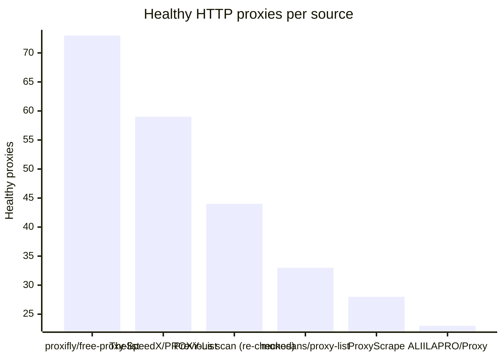
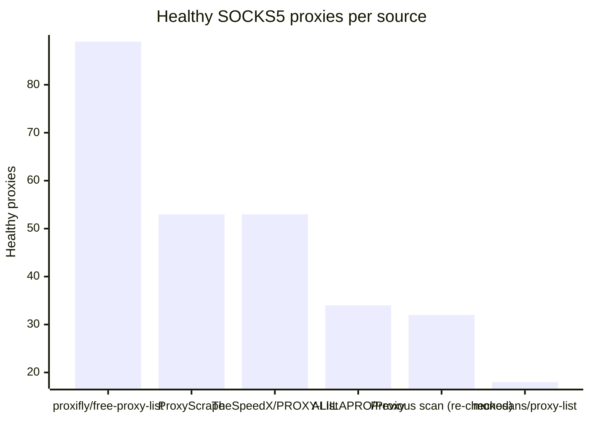

# Proxy Configs

<!-- dynamic timestamp placeholders for workflow sed script -->
channel_stats_chart.svg?v=1790812913
performance_report.html?v=1790812913

### Performance Chart

### Performance Report
[View Report](assets/performance_report.html?v=1790812913)

## HTTP

<!-- STATS:HTTP:START -->

_Last updated: 2026-09-30 12:20 UTC_

```mermaid
xychart-beta
    title "Healthy HTTP proxies per source"
    x-axis ["proxifly/free-proxy-list", "TheSpeedX/PROXY-List", "Previous scan (re-checked)", "monosans/proxy-list", "ProxyScrape", "ALIILAPRO/Proxy"]
    y-axis "Healthy proxies"
    bar [73, 59, 44, 33, 28, 23]
```

| Source | Healthy proxies |
|---|---|
| proxifly/free-proxy-list | 73 |
| TheSpeedX/PROXY-List | 59 |
| Previous scan (re-checked) | 44 |
| monosans/proxy-list | 33 |
| ProxyScrape | 28 |
| ALIILAPRO/Proxy | 23 |
| **Total unique** | **260** |

<!-- STATS:HTTP:END -->

## SOCKS5

<!-- STATS:SOCKS5:START -->

_Last updated: 2026-09-30 12:20 UTC_

```mermaid
xychart-beta
    title "Healthy SOCKS5 proxies per source"
    x-axis ["proxifly/free-proxy-list", "ProxyScrape", "TheSpeedX/PROXY-List", "ALIILAPRO/Proxy", "Previous scan (re-checked)", "monosans/proxy-list"]
    y-axis "Healthy proxies"
    bar [89, 53, 53, 34, 32, 18]
```

| Source | Healthy proxies |
|---|---|
| proxifly/free-proxy-list | 89 |
| ProxyScrape | 53 |
| TheSpeedX/PROXY-List | 53 |
| ALIILAPRO/Proxy | 34 |
| Previous scan (re-checked) | 32 |
| monosans/proxy-list | 18 |
| **Total unique** | **279** |

<!-- STATS:SOCKS5:END -->
