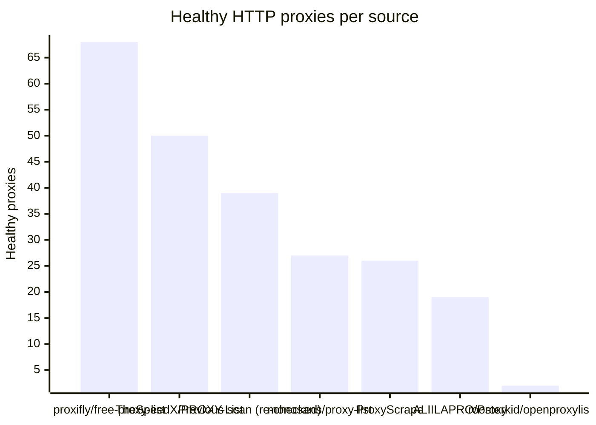
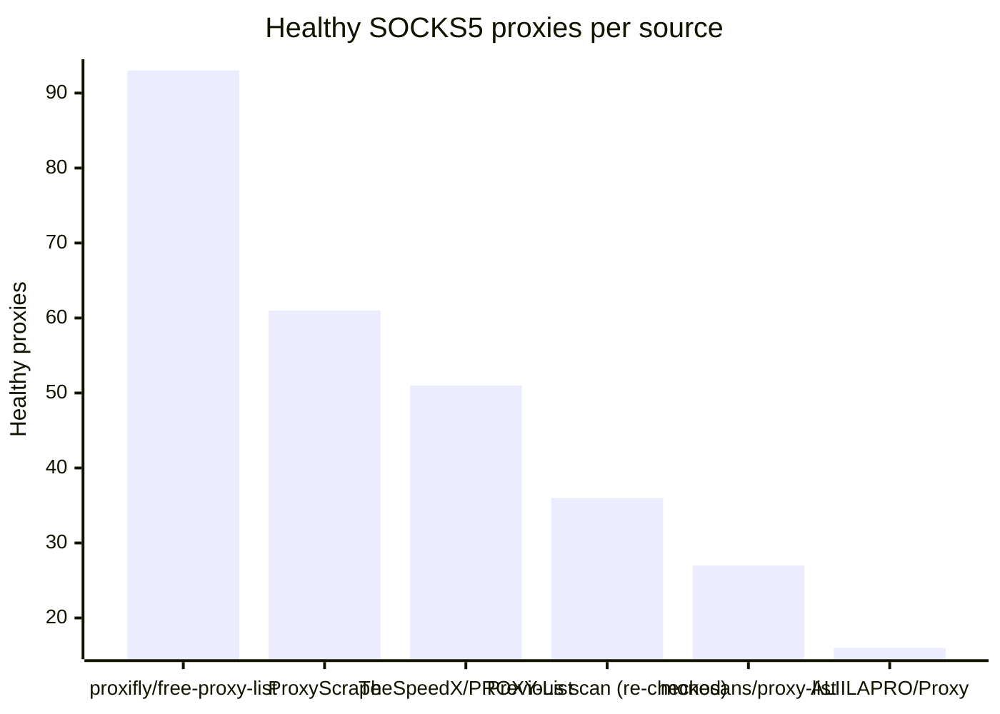

# Proxy Configs

<!-- dynamic timestamp placeholders for workflow sed script -->
channel_stats_chart.svg?v=1790510548
performance_report.html?v=1790510548

### Performance Chart

### Performance Report
[View Report](assets/performance_report.html?v=1790510548)

## HTTP

<!-- STATS:HTTP:START -->

_Last updated: 2026-09-27 06:20 UTC_

```mermaid
xychart-beta
    title "Healthy HTTP proxies per source"
    x-axis ["proxifly/free-proxy-list", "TheSpeedX/PROXY-List", "Previous scan (re-checked)", "monosans/proxy-list", "ProxyScrape", "ALIILAPRO/Proxy", "roosterkid/openproxylist"]
    y-axis "Healthy proxies"
    bar [68, 50, 39, 27, 26, 19, 2]
```

| Source | Healthy proxies |
|---|---|
| proxifly/free-proxy-list | 68 |
| TheSpeedX/PROXY-List | 50 |
| Previous scan (re-checked) | 39 |
| monosans/proxy-list | 27 |
| ProxyScrape | 26 |
| ALIILAPRO/Proxy | 19 |
| roosterkid/openproxylist | 2 |
| **Total unique** | **231** |

<!-- STATS:HTTP:END -->

## SOCKS5

<!-- STATS:SOCKS5:START -->

_Last updated: 2026-09-27 06:20 UTC_

```mermaid
xychart-beta
    title "Healthy SOCKS5 proxies per source"
    x-axis ["proxifly/free-proxy-list", "ProxyScrape", "TheSpeedX/PROXY-List", "Previous scan (re-checked)", "monosans/proxy-list", "ALIILAPRO/Proxy"]
    y-axis "Healthy proxies"
    bar [93, 61, 51, 36, 27, 16]
```

| Source | Healthy proxies |
|---|---|
| proxifly/free-proxy-list | 93 |
| ProxyScrape | 61 |
| TheSpeedX/PROXY-List | 51 |
| Previous scan (re-checked) | 36 |
| monosans/proxy-list | 27 |
| ALIILAPRO/Proxy | 16 |
| **Total unique** | **284** |

<!-- STATS:SOCKS5:END -->
