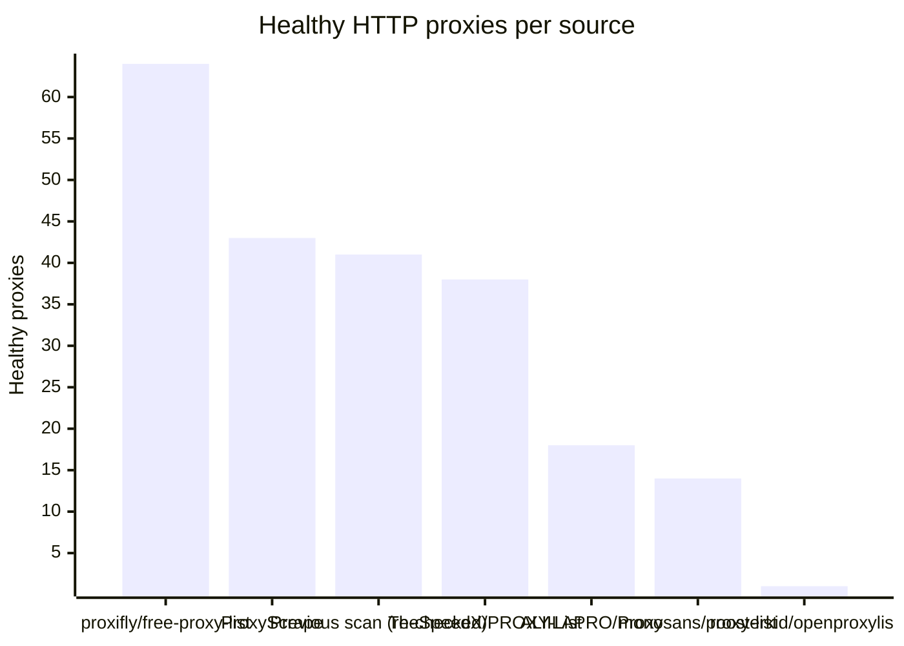
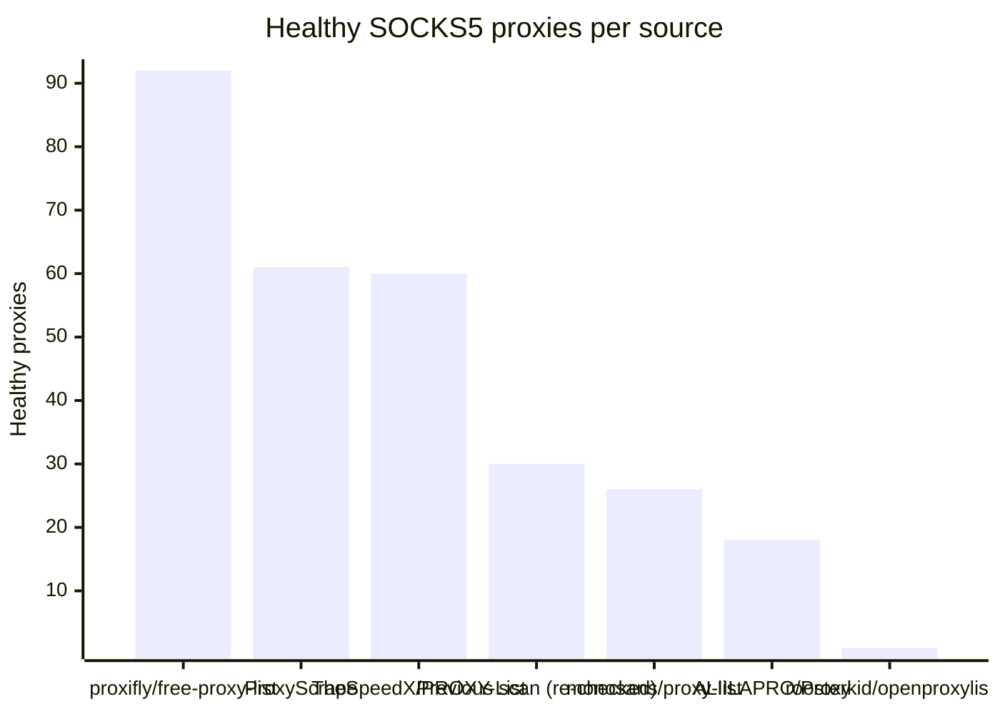

# Proxy Configs

<!-- dynamic timestamp placeholders for workflow sed script -->
channel_stats_chart.svg?v=1791633767
performance_report.html?v=1791633767

### Performance Chart

### Performance Report
[View Report](assets/performance_report.html?v=1791633767)

## HTTP

<!-- STATS:HTTP:START -->

_Last updated: 2026-10-10 06:23 UTC_

```mermaid
xychart-beta
    title "Healthy HTTP proxies per source"
    x-axis ["proxifly/free-proxy-list", "ProxyScrape", "Previous scan (re-checked)", "TheSpeedX/PROXY-List", "ALIILAPRO/Proxy", "monosans/proxy-list", "roosterkid/openproxylist"]
    y-axis "Healthy proxies"
    bar [64, 43, 41, 38, 18, 14, 1]
```

| Source | Healthy proxies |
|---|---|
| proxifly/free-proxy-list | 64 |
| ProxyScrape | 43 |
| Previous scan (re-checked) | 41 |
| TheSpeedX/PROXY-List | 38 |
| ALIILAPRO/Proxy | 18 |
| monosans/proxy-list | 14 |
| roosterkid/openproxylist | 1 |
| **Total unique** | **219** |

<!-- STATS:HTTP:END -->

## SOCKS5

<!-- STATS:SOCKS5:START -->

_Last updated: 2026-10-10 06:23 UTC_

```mermaid
xychart-beta
    title "Healthy SOCKS5 proxies per source"
    x-axis ["proxifly/free-proxy-list", "ProxyScrape", "TheSpeedX/PROXY-List", "Previous scan (re-checked)", "monosans/proxy-list", "ALIILAPRO/Proxy", "roosterkid/openproxylist"]
    y-axis "Healthy proxies"
    bar [92, 61, 60, 30, 26, 18, 1]
```

| Source | Healthy proxies |
|---|---|
| proxifly/free-proxy-list | 92 |
| ProxyScrape | 61 |
| TheSpeedX/PROXY-List | 60 |
| Previous scan (re-checked) | 30 |
| monosans/proxy-list | 26 |
| ALIILAPRO/Proxy | 18 |
| roosterkid/openproxylist | 1 |
| **Total unique** | **288** |

<!-- STATS:SOCKS5:END -->
