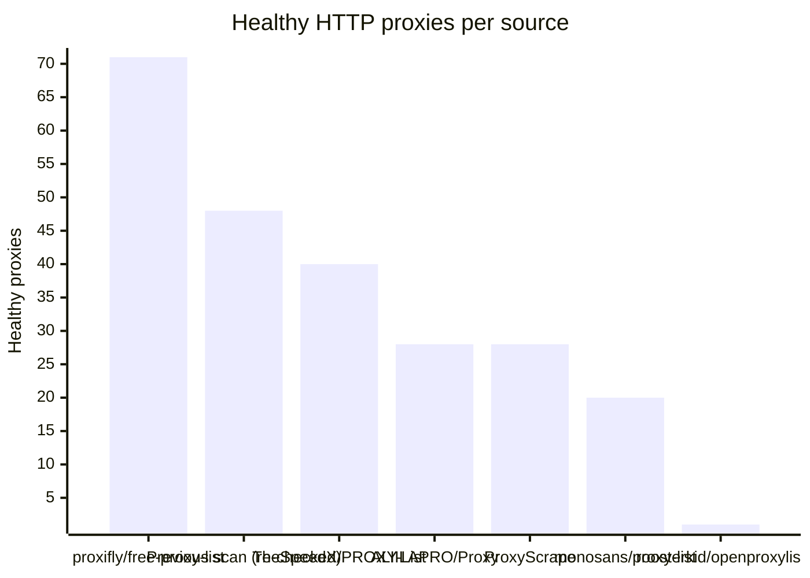
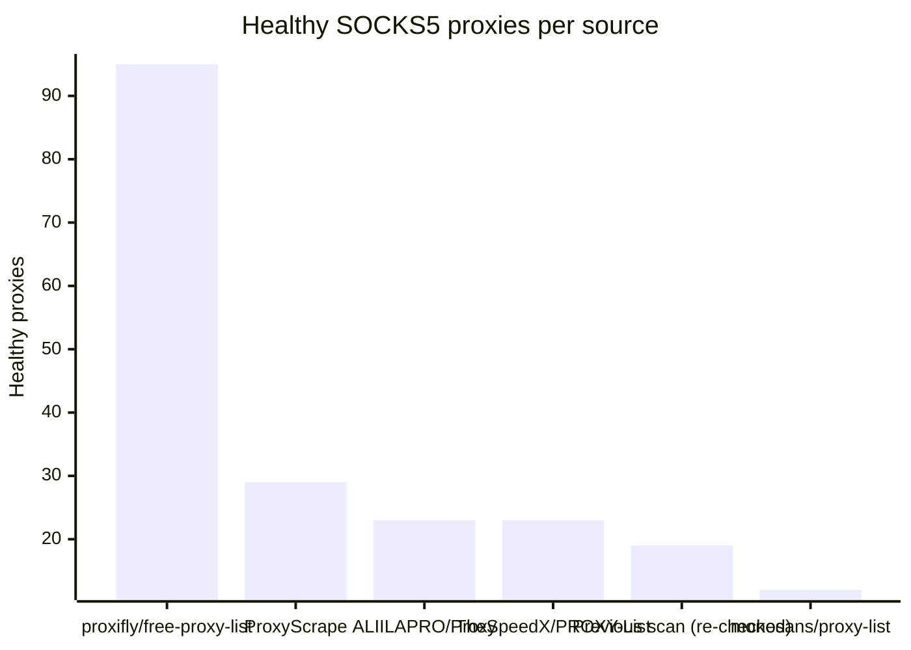

# Proxy Configs

<!-- dynamic timestamp placeholders for workflow sed script -->
channel_stats_chart.svg?v=1791352972
performance_report.html?v=1791352972

### Performance Chart

### Performance Report
[View Report](assets/performance_report.html?v=1791352972)

## HTTP

<!-- STATS:HTTP:START -->

_Last updated: 2026-10-07 00:21 UTC_

```mermaid
xychart-beta
    title "Healthy HTTP proxies per source"
    x-axis ["proxifly/free-proxy-list", "Previous scan (re-checked)", "TheSpeedX/PROXY-List", "ALIILAPRO/Proxy", "ProxyScrape", "monosans/proxy-list", "roosterkid/openproxylist"]
    y-axis "Healthy proxies"
    bar [71, 48, 40, 28, 28, 20, 1]
```

| Source | Healthy proxies |
|---|---|
| proxifly/free-proxy-list | 71 |
| Previous scan (re-checked) | 48 |
| TheSpeedX/PROXY-List | 40 |
| ALIILAPRO/Proxy | 28 |
| ProxyScrape | 28 |
| monosans/proxy-list | 20 |
| roosterkid/openproxylist | 1 |
| **Total unique** | **236** |

<!-- STATS:HTTP:END -->

## SOCKS5

<!-- STATS:SOCKS5:START -->

_Last updated: 2026-10-07 00:21 UTC_

```mermaid
xychart-beta
    title "Healthy SOCKS5 proxies per source"
    x-axis ["proxifly/free-proxy-list", "ProxyScrape", "ALIILAPRO/Proxy", "TheSpeedX/PROXY-List", "Previous scan (re-checked)", "monosans/proxy-list"]
    y-axis "Healthy proxies"
    bar [95, 29, 23, 23, 19, 12]
```

| Source | Healthy proxies |
|---|---|
| proxifly/free-proxy-list | 95 |
| ProxyScrape | 29 |
| ALIILAPRO/Proxy | 23 |
| TheSpeedX/PROXY-List | 23 |
| Previous scan (re-checked) | 19 |
| monosans/proxy-list | 12 |
| **Total unique** | **201** |

<!-- STATS:SOCKS5:END -->
