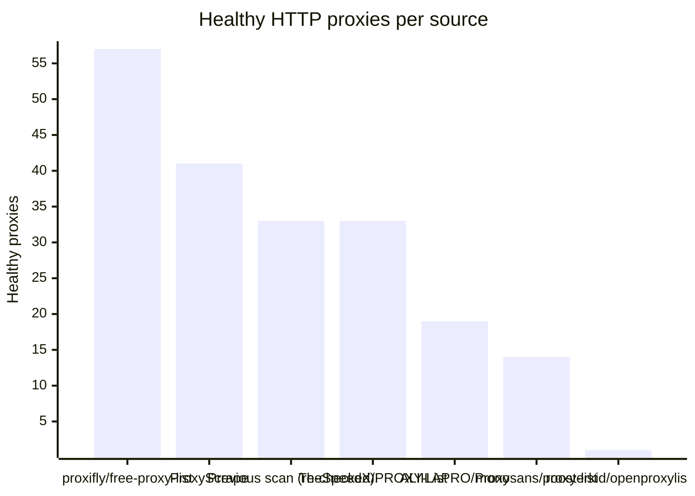
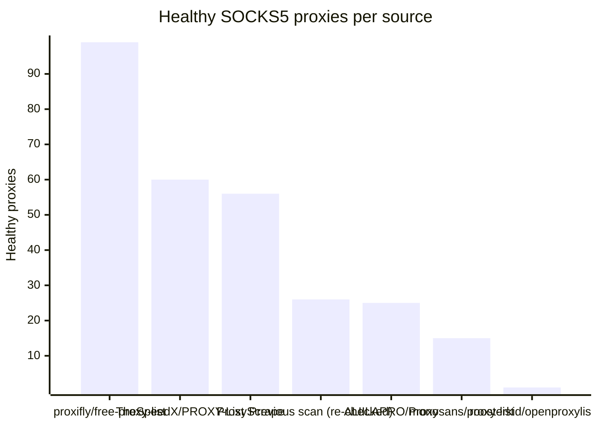

# Proxy Configs

<!-- dynamic timestamp placeholders for workflow sed script -->
channel_stats_chart.svg?v=1788030873
performance_report.html?v=1788030873

### Performance Chart

### Performance Report
[View Report](assets/performance_report.html?v=1788030873)

## HTTP

<!-- STATS:HTTP:START -->

_Last updated: 2026-09-27 00:19 UTC_

```mermaid
xychart-beta
    title "Healthy HTTP proxies per source"
    x-axis ["proxifly/free-proxy-list", "ProxyScrape", "Previous scan (re-checked)", "TheSpeedX/PROXY-List", "ALIILAPRO/Proxy", "monosans/proxy-list", "roosterkid/openproxylist"]
    y-axis "Healthy proxies"
    bar [57, 41, 33, 33, 19, 14, 1]
```

| Source | Healthy proxies |
|---|---|
| proxifly/free-proxy-list | 57 |
| ProxyScrape | 41 |
| Previous scan (re-checked) | 33 |
| TheSpeedX/PROXY-List | 33 |
| ALIILAPRO/Proxy | 19 |
| monosans/proxy-list | 14 |
| roosterkid/openproxylist | 1 |
| **Total unique** | **198** |

<!-- STATS:HTTP:END -->

## SOCKS5

<!-- STATS:SOCKS5:START -->

_Last updated: 2026-09-27 00:19 UTC_

```mermaid
xychart-beta
    title "Healthy SOCKS5 proxies per source"
    x-axis ["proxifly/free-proxy-list", "TheSpeedX/PROXY-List", "ProxyScrape", "Previous scan (re-checked)", "ALIILAPRO/Proxy", "monosans/proxy-list", "roosterkid/openproxylist"]
    y-axis "Healthy proxies"
    bar [99, 60, 56, 26, 25, 15, 1]
```

| Source | Healthy proxies |
|---|---|
| proxifly/free-proxy-list | 99 |
| TheSpeedX/PROXY-List | 60 |
| ProxyScrape | 56 |
| Previous scan (re-checked) | 26 |
| ALIILAPRO/Proxy | 25 |
| monosans/proxy-list | 15 |
| roosterkid/openproxylist | 1 |
| **Total unique** | **282** |

<!-- STATS:SOCKS5:END -->
