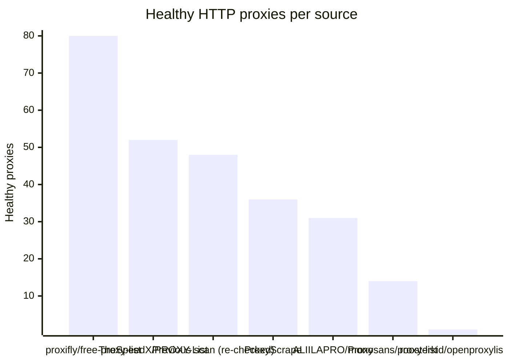
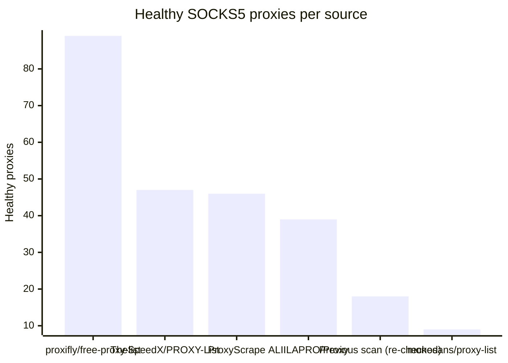

# Proxy Configs

<!-- dynamic timestamp placeholders for workflow sed script -->
channel_stats_chart.svg?v=1790856163
performance_report.html?v=1790856163

### Performance Chart

### Performance Report
[View Report](assets/performance_report.html?v=1790856163)

## HTTP

<!-- STATS:HTTP:START -->

_Last updated: 2026-10-02 18:21 UTC_

```mermaid
xychart-beta
    title "Healthy HTTP proxies per source"
    x-axis ["proxifly/free-proxy-list", "TheSpeedX/PROXY-List", "Previous scan (re-checked)", "ProxyScrape", "ALIILAPRO/Proxy", "monosans/proxy-list", "roosterkid/openproxylist"]
    y-axis "Healthy proxies"
    bar [80, 52, 48, 36, 31, 14, 1]
```

| Source | Healthy proxies |
|---|---|
| proxifly/free-proxy-list | 80 |
| TheSpeedX/PROXY-List | 52 |
| Previous scan (re-checked) | 48 |
| ProxyScrape | 36 |
| ALIILAPRO/Proxy | 31 |
| monosans/proxy-list | 14 |
| roosterkid/openproxylist | 1 |
| **Total unique** | **262** |

<!-- STATS:HTTP:END -->

## SOCKS5

<!-- STATS:SOCKS5:START -->

_Last updated: 2026-10-02 18:21 UTC_

```mermaid
xychart-beta
    title "Healthy SOCKS5 proxies per source"
    x-axis ["proxifly/free-proxy-list", "TheSpeedX/PROXY-List", "ProxyScrape", "ALIILAPRO/Proxy", "Previous scan (re-checked)", "monosans/proxy-list"]
    y-axis "Healthy proxies"
    bar [89, 47, 46, 39, 18, 9]
```

| Source | Healthy proxies |
|---|---|
| proxifly/free-proxy-list | 89 |
| TheSpeedX/PROXY-List | 47 |
| ProxyScrape | 46 |
| ALIILAPRO/Proxy | 39 |
| Previous scan (re-checked) | 18 |
| monosans/proxy-list | 9 |
| **Total unique** | **248** |

<!-- STATS:SOCKS5:END -->
