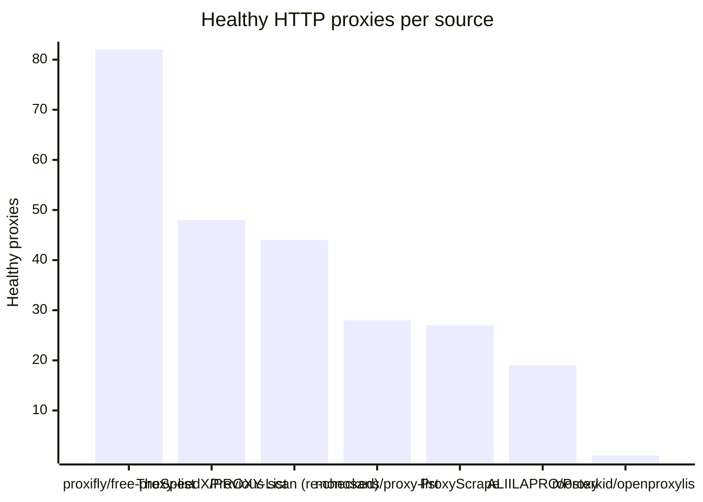
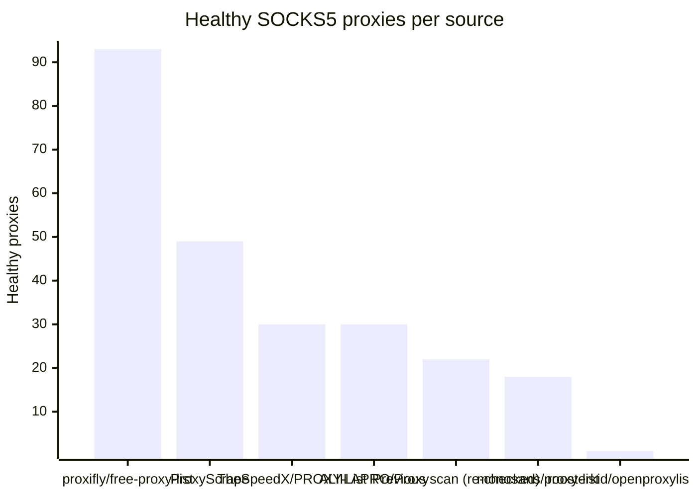

# Proxy Configs

<!-- dynamic timestamp placeholders for workflow sed script -->
channel_stats_chart.svg?v=1788030873
performance_report.html?v=1788030873

### Performance Chart

### Performance Report
[View Report](assets/performance_report.html?v=1788030873)

## HTTP

<!-- STATS:HTTP:START -->

_Last updated: 2026-09-28 18:19 UTC_

```mermaid
xychart-beta
    title "Healthy HTTP proxies per source"
    x-axis ["proxifly/free-proxy-list", "TheSpeedX/PROXY-List", "Previous scan (re-checked)", "monosans/proxy-list", "ProxyScrape", "ALIILAPRO/Proxy", "roosterkid/openproxylist"]
    y-axis "Healthy proxies"
    bar [82, 48, 44, 28, 27, 19, 1]
```

| Source | Healthy proxies |
|---|---|
| proxifly/free-proxy-list | 82 |
| TheSpeedX/PROXY-List | 48 |
| Previous scan (re-checked) | 44 |
| monosans/proxy-list | 28 |
| ProxyScrape | 27 |
| ALIILAPRO/Proxy | 19 |
| roosterkid/openproxylist | 1 |
| **Total unique** | **249** |

<!-- STATS:HTTP:END -->

## SOCKS5

<!-- STATS:SOCKS5:START -->

_Last updated: 2026-09-28 18:19 UTC_

```mermaid
xychart-beta
    title "Healthy SOCKS5 proxies per source"
    x-axis ["proxifly/free-proxy-list", "ProxyScrape", "TheSpeedX/PROXY-List", "ALIILAPRO/Proxy", "Previous scan (re-checked)", "monosans/proxy-list", "roosterkid/openproxylist"]
    y-axis "Healthy proxies"
    bar [93, 49, 30, 30, 22, 18, 1]
```

| Source | Healthy proxies |
|---|---|
| proxifly/free-proxy-list | 93 |
| ProxyScrape | 49 |
| TheSpeedX/PROXY-List | 30 |
| ALIILAPRO/Proxy | 30 |
| Previous scan (re-checked) | 22 |
| monosans/proxy-list | 18 |
| roosterkid/openproxylist | 1 |
| **Total unique** | **243** |

<!-- STATS:SOCKS5:END -->
