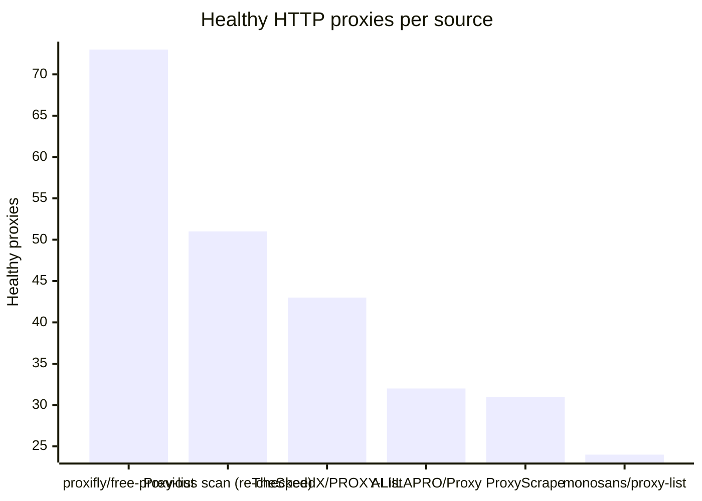
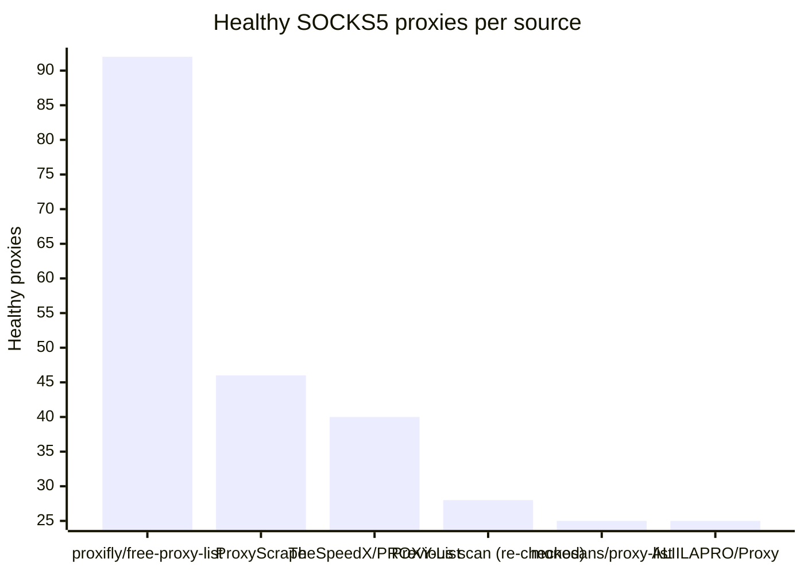

# Proxy Configs

<!-- dynamic timestamp placeholders for workflow sed script -->
channel_stats_chart.svg?v=1791460970
performance_report.html?v=1791460970

### Performance Chart

### Performance Report
[View Report](assets/performance_report.html?v=1791460970)

## HTTP

<!-- STATS:HTTP:START -->

_Last updated: 2026-10-08 06:21 UTC_

```mermaid
xychart-beta
    title "Healthy HTTP proxies per source"
    x-axis ["proxifly/free-proxy-list", "Previous scan (re-checked)", "TheSpeedX/PROXY-List", "ALIILAPRO/Proxy", "ProxyScrape", "monosans/proxy-list"]
    y-axis "Healthy proxies"
    bar [73, 51, 43, 32, 31, 24]
```

| Source | Healthy proxies |
|---|---|
| proxifly/free-proxy-list | 73 |
| Previous scan (re-checked) | 51 |
| TheSpeedX/PROXY-List | 43 |
| ALIILAPRO/Proxy | 32 |
| ProxyScrape | 31 |
| monosans/proxy-list | 24 |
| **Total unique** | **254** |

<!-- STATS:HTTP:END -->

## SOCKS5

<!-- STATS:SOCKS5:START -->

_Last updated: 2026-10-08 06:21 UTC_

```mermaid
xychart-beta
    title "Healthy SOCKS5 proxies per source"
    x-axis ["proxifly/free-proxy-list", "ProxyScrape", "TheSpeedX/PROXY-List", "Previous scan (re-checked)", "monosans/proxy-list", "ALIILAPRO/Proxy"]
    y-axis "Healthy proxies"
    bar [92, 46, 40, 28, 25, 25]
```

| Source | Healthy proxies |
|---|---|
| proxifly/free-proxy-list | 92 |
| ProxyScrape | 46 |
| TheSpeedX/PROXY-List | 40 |
| Previous scan (re-checked) | 28 |
| monosans/proxy-list | 25 |
| ALIILAPRO/Proxy | 25 |
| **Total unique** | **256** |

<!-- STATS:SOCKS5:END -->
