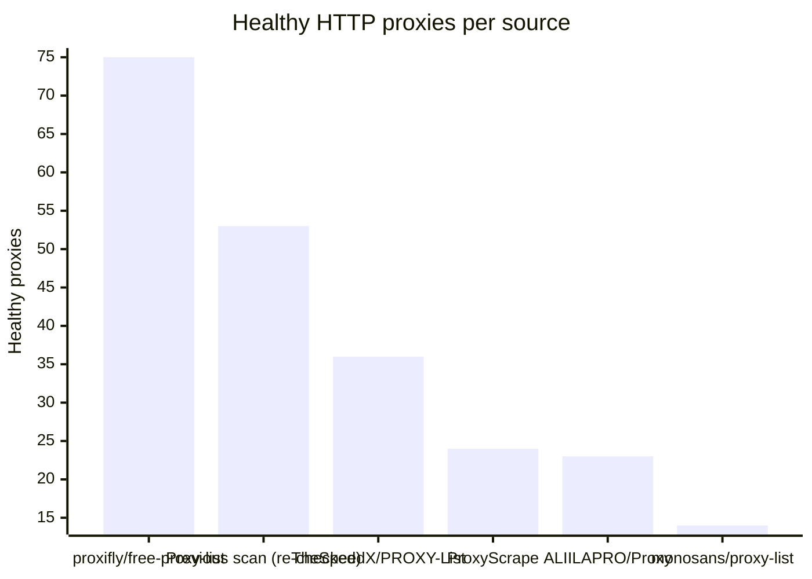
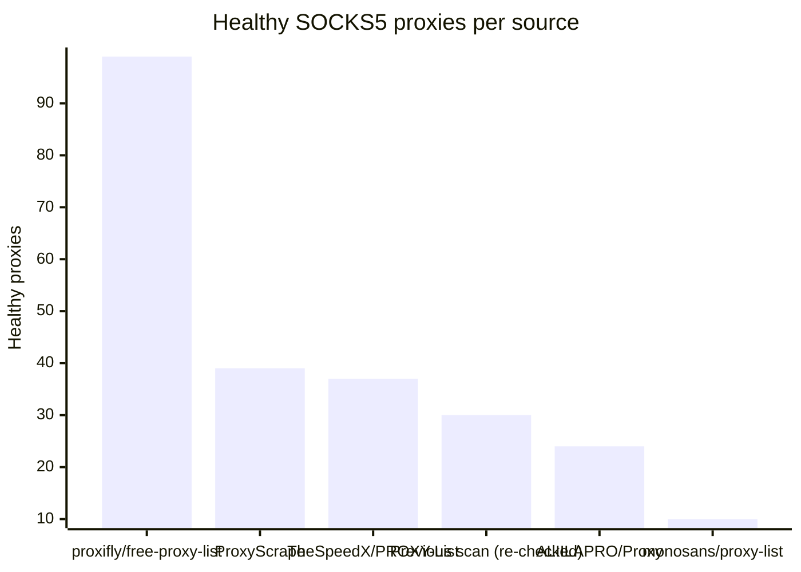

# Proxy Configs

<!-- dynamic timestamp placeholders for workflow sed script -->
channel_stats_chart.svg?v=1788030873
performance_report.html?v=1788030873

### Performance Chart

### Performance Report
[View Report](assets/performance_report.html?v=1788030873)

## HTTP

<!-- STATS:HTTP:START -->

_Last updated: 2026-09-27 18:17 UTC_

```mermaid
xychart-beta
    title "Healthy HTTP proxies per source"
    x-axis ["proxifly/free-proxy-list", "Previous scan (re-checked)", "TheSpeedX/PROXY-List", "ProxyScrape", "ALIILAPRO/Proxy", "monosans/proxy-list"]
    y-axis "Healthy proxies"
    bar [75, 53, 36, 24, 23, 14]
```

| Source | Healthy proxies |
|---|---|
| proxifly/free-proxy-list | 75 |
| Previous scan (re-checked) | 53 |
| TheSpeedX/PROXY-List | 36 |
| ProxyScrape | 24 |
| ALIILAPRO/Proxy | 23 |
| monosans/proxy-list | 14 |
| **Total unique** | **225** |

<!-- STATS:HTTP:END -->

## SOCKS5

<!-- STATS:SOCKS5:START -->

_Last updated: 2026-09-27 18:17 UTC_

```mermaid
xychart-beta
    title "Healthy SOCKS5 proxies per source"
    x-axis ["proxifly/free-proxy-list", "ProxyScrape", "TheSpeedX/PROXY-List", "Previous scan (re-checked)", "ALIILAPRO/Proxy", "monosans/proxy-list"]
    y-axis "Healthy proxies"
    bar [99, 39, 37, 30, 24, 10]
```

| Source | Healthy proxies |
|---|---|
| proxifly/free-proxy-list | 99 |
| ProxyScrape | 39 |
| TheSpeedX/PROXY-List | 37 |
| Previous scan (re-checked) | 30 |
| ALIILAPRO/Proxy | 24 |
| monosans/proxy-list | 10 |
| **Total unique** | **239** |

<!-- STATS:SOCKS5:END -->
