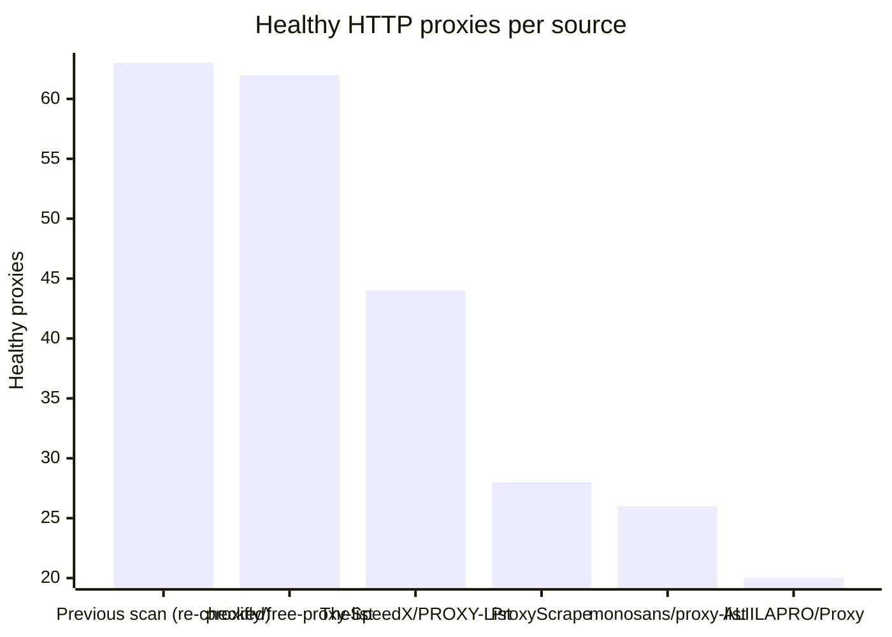
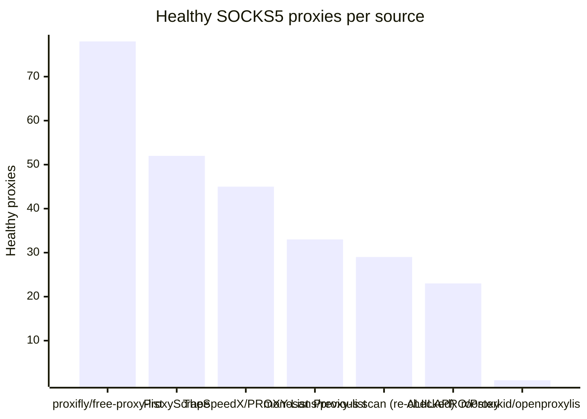

# Proxy Configs

<!-- dynamic timestamp placeholders for workflow sed script -->
channel_stats_chart.svg?v=1790942519
performance_report.html?v=1790942519

### Performance Chart

### Performance Report
[View Report](assets/performance_report.html?v=1790942519)

## HTTP

<!-- STATS:HTTP:START -->

_Last updated: 2026-10-02 06:18 UTC_

```mermaid
xychart-beta
    title "Healthy HTTP proxies per source"
    x-axis ["Previous scan (re-checked)", "proxifly/free-proxy-list", "TheSpeedX/PROXY-List", "ProxyScrape", "monosans/proxy-list", "ALIILAPRO/Proxy"]
    y-axis "Healthy proxies"
    bar [63, 62, 44, 28, 26, 20]
```

| Source | Healthy proxies |
|---|---|
| Previous scan (re-checked) | 63 |
| proxifly/free-proxy-list | 62 |
| TheSpeedX/PROXY-List | 44 |
| ProxyScrape | 28 |
| monosans/proxy-list | 26 |
| ALIILAPRO/Proxy | 20 |
| **Total unique** | **243** |

<!-- STATS:HTTP:END -->

## SOCKS5

<!-- STATS:SOCKS5:START -->

_Last updated: 2026-10-02 06:18 UTC_

```mermaid
xychart-beta
    title "Healthy SOCKS5 proxies per source"
    x-axis ["proxifly/free-proxy-list", "ProxyScrape", "TheSpeedX/PROXY-List", "monosans/proxy-list", "Previous scan (re-checked)", "ALIILAPRO/Proxy", "roosterkid/openproxylist"]
    y-axis "Healthy proxies"
    bar [78, 52, 45, 33, 29, 23, 1]
```

| Source | Healthy proxies |
|---|---|
| proxifly/free-proxy-list | 78 |
| ProxyScrape | 52 |
| TheSpeedX/PROXY-List | 45 |
| monosans/proxy-list | 33 |
| Previous scan (re-checked) | 29 |
| ALIILAPRO/Proxy | 23 |
| roosterkid/openproxylist | 1 |
| **Total unique** | **261** |

<!-- STATS:SOCKS5:END -->
