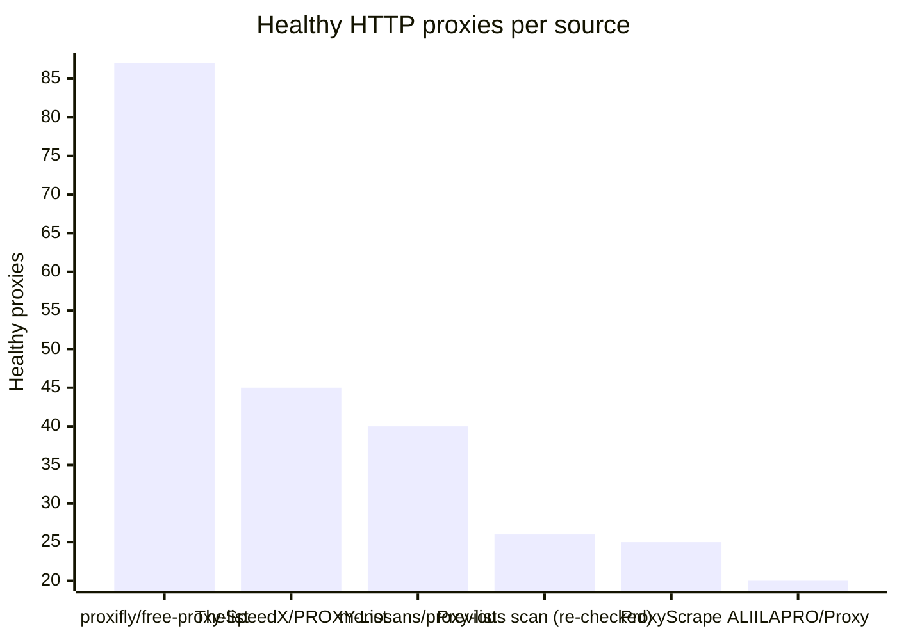
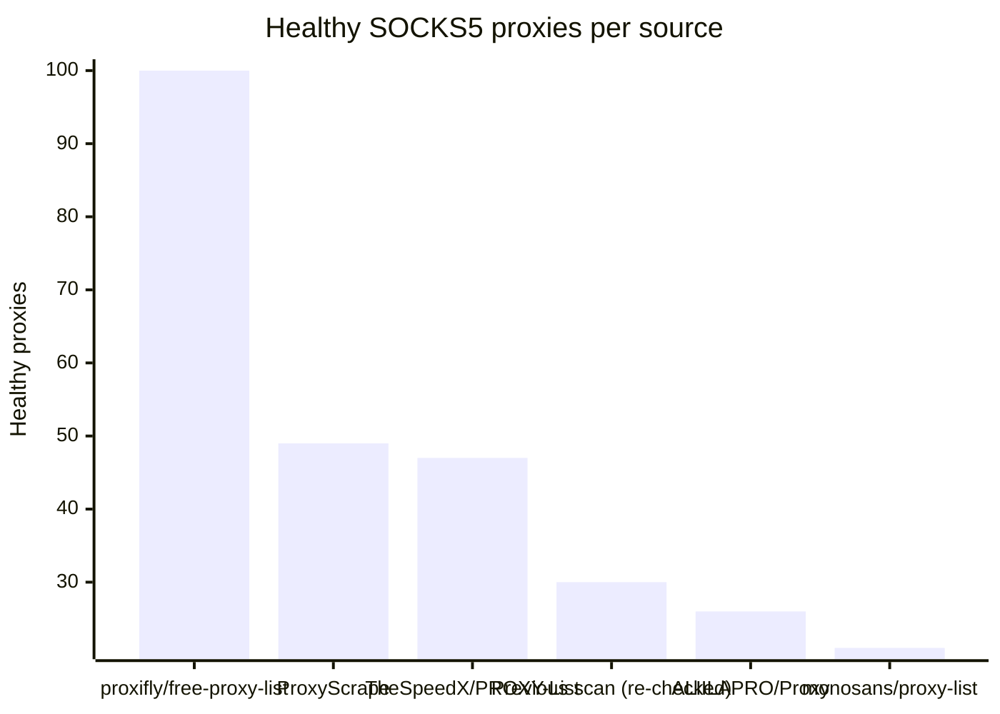

# Proxy Configs

<!-- dynamic timestamp placeholders for workflow sed script -->
channel_stats_chart.svg?v=1792843397
performance_report.html?v=1792843397

### Performance Chart

### Performance Report
[View Report](assets/performance_report.html?v=1792843397)

## HTTP

<!-- STATS:HTTP:START -->

_Last updated: 2026-10-24 06:23 UTC_

```mermaid
xychart-beta
    title "Healthy HTTP proxies per source"
    x-axis ["proxifly/free-proxy-list", "TheSpeedX/PROXY-List", "monosans/proxy-list", "Previous scan (re-checked)", "ProxyScrape", "ALIILAPRO/Proxy"]
    y-axis "Healthy proxies"
    bar [87, 45, 40, 26, 25, 20]
```

| Source | Healthy proxies |
|---|---|
| proxifly/free-proxy-list | 87 |
| TheSpeedX/PROXY-List | 45 |
| monosans/proxy-list | 40 |
| Previous scan (re-checked) | 26 |
| ProxyScrape | 25 |
| ALIILAPRO/Proxy | 20 |
| **Total unique** | **243** |

<!-- STATS:HTTP:END -->

## SOCKS5

<!-- STATS:SOCKS5:START -->

_Last updated: 2026-10-24 06:23 UTC_

```mermaid
xychart-beta
    title "Healthy SOCKS5 proxies per source"
    x-axis ["proxifly/free-proxy-list", "ProxyScrape", "TheSpeedX/PROXY-List", "Previous scan (re-checked)", "ALIILAPRO/Proxy", "monosans/proxy-list"]
    y-axis "Healthy proxies"
    bar [100, 49, 47, 30, 26, 21]
```

| Source | Healthy proxies |
|---|---|
| proxifly/free-proxy-list | 100 |
| ProxyScrape | 49 |
| TheSpeedX/PROXY-List | 47 |
| Previous scan (re-checked) | 30 |
| ALIILAPRO/Proxy | 26 |
| monosans/proxy-list | 21 |
| **Total unique** | **273** |

<!-- STATS:SOCKS5:END -->
