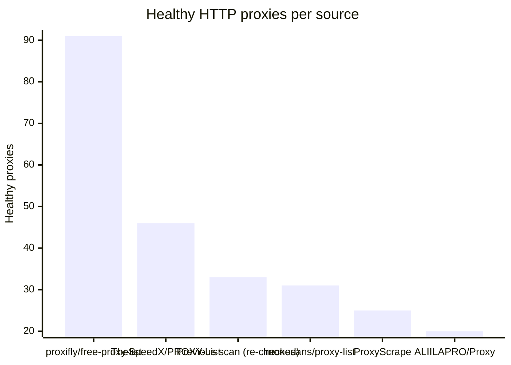
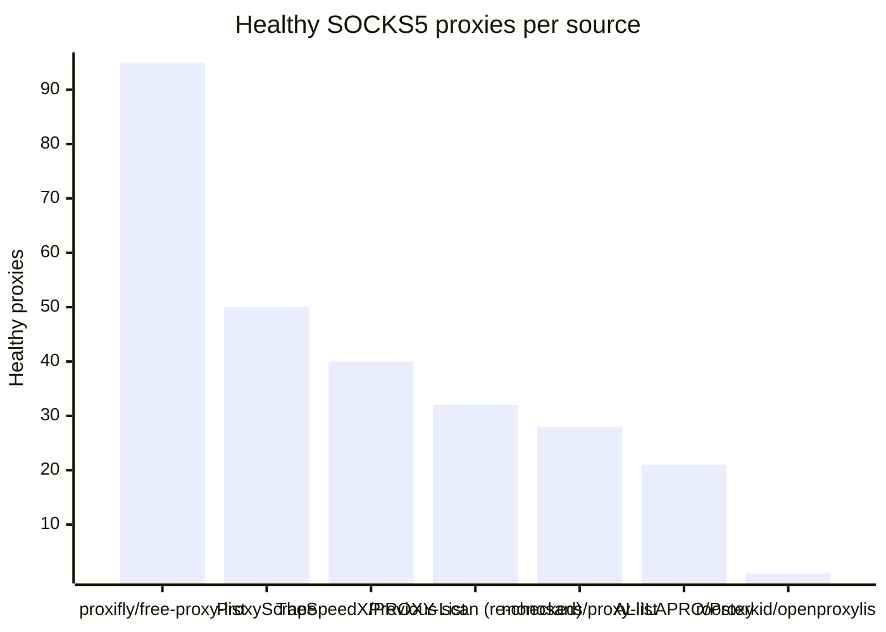

# Proxy Configs

<!-- dynamic timestamp placeholders for workflow sed script -->
channel_stats_chart.svg?v=1791309724
performance_report.html?v=1791309724

### Performance Chart

### Performance Report
[View Report](assets/performance_report.html?v=1791309724)

## HTTP

<!-- STATS:HTTP:START -->

_Last updated: 2026-10-21 06:20 UTC_

```mermaid
xychart-beta
    title "Healthy HTTP proxies per source"
    x-axis ["proxifly/free-proxy-list", "TheSpeedX/PROXY-List", "Previous scan (re-checked)", "monosans/proxy-list", "ProxyScrape", "ALIILAPRO/Proxy"]
    y-axis "Healthy proxies"
    bar [91, 46, 33, 31, 25, 20]
```

| Source | Healthy proxies |
|---|---|
| proxifly/free-proxy-list | 91 |
| TheSpeedX/PROXY-List | 46 |
| Previous scan (re-checked) | 33 |
| monosans/proxy-list | 31 |
| ProxyScrape | 25 |
| ALIILAPRO/Proxy | 20 |
| **Total unique** | **246** |

<!-- STATS:HTTP:END -->

## SOCKS5

<!-- STATS:SOCKS5:START -->

_Last updated: 2026-10-21 06:20 UTC_

```mermaid
xychart-beta
    title "Healthy SOCKS5 proxies per source"
    x-axis ["proxifly/free-proxy-list", "ProxyScrape", "TheSpeedX/PROXY-List", "Previous scan (re-checked)", "monosans/proxy-list", "ALIILAPRO/Proxy", "roosterkid/openproxylist"]
    y-axis "Healthy proxies"
    bar [95, 50, 40, 32, 28, 21, 1]
```

| Source | Healthy proxies |
|---|---|
| proxifly/free-proxy-list | 95 |
| ProxyScrape | 50 |
| TheSpeedX/PROXY-List | 40 |
| Previous scan (re-checked) | 32 |
| monosans/proxy-list | 28 |
| ALIILAPRO/Proxy | 21 |
| roosterkid/openproxylist | 1 |
| **Total unique** | **267** |

<!-- STATS:SOCKS5:END -->
