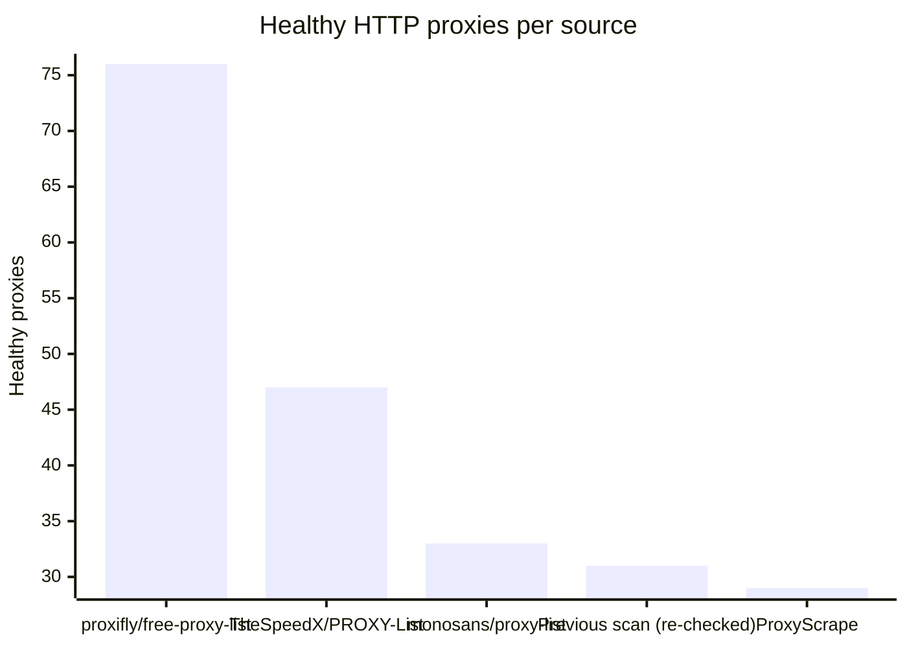
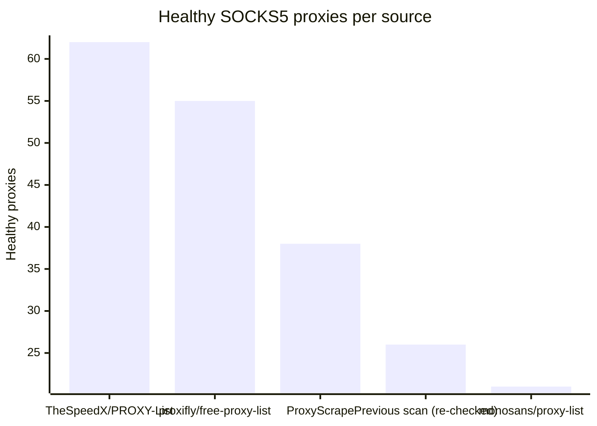

# Proxy Configs

<!-- dynamic timestamp placeholders for workflow sed script -->
channel_stats_chart.svg?v=1791309724
performance_report.html?v=1791309724

### Performance Chart

### Performance Report
[View Report](assets/performance_report.html?v=1791309724)

## HTTP

<!-- STATS:HTTP:START -->

_Last updated: 2026-10-30 18:16 UTC_

```mermaid
xychart-beta
    title "Healthy HTTP proxies per source"
    x-axis ["proxifly/free-proxy-list", "TheSpeedX/PROXY-List", "monosans/proxy-list", "Previous scan (re-checked)", "ProxyScrape"]
    y-axis "Healthy proxies"
    bar [76, 47, 33, 31, 29]
```

| Source | Healthy proxies |
|---|---|
| proxifly/free-proxy-list | 76 |
| TheSpeedX/PROXY-List | 47 |
| monosans/proxy-list | 33 |
| Previous scan (re-checked) | 31 |
| ProxyScrape | 29 |
| **Total unique** | **216** |

<!-- STATS:HTTP:END -->

## SOCKS5

<!-- STATS:SOCKS5:START -->

_Last updated: 2026-10-30 18:16 UTC_

```mermaid
xychart-beta
    title "Healthy SOCKS5 proxies per source"
    x-axis ["TheSpeedX/PROXY-List", "proxifly/free-proxy-list", "ProxyScrape", "Previous scan (re-checked)", "monosans/proxy-list"]
    y-axis "Healthy proxies"
    bar [62, 55, 38, 26, 21]
```

| Source | Healthy proxies |
|---|---|
| TheSpeedX/PROXY-List | 62 |
| proxifly/free-proxy-list | 55 |
| ProxyScrape | 38 |
| Previous scan (re-checked) | 26 |
| monosans/proxy-list | 21 |
| **Total unique** | **202** |

<!-- STATS:SOCKS5:END -->
