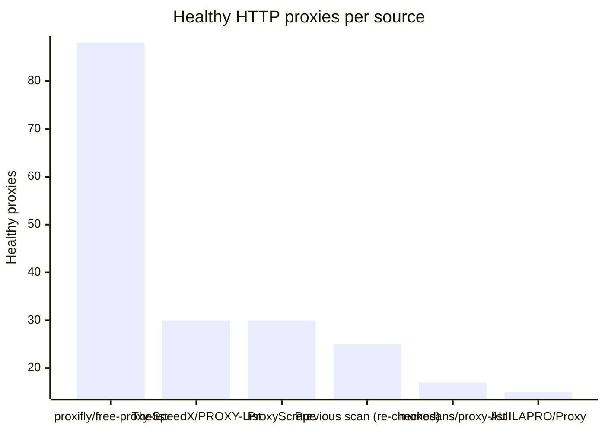
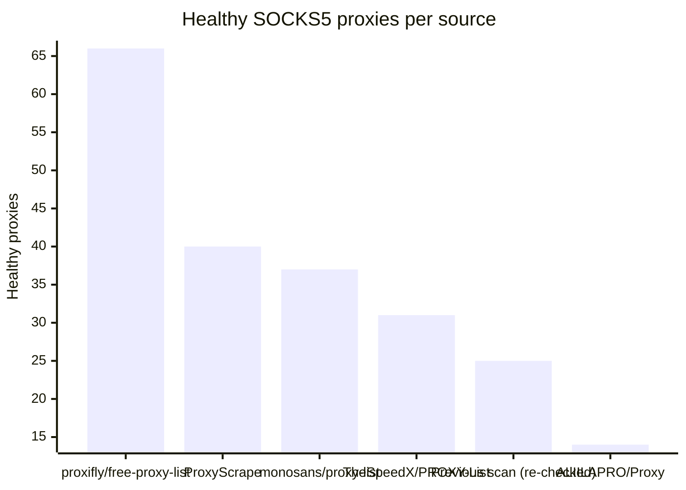

# Proxy Configs

<!-- dynamic timestamp placeholders for workflow sed script -->
channel_stats_chart.svg?v=1792152260
performance_report.html?v=1792152260

### Performance Chart

### Performance Report
[View Report](assets/performance_report.html?v=1792152260)

## HTTP

<!-- STATS:HTTP:START -->

_Last updated: 2026-10-16 06:21 UTC_

```mermaid
xychart-beta
    title "Healthy HTTP proxies per source"
    x-axis ["proxifly/free-proxy-list", "TheSpeedX/PROXY-List", "ProxyScrape", "Previous scan (re-checked)", "monosans/proxy-list", "ALIILAPRO/Proxy"]
    y-axis "Healthy proxies"
    bar [88, 30, 30, 25, 17, 15]
```

| Source | Healthy proxies |
|---|---|
| proxifly/free-proxy-list | 88 |
| TheSpeedX/PROXY-List | 30 |
| ProxyScrape | 30 |
| Previous scan (re-checked) | 25 |
| monosans/proxy-list | 17 |
| ALIILAPRO/Proxy | 15 |
| **Total unique** | **205** |

<!-- STATS:HTTP:END -->

## SOCKS5

<!-- STATS:SOCKS5:START -->

_Last updated: 2026-10-16 06:21 UTC_

```mermaid
xychart-beta
    title "Healthy SOCKS5 proxies per source"
    x-axis ["proxifly/free-proxy-list", "ProxyScrape", "monosans/proxy-list", "TheSpeedX/PROXY-List", "Previous scan (re-checked)", "ALIILAPRO/Proxy"]
    y-axis "Healthy proxies"
    bar [66, 40, 37, 31, 25, 14]
```

| Source | Healthy proxies |
|---|---|
| proxifly/free-proxy-list | 66 |
| ProxyScrape | 40 |
| monosans/proxy-list | 37 |
| TheSpeedX/PROXY-List | 31 |
| Previous scan (re-checked) | 25 |
| ALIILAPRO/Proxy | 14 |
| **Total unique** | **213** |

<!-- STATS:SOCKS5:END -->
