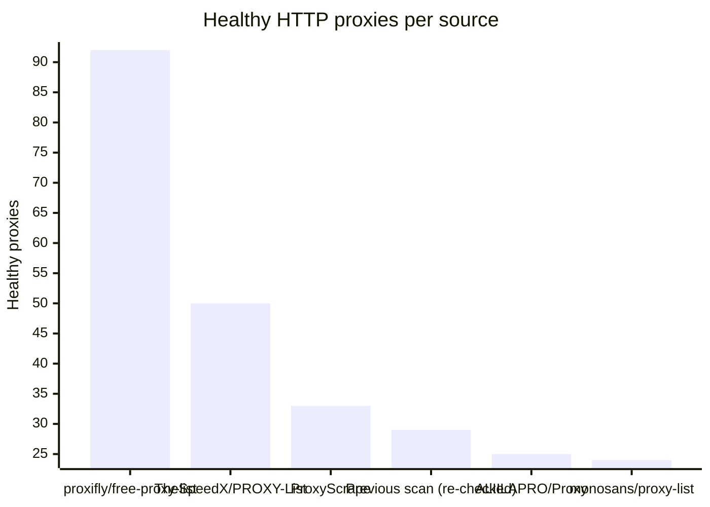
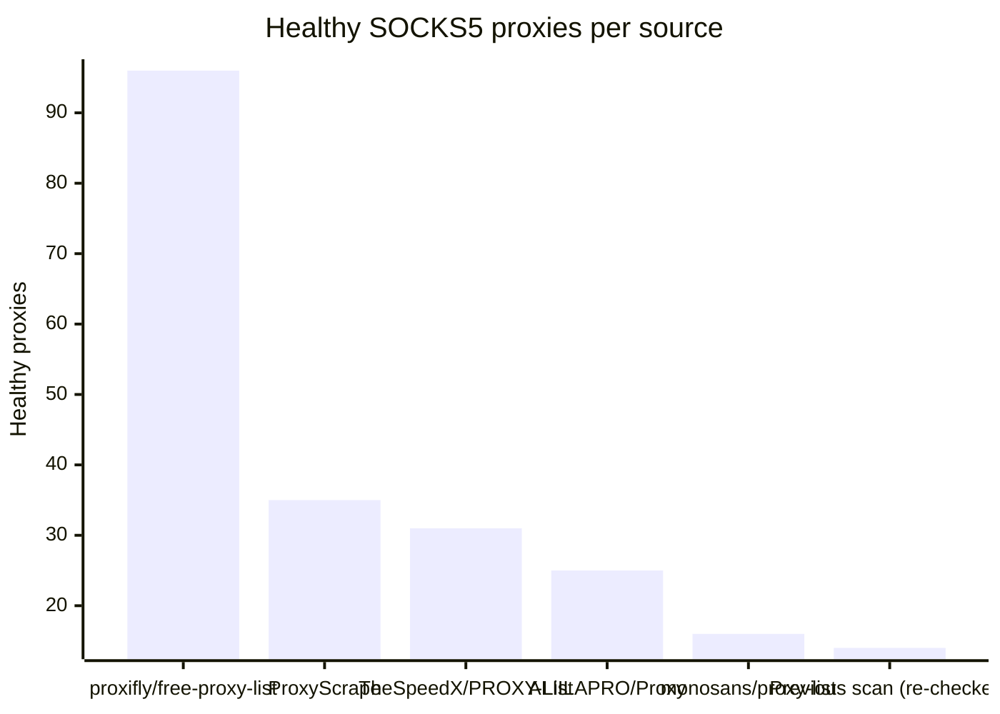

# Proxy Configs

<!-- dynamic timestamp placeholders for workflow sed script -->
channel_stats_chart.svg?v=1791309724
performance_report.html?v=1791309724

### Performance Chart

### Performance Report
[View Report](assets/performance_report.html?v=1791309724)

## HTTP

<!-- STATS:HTTP:START -->

_Last updated: 2026-10-23 06:24 UTC_

```mermaid
xychart-beta
    title "Healthy HTTP proxies per source"
    x-axis ["proxifly/free-proxy-list", "TheSpeedX/PROXY-List", "ProxyScrape", "Previous scan (re-checked)", "ALIILAPRO/Proxy", "monosans/proxy-list"]
    y-axis "Healthy proxies"
    bar [92, 50, 33, 29, 25, 24]
```

| Source | Healthy proxies |
|---|---|
| proxifly/free-proxy-list | 92 |
| TheSpeedX/PROXY-List | 50 |
| ProxyScrape | 33 |
| Previous scan (re-checked) | 29 |
| ALIILAPRO/Proxy | 25 |
| monosans/proxy-list | 24 |
| **Total unique** | **253** |

<!-- STATS:HTTP:END -->

## SOCKS5

<!-- STATS:SOCKS5:START -->

_Last updated: 2026-10-23 06:24 UTC_

```mermaid
xychart-beta
    title "Healthy SOCKS5 proxies per source"
    x-axis ["proxifly/free-proxy-list", "ProxyScrape", "TheSpeedX/PROXY-List", "ALIILAPRO/Proxy", "monosans/proxy-list", "Previous scan (re-checked)"]
    y-axis "Healthy proxies"
    bar [96, 35, 31, 25, 16, 14]
```

| Source | Healthy proxies |
|---|---|
| proxifly/free-proxy-list | 96 |
| ProxyScrape | 35 |
| TheSpeedX/PROXY-List | 31 |
| ALIILAPRO/Proxy | 25 |
| monosans/proxy-list | 16 |
| Previous scan (re-checked) | 14 |
| **Total unique** | **217** |

<!-- STATS:SOCKS5:END -->
