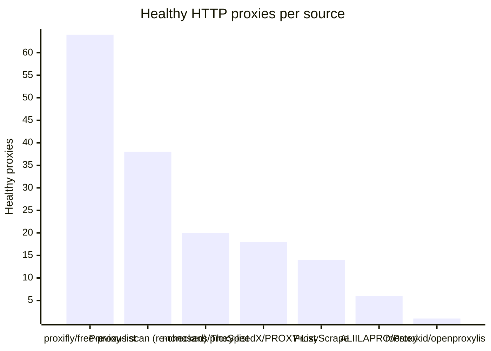
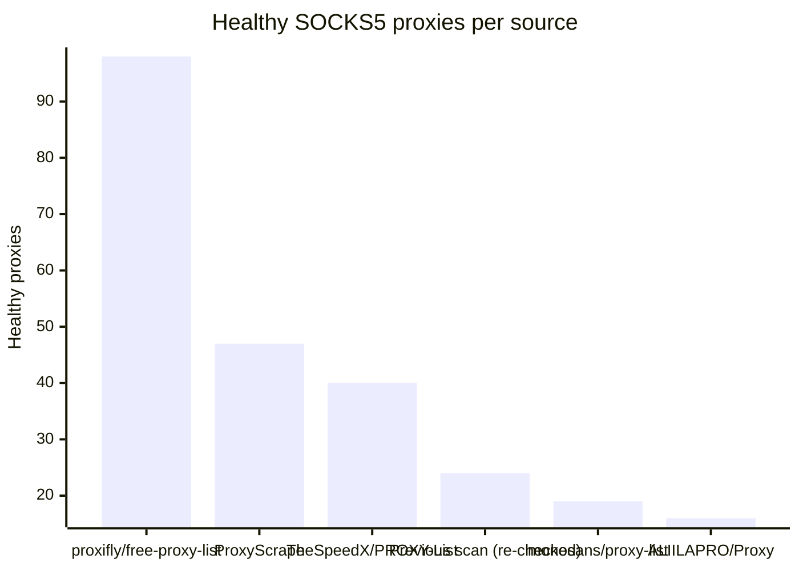

# Proxy Configs

<!-- dynamic timestamp placeholders for workflow sed script -->
channel_stats_chart.svg?v=1791309724
performance_report.html?v=1791309724

### Performance Chart

### Performance Report
[View Report](assets/performance_report.html?v=1791309724)

## HTTP

<!-- STATS:HTTP:START -->

_Last updated: 2026-10-16 12:23 UTC_

```mermaid
xychart-beta
    title "Healthy HTTP proxies per source"
    x-axis ["proxifly/free-proxy-list", "Previous scan (re-checked)", "monosans/proxy-list", "TheSpeedX/PROXY-List", "ProxyScrape", "ALIILAPRO/Proxy", "roosterkid/openproxylist"]
    y-axis "Healthy proxies"
    bar [64, 38, 20, 18, 14, 6, 1]
```

| Source | Healthy proxies |
|---|---|
| proxifly/free-proxy-list | 64 |
| Previous scan (re-checked) | 38 |
| monosans/proxy-list | 20 |
| TheSpeedX/PROXY-List | 18 |
| ProxyScrape | 14 |
| ALIILAPRO/Proxy | 6 |
| roosterkid/openproxylist | 1 |
| **Total unique** | **161** |

<!-- STATS:HTTP:END -->

## SOCKS5

<!-- STATS:SOCKS5:START -->

_Last updated: 2026-10-16 12:23 UTC_

```mermaid
xychart-beta
    title "Healthy SOCKS5 proxies per source"
    x-axis ["proxifly/free-proxy-list", "ProxyScrape", "TheSpeedX/PROXY-List", "Previous scan (re-checked)", "monosans/proxy-list", "ALIILAPRO/Proxy"]
    y-axis "Healthy proxies"
    bar [98, 47, 40, 24, 19, 16]
```

| Source | Healthy proxies |
|---|---|
| proxifly/free-proxy-list | 98 |
| ProxyScrape | 47 |
| TheSpeedX/PROXY-List | 40 |
| Previous scan (re-checked) | 24 |
| monosans/proxy-list | 19 |
| ALIILAPRO/Proxy | 16 |
| **Total unique** | **244** |

<!-- STATS:SOCKS5:END -->
