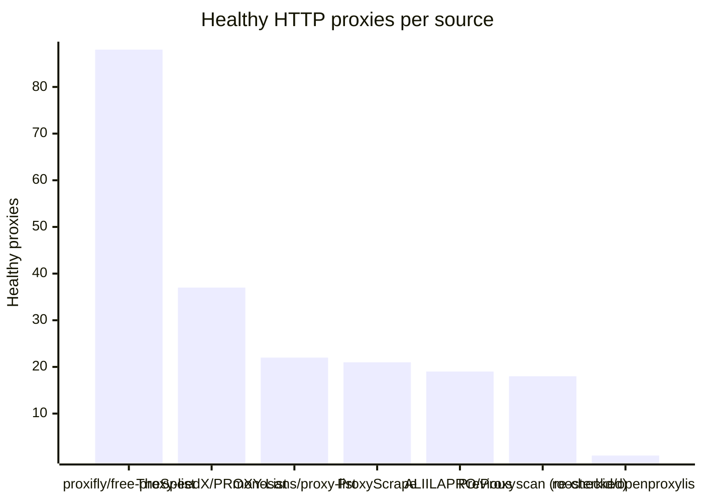
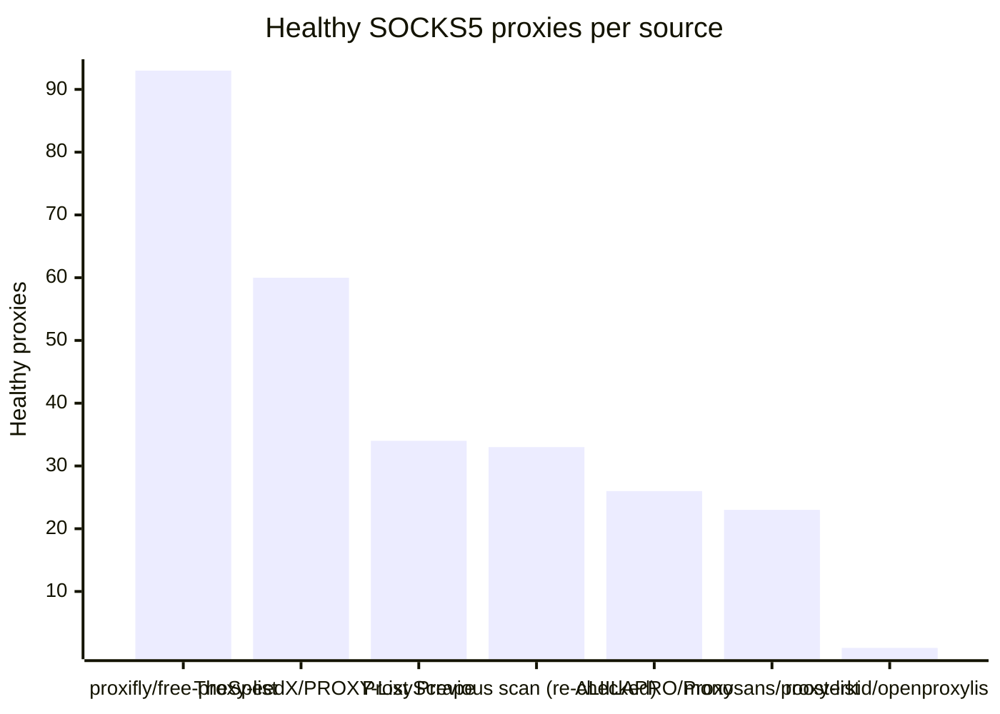

# Proxy Configs

<!-- dynamic timestamp placeholders for workflow sed script -->
channel_stats_chart.svg?v=1792368107
performance_report.html?v=1792368107

### Performance Chart

### Performance Report
[View Report](assets/performance_report.html?v=1792368107)

## HTTP

<!-- STATS:HTTP:START -->

_Last updated: 2026-10-18 18:21 UTC_

```mermaid
xychart-beta
    title "Healthy HTTP proxies per source"
    x-axis ["proxifly/free-proxy-list", "TheSpeedX/PROXY-List", "monosans/proxy-list", "ProxyScrape", "ALIILAPRO/Proxy", "Previous scan (re-checked)", "roosterkid/openproxylist"]
    y-axis "Healthy proxies"
    bar [88, 37, 22, 21, 19, 18, 1]
```

| Source | Healthy proxies |
|---|---|
| proxifly/free-proxy-list | 88 |
| TheSpeedX/PROXY-List | 37 |
| monosans/proxy-list | 22 |
| ProxyScrape | 21 |
| ALIILAPRO/Proxy | 19 |
| Previous scan (re-checked) | 18 |
| roosterkid/openproxylist | 1 |
| **Total unique** | **206** |

<!-- STATS:HTTP:END -->

## SOCKS5

<!-- STATS:SOCKS5:START -->

_Last updated: 2026-10-18 18:21 UTC_

```mermaid
xychart-beta
    title "Healthy SOCKS5 proxies per source"
    x-axis ["proxifly/free-proxy-list", "TheSpeedX/PROXY-List", "ProxyScrape", "Previous scan (re-checked)", "ALIILAPRO/Proxy", "monosans/proxy-list", "roosterkid/openproxylist"]
    y-axis "Healthy proxies"
    bar [93, 60, 34, 33, 26, 23, 1]
```

| Source | Healthy proxies |
|---|---|
| proxifly/free-proxy-list | 93 |
| TheSpeedX/PROXY-List | 60 |
| ProxyScrape | 34 |
| Previous scan (re-checked) | 33 |
| ALIILAPRO/Proxy | 26 |
| monosans/proxy-list | 23 |
| roosterkid/openproxylist | 1 |
| **Total unique** | **270** |

<!-- STATS:SOCKS5:END -->
