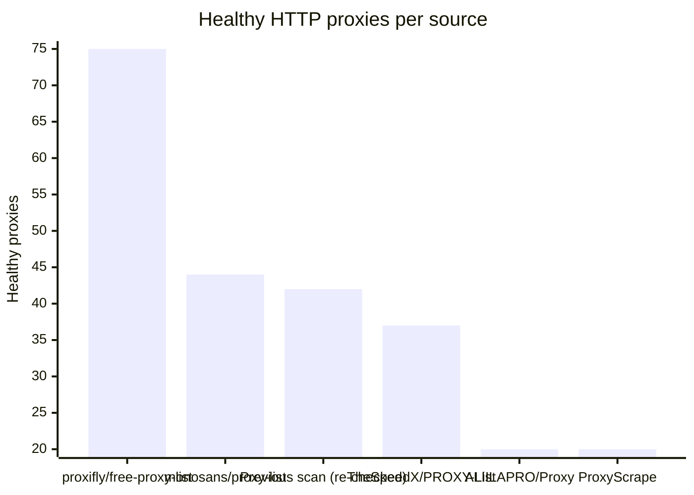
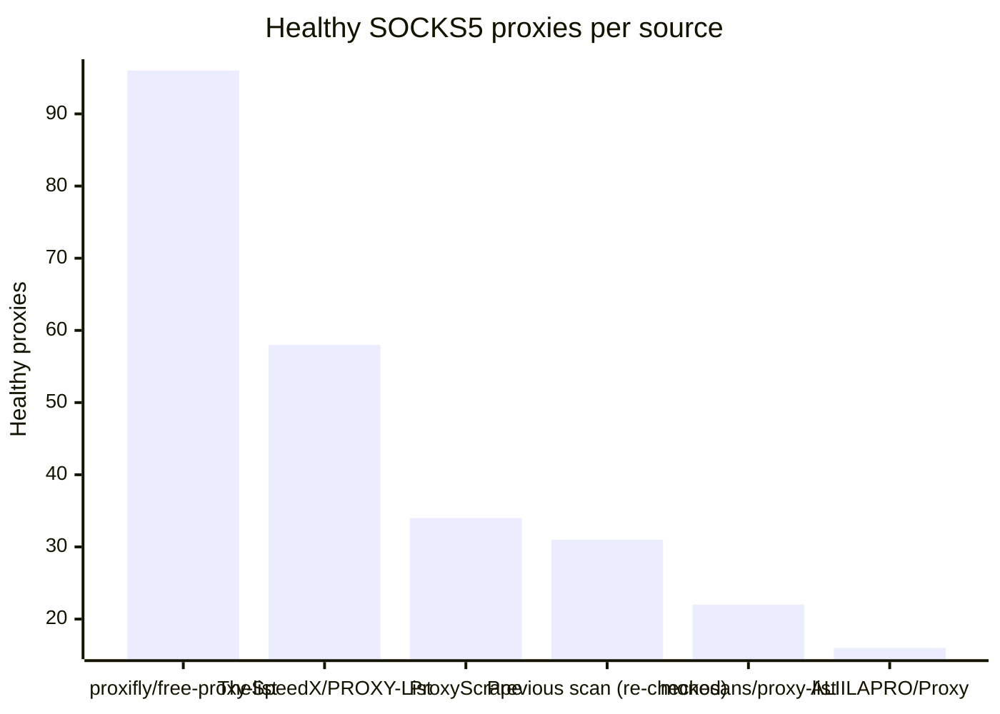

# Proxy Configs

<!-- dynamic timestamp placeholders for workflow sed script -->
channel_stats_chart.svg?v=1792303478
performance_report.html?v=1792303478

### Performance Chart

### Performance Report
[View Report](assets/performance_report.html?v=1792303478)

## HTTP

<!-- STATS:HTTP:START -->

_Last updated: 2026-10-18 00:20 UTC_

```mermaid
xychart-beta
    title "Healthy HTTP proxies per source"
    x-axis ["proxifly/free-proxy-list", "monosans/proxy-list", "Previous scan (re-checked)", "TheSpeedX/PROXY-List", "ALIILAPRO/Proxy", "ProxyScrape"]
    y-axis "Healthy proxies"
    bar [75, 44, 42, 37, 20, 20]
```

| Source | Healthy proxies |
|---|---|
| proxifly/free-proxy-list | 75 |
| monosans/proxy-list | 44 |
| Previous scan (re-checked) | 42 |
| TheSpeedX/PROXY-List | 37 |
| ALIILAPRO/Proxy | 20 |
| ProxyScrape | 20 |
| **Total unique** | **238** |

<!-- STATS:HTTP:END -->

## SOCKS5

<!-- STATS:SOCKS5:START -->

_Last updated: 2026-10-18 00:20 UTC_

```mermaid
xychart-beta
    title "Healthy SOCKS5 proxies per source"
    x-axis ["proxifly/free-proxy-list", "TheSpeedX/PROXY-List", "ProxyScrape", "Previous scan (re-checked)", "monosans/proxy-list", "ALIILAPRO/Proxy"]
    y-axis "Healthy proxies"
    bar [96, 58, 34, 31, 22, 16]
```

| Source | Healthy proxies |
|---|---|
| proxifly/free-proxy-list | 96 |
| TheSpeedX/PROXY-List | 58 |
| ProxyScrape | 34 |
| Previous scan (re-checked) | 31 |
| monosans/proxy-list | 22 |
| ALIILAPRO/Proxy | 16 |
| **Total unique** | **257** |

<!-- STATS:SOCKS5:END -->
