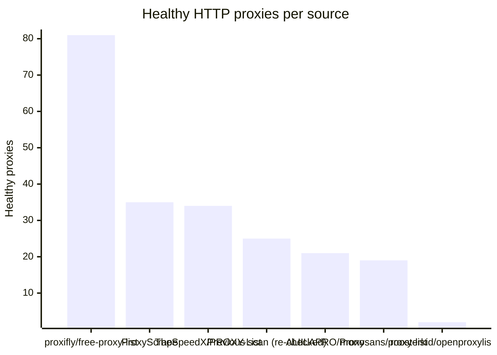
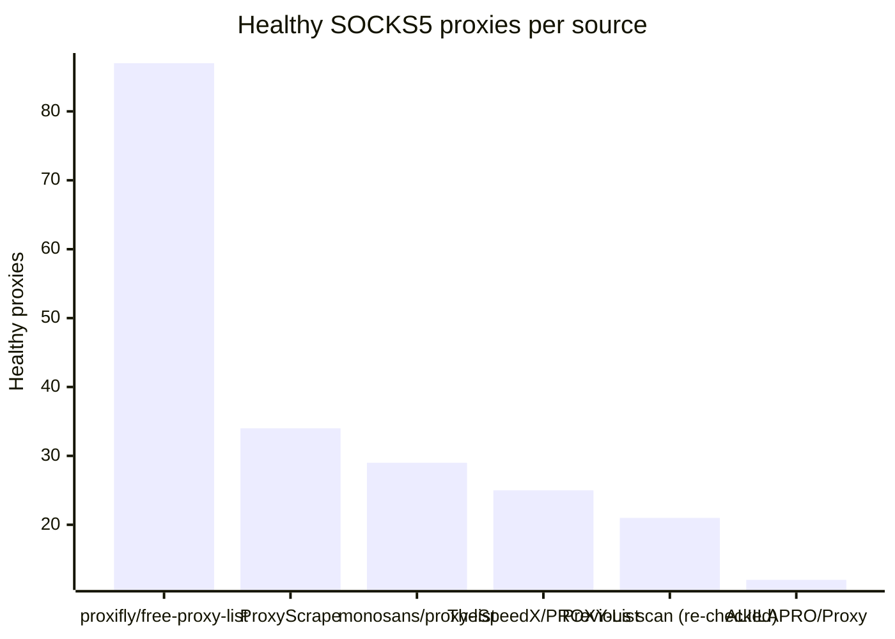

# Proxy Configs

<!-- dynamic timestamp placeholders for workflow sed script -->
channel_stats_chart.svg?v=1791979356
performance_report.html?v=1791979356

### Performance Chart

### Performance Report
[View Report](assets/performance_report.html?v=1791979356)

## HTTP

<!-- STATS:HTTP:START -->

_Last updated: 2026-10-14 06:21 UTC_

```mermaid
xychart-beta
    title "Healthy HTTP proxies per source"
    x-axis ["proxifly/free-proxy-list", "ProxyScrape", "TheSpeedX/PROXY-List", "Previous scan (re-checked)", "ALIILAPRO/Proxy", "monosans/proxy-list", "roosterkid/openproxylist"]
    y-axis "Healthy proxies"
    bar [81, 35, 34, 25, 21, 19, 2]
```

| Source | Healthy proxies |
|---|---|
| proxifly/free-proxy-list | 81 |
| ProxyScrape | 35 |
| TheSpeedX/PROXY-List | 34 |
| Previous scan (re-checked) | 25 |
| ALIILAPRO/Proxy | 21 |
| monosans/proxy-list | 19 |
| roosterkid/openproxylist | 2 |
| **Total unique** | **217** |

<!-- STATS:HTTP:END -->

## SOCKS5

<!-- STATS:SOCKS5:START -->

_Last updated: 2026-10-14 06:21 UTC_

```mermaid
xychart-beta
    title "Healthy SOCKS5 proxies per source"
    x-axis ["proxifly/free-proxy-list", "ProxyScrape", "monosans/proxy-list", "TheSpeedX/PROXY-List", "Previous scan (re-checked)", "ALIILAPRO/Proxy"]
    y-axis "Healthy proxies"
    bar [87, 34, 29, 25, 21, 12]
```

| Source | Healthy proxies |
|---|---|
| proxifly/free-proxy-list | 87 |
| ProxyScrape | 34 |
| monosans/proxy-list | 29 |
| TheSpeedX/PROXY-List | 25 |
| Previous scan (re-checked) | 21 |
| ALIILAPRO/Proxy | 12 |
| **Total unique** | **208** |

<!-- STATS:SOCKS5:END -->
