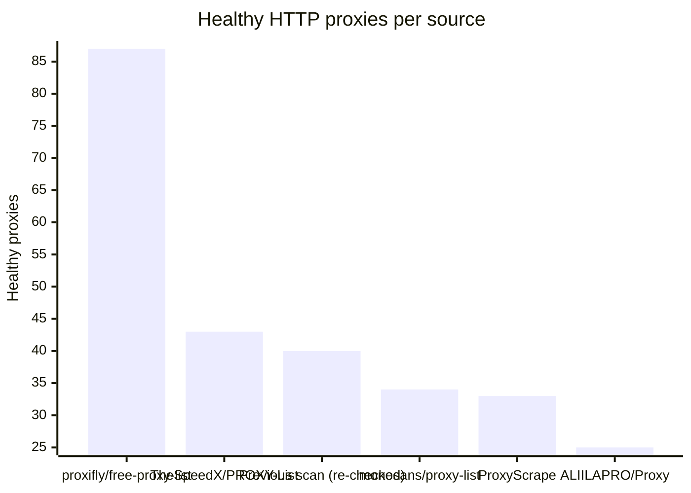
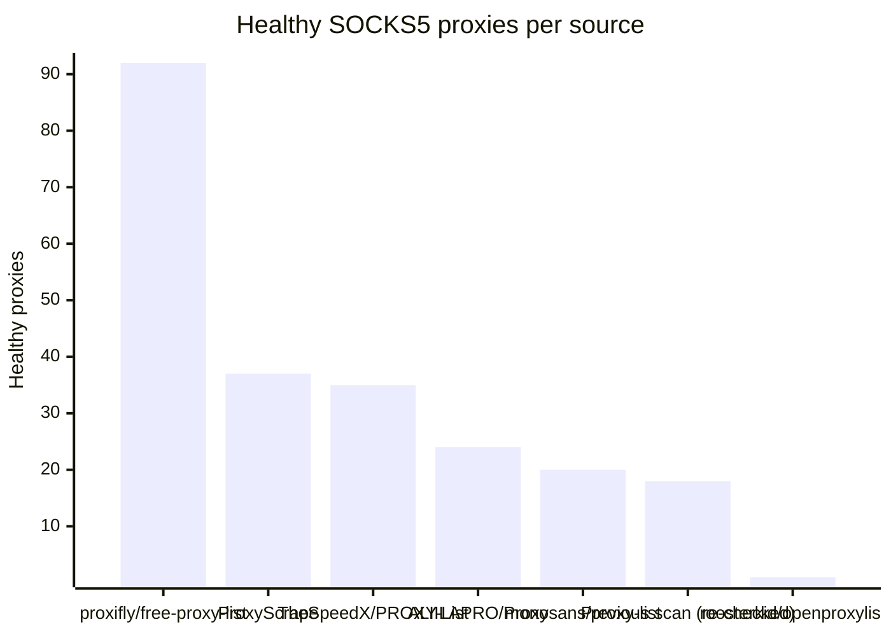

# Proxy Configs

<!-- dynamic timestamp placeholders for workflow sed script -->
channel_stats_chart.svg?v=1792800195
performance_report.html?v=1792800195

### Performance Chart

### Performance Report
[View Report](assets/performance_report.html?v=1792800195)

## HTTP

<!-- STATS:HTTP:START -->

_Last updated: 2026-10-23 18:22 UTC_

```mermaid
xychart-beta
    title "Healthy HTTP proxies per source"
    x-axis ["proxifly/free-proxy-list", "TheSpeedX/PROXY-List", "Previous scan (re-checked)", "monosans/proxy-list", "ProxyScrape", "ALIILAPRO/Proxy"]
    y-axis "Healthy proxies"
    bar [87, 43, 40, 34, 33, 25]
```

| Source | Healthy proxies |
|---|---|
| proxifly/free-proxy-list | 87 |
| TheSpeedX/PROXY-List | 43 |
| Previous scan (re-checked) | 40 |
| monosans/proxy-list | 34 |
| ProxyScrape | 33 |
| ALIILAPRO/Proxy | 25 |
| **Total unique** | **262** |

<!-- STATS:HTTP:END -->

## SOCKS5

<!-- STATS:SOCKS5:START -->

_Last updated: 2026-10-23 18:22 UTC_

```mermaid
xychart-beta
    title "Healthy SOCKS5 proxies per source"
    x-axis ["proxifly/free-proxy-list", "ProxyScrape", "TheSpeedX/PROXY-List", "ALIILAPRO/Proxy", "monosans/proxy-list", "Previous scan (re-checked)", "roosterkid/openproxylist"]
    y-axis "Healthy proxies"
    bar [92, 37, 35, 24, 20, 18, 1]
```

| Source | Healthy proxies |
|---|---|
| proxifly/free-proxy-list | 92 |
| ProxyScrape | 37 |
| TheSpeedX/PROXY-List | 35 |
| ALIILAPRO/Proxy | 24 |
| monosans/proxy-list | 20 |
| Previous scan (re-checked) | 18 |
| roosterkid/openproxylist | 1 |
| **Total unique** | **227** |

<!-- STATS:SOCKS5:END -->
