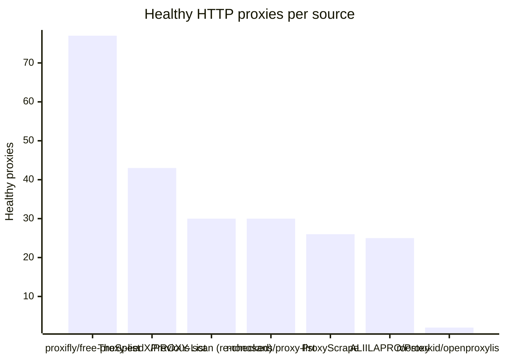
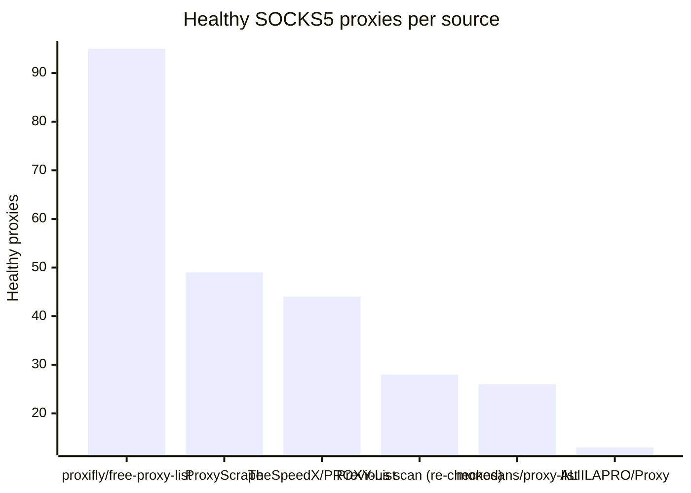

# Proxy Configs

<!-- dynamic timestamp placeholders for workflow sed script -->
channel_stats_chart.svg?v=1791806588
performance_report.html?v=1791806588

### Performance Chart

### Performance Report
[View Report](assets/performance_report.html?v=1791806588)

## HTTP

<!-- STATS:HTTP:START -->

_Last updated: 2026-10-12 06:22 UTC_

```mermaid
xychart-beta
    title "Healthy HTTP proxies per source"
    x-axis ["proxifly/free-proxy-list", "TheSpeedX/PROXY-List", "Previous scan (re-checked)", "monosans/proxy-list", "ProxyScrape", "ALIILAPRO/Proxy", "roosterkid/openproxylist"]
    y-axis "Healthy proxies"
    bar [77, 43, 30, 30, 26, 25, 2]
```

| Source | Healthy proxies |
|---|---|
| proxifly/free-proxy-list | 77 |
| TheSpeedX/PROXY-List | 43 |
| Previous scan (re-checked) | 30 |
| monosans/proxy-list | 30 |
| ProxyScrape | 26 |
| ALIILAPRO/Proxy | 25 |
| roosterkid/openproxylist | 2 |
| **Total unique** | **233** |

<!-- STATS:HTTP:END -->

## SOCKS5

<!-- STATS:SOCKS5:START -->

_Last updated: 2026-10-12 06:22 UTC_

```mermaid
xychart-beta
    title "Healthy SOCKS5 proxies per source"
    x-axis ["proxifly/free-proxy-list", "ProxyScrape", "TheSpeedX/PROXY-List", "Previous scan (re-checked)", "monosans/proxy-list", "ALIILAPRO/Proxy"]
    y-axis "Healthy proxies"
    bar [95, 49, 44, 28, 26, 13]
```

| Source | Healthy proxies |
|---|---|
| proxifly/free-proxy-list | 95 |
| ProxyScrape | 49 |
| TheSpeedX/PROXY-List | 44 |
| Previous scan (re-checked) | 28 |
| monosans/proxy-list | 26 |
| ALIILAPRO/Proxy | 13 |
| **Total unique** | **255** |

<!-- STATS:SOCKS5:END -->
