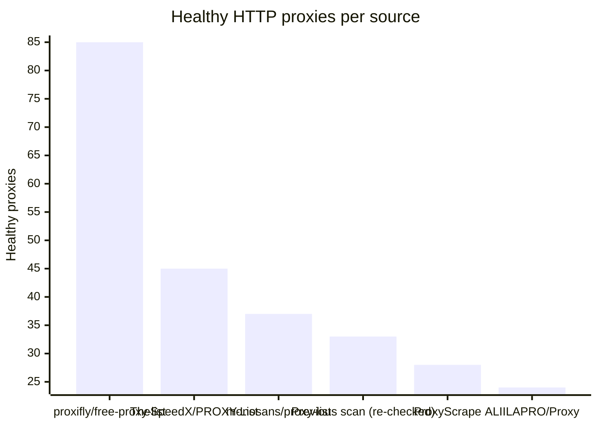
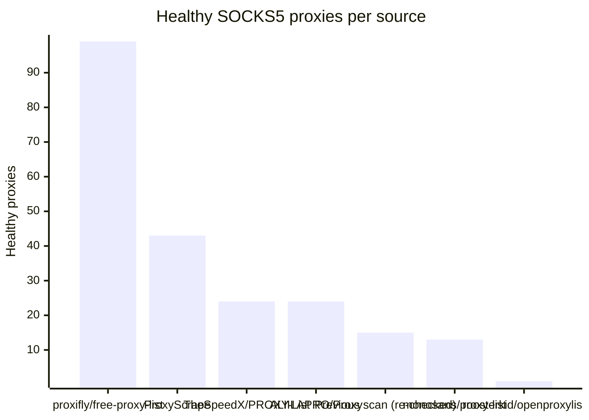

# Proxy Configs

<!-- dynamic timestamp placeholders for workflow sed script -->
channel_stats_chart.svg?v=1792865017
performance_report.html?v=1792865017

### Performance Chart

### Performance Report
[View Report](assets/performance_report.html?v=1792865017)

## HTTP

<!-- STATS:HTTP:START -->

_Last updated: 2026-10-24 12:22 UTC_

```mermaid
xychart-beta
    title "Healthy HTTP proxies per source"
    x-axis ["proxifly/free-proxy-list", "TheSpeedX/PROXY-List", "monosans/proxy-list", "Previous scan (re-checked)", "ProxyScrape", "ALIILAPRO/Proxy"]
    y-axis "Healthy proxies"
    bar [85, 45, 37, 33, 28, 24]
```

| Source | Healthy proxies |
|---|---|
| proxifly/free-proxy-list | 85 |
| TheSpeedX/PROXY-List | 45 |
| monosans/proxy-list | 37 |
| Previous scan (re-checked) | 33 |
| ProxyScrape | 28 |
| ALIILAPRO/Proxy | 24 |
| **Total unique** | **252** |

<!-- STATS:HTTP:END -->

## SOCKS5

<!-- STATS:SOCKS5:START -->

_Last updated: 2026-10-24 12:22 UTC_

```mermaid
xychart-beta
    title "Healthy SOCKS5 proxies per source"
    x-axis ["proxifly/free-proxy-list", "ProxyScrape", "TheSpeedX/PROXY-List", "ALIILAPRO/Proxy", "Previous scan (re-checked)", "monosans/proxy-list", "roosterkid/openproxylist"]
    y-axis "Healthy proxies"
    bar [99, 43, 24, 24, 15, 13, 1]
```

| Source | Healthy proxies |
|---|---|
| proxifly/free-proxy-list | 99 |
| ProxyScrape | 43 |
| TheSpeedX/PROXY-List | 24 |
| ALIILAPRO/Proxy | 24 |
| Previous scan (re-checked) | 15 |
| monosans/proxy-list | 13 |
| roosterkid/openproxylist | 1 |
| **Total unique** | **219** |

<!-- STATS:SOCKS5:END -->
