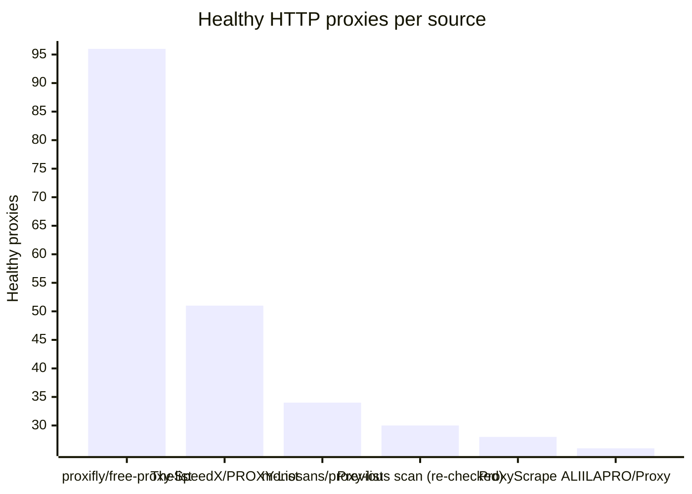
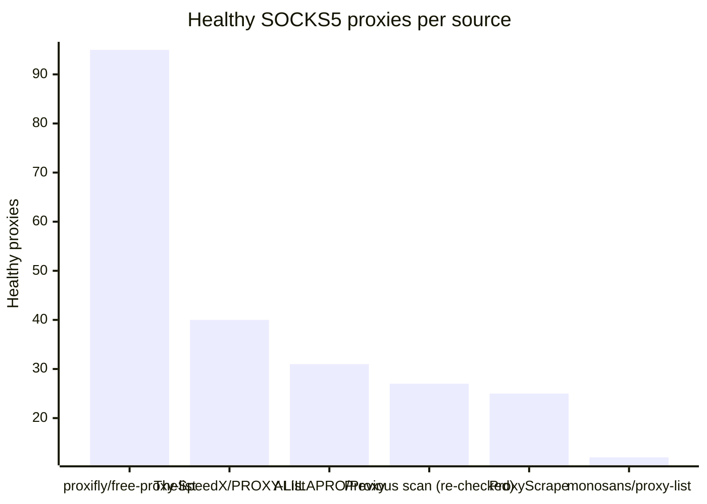

# Proxy Configs

<!-- dynamic timestamp placeholders for workflow sed script -->
channel_stats_chart.svg?v=1792541056
performance_report.html?v=1792541056

### Performance Chart

### Performance Report
[View Report](assets/performance_report.html?v=1792541056)

## HTTP

<!-- STATS:HTTP:START -->

_Last updated: 2026-10-20 18:21 UTC_

```mermaid
xychart-beta
    title "Healthy HTTP proxies per source"
    x-axis ["proxifly/free-proxy-list", "TheSpeedX/PROXY-List", "monosans/proxy-list", "Previous scan (re-checked)", "ProxyScrape", "ALIILAPRO/Proxy"]
    y-axis "Healthy proxies"
    bar [96, 51, 34, 30, 28, 26]
```

| Source | Healthy proxies |
|---|---|
| proxifly/free-proxy-list | 96 |
| TheSpeedX/PROXY-List | 51 |
| monosans/proxy-list | 34 |
| Previous scan (re-checked) | 30 |
| ProxyScrape | 28 |
| ALIILAPRO/Proxy | 26 |
| **Total unique** | **265** |

<!-- STATS:HTTP:END -->

## SOCKS5

<!-- STATS:SOCKS5:START -->

_Last updated: 2026-10-20 18:21 UTC_

```mermaid
xychart-beta
    title "Healthy SOCKS5 proxies per source"
    x-axis ["proxifly/free-proxy-list", "TheSpeedX/PROXY-List", "ALIILAPRO/Proxy", "Previous scan (re-checked)", "ProxyScrape", "monosans/proxy-list"]
    y-axis "Healthy proxies"
    bar [95, 40, 31, 27, 25, 12]
```

| Source | Healthy proxies |
|---|---|
| proxifly/free-proxy-list | 95 |
| TheSpeedX/PROXY-List | 40 |
| ALIILAPRO/Proxy | 31 |
| Previous scan (re-checked) | 27 |
| ProxyScrape | 25 |
| monosans/proxy-list | 12 |
| **Total unique** | **230** |

<!-- STATS:SOCKS5:END -->
