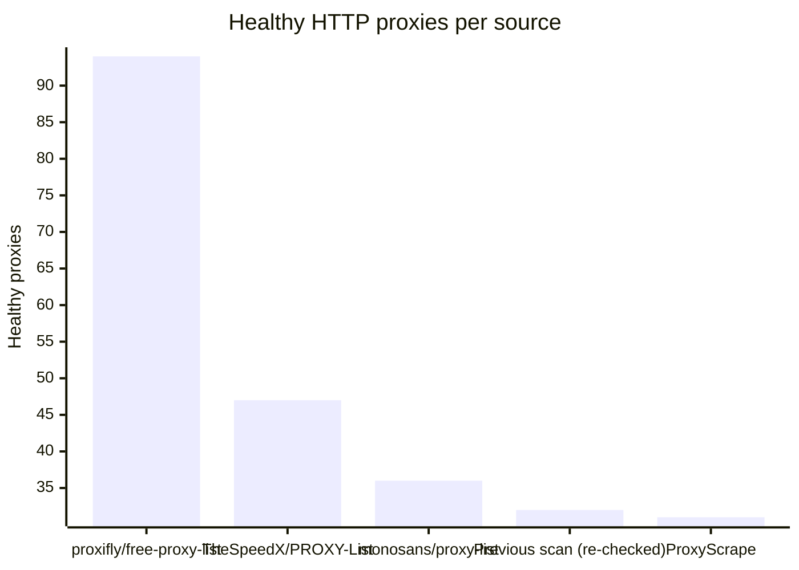
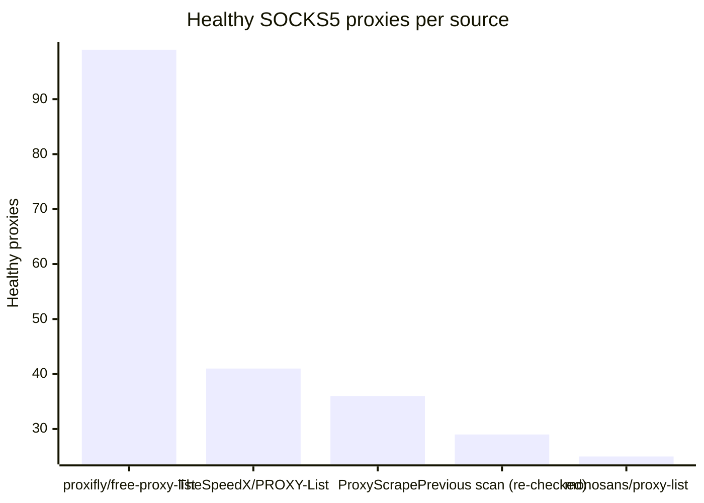

# Proxy Configs

<!-- dynamic timestamp placeholders for workflow sed script -->
channel_stats_chart.svg?v=1792324902
performance_report.html?v=1792324902

### Performance Chart

### Performance Report
[View Report](assets/performance_report.html?v=1792324902)

## HTTP

<!-- STATS:HTTP:START -->

_Last updated: 2026-10-18 06:23 UTC_

```mermaid
xychart-beta
    title "Healthy HTTP proxies per source"
    x-axis ["proxifly/free-proxy-list", "TheSpeedX/PROXY-List", "monosans/proxy-list", "Previous scan (re-checked)", "ProxyScrape"]
    y-axis "Healthy proxies"
    bar [94, 47, 36, 32, 31]
```

| Source | Healthy proxies |
|---|---|
| proxifly/free-proxy-list | 94 |
| TheSpeedX/PROXY-List | 47 |
| monosans/proxy-list | 36 |
| Previous scan (re-checked) | 32 |
| ProxyScrape | 31 |
| **Total unique** | **240** |

<!-- STATS:HTTP:END -->

## SOCKS5

<!-- STATS:SOCKS5:START -->

_Last updated: 2026-10-18 06:23 UTC_

```mermaid
xychart-beta
    title "Healthy SOCKS5 proxies per source"
    x-axis ["proxifly/free-proxy-list", "TheSpeedX/PROXY-List", "ProxyScrape", "Previous scan (re-checked)", "monosans/proxy-list"]
    y-axis "Healthy proxies"
    bar [99, 41, 36, 29, 25]
```

| Source | Healthy proxies |
|---|---|
| proxifly/free-proxy-list | 99 |
| TheSpeedX/PROXY-List | 41 |
| ProxyScrape | 36 |
| Previous scan (re-checked) | 29 |
| monosans/proxy-list | 25 |
| **Total unique** | **230** |

<!-- STATS:SOCKS5:END -->
