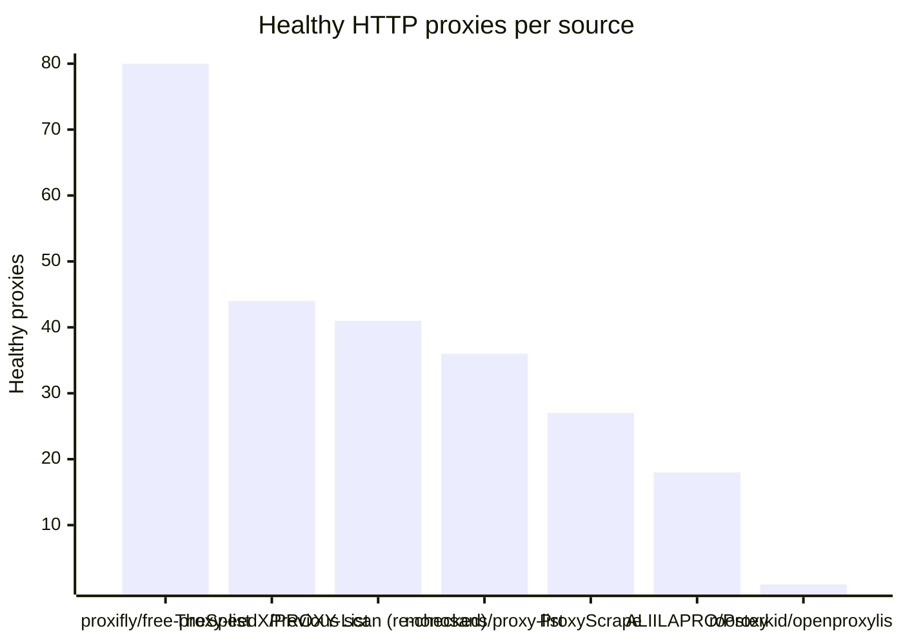
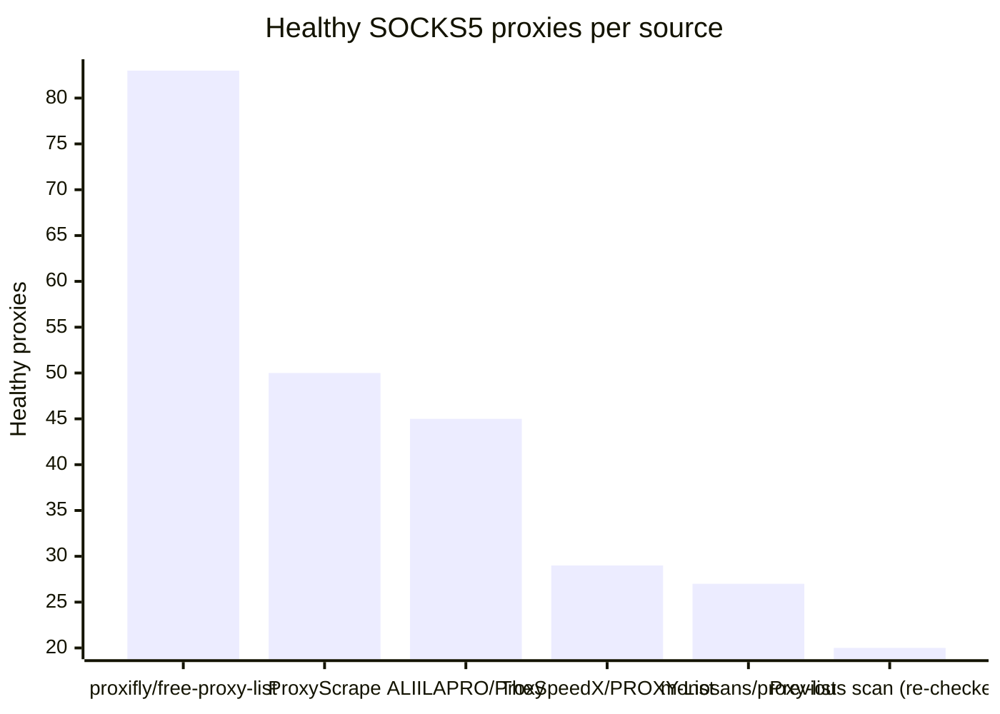

# Proxy Configs

<!-- dynamic timestamp placeholders for workflow sed script -->
channel_stats_chart.svg?v=1791309724
performance_report.html?v=1791309724

### Performance Chart

### Performance Report
[View Report](assets/performance_report.html?v=1791309724)

## HTTP

<!-- STATS:HTTP:START -->

_Last updated: 2026-10-17 06:22 UTC_

```mermaid
xychart-beta
    title "Healthy HTTP proxies per source"
    x-axis ["proxifly/free-proxy-list", "TheSpeedX/PROXY-List", "Previous scan (re-checked)", "monosans/proxy-list", "ProxyScrape", "ALIILAPRO/Proxy", "roosterkid/openproxylist"]
    y-axis "Healthy proxies"
    bar [80, 44, 41, 36, 27, 18, 1]
```

| Source | Healthy proxies |
|---|---|
| proxifly/free-proxy-list | 80 |
| TheSpeedX/PROXY-List | 44 |
| Previous scan (re-checked) | 41 |
| monosans/proxy-list | 36 |
| ProxyScrape | 27 |
| ALIILAPRO/Proxy | 18 |
| roosterkid/openproxylist | 1 |
| **Total unique** | **247** |

<!-- STATS:HTTP:END -->

## SOCKS5

<!-- STATS:SOCKS5:START -->

_Last updated: 2026-10-17 06:22 UTC_

```mermaid
xychart-beta
    title "Healthy SOCKS5 proxies per source"
    x-axis ["proxifly/free-proxy-list", "ProxyScrape", "ALIILAPRO/Proxy", "TheSpeedX/PROXY-List", "monosans/proxy-list", "Previous scan (re-checked)"]
    y-axis "Healthy proxies"
    bar [83, 50, 45, 29, 27, 20]
```

| Source | Healthy proxies |
|---|---|
| proxifly/free-proxy-list | 83 |
| ProxyScrape | 50 |
| ALIILAPRO/Proxy | 45 |
| TheSpeedX/PROXY-List | 29 |
| monosans/proxy-list | 27 |
| Previous scan (re-checked) | 20 |
| **Total unique** | **254** |

<!-- STATS:SOCKS5:END -->
