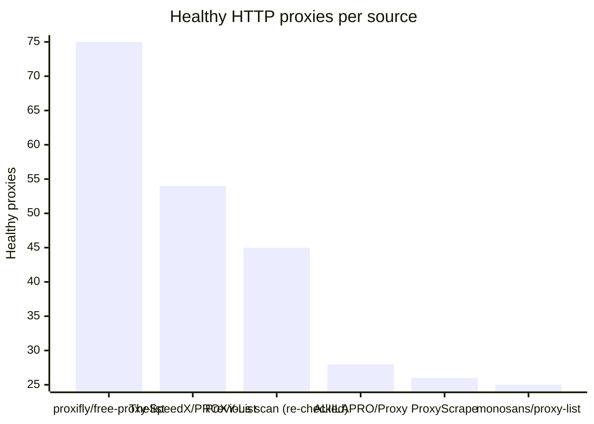
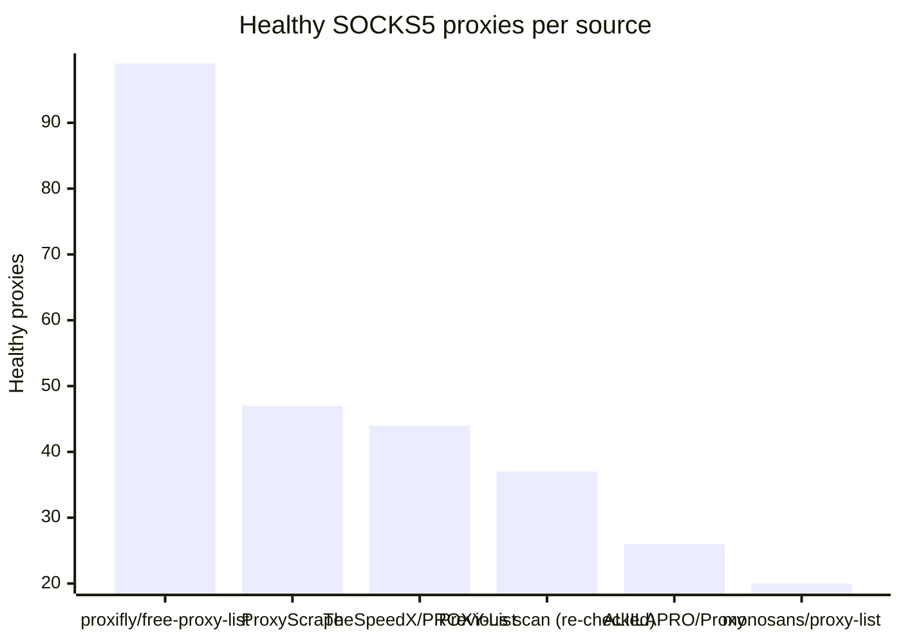

# Proxy Configs

<!-- dynamic timestamp placeholders for workflow sed script -->
channel_stats_chart.svg?v=1791309724
performance_report.html?v=1791309724

### Performance Chart

### Performance Report
[View Report](assets/performance_report.html?v=1791309724)

## HTTP

<!-- STATS:HTTP:START -->

_Last updated: 2026-10-11 12:21 UTC_

```mermaid
xychart-beta
    title "Healthy HTTP proxies per source"
    x-axis ["proxifly/free-proxy-list", "TheSpeedX/PROXY-List", "Previous scan (re-checked)", "ALIILAPRO/Proxy", "ProxyScrape", "monosans/proxy-list"]
    y-axis "Healthy proxies"
    bar [75, 54, 45, 28, 26, 25]
```

| Source | Healthy proxies |
|---|---|
| proxifly/free-proxy-list | 75 |
| TheSpeedX/PROXY-List | 54 |
| Previous scan (re-checked) | 45 |
| ALIILAPRO/Proxy | 28 |
| ProxyScrape | 26 |
| monosans/proxy-list | 25 |
| **Total unique** | **253** |

<!-- STATS:HTTP:END -->

## SOCKS5

<!-- STATS:SOCKS5:START -->

_Last updated: 2026-10-11 12:21 UTC_

```mermaid
xychart-beta
    title "Healthy SOCKS5 proxies per source"
    x-axis ["proxifly/free-proxy-list", "ProxyScrape", "TheSpeedX/PROXY-List", "Previous scan (re-checked)", "ALIILAPRO/Proxy", "monosans/proxy-list"]
    y-axis "Healthy proxies"
    bar [99, 47, 44, 37, 26, 20]
```

| Source | Healthy proxies |
|---|---|
| proxifly/free-proxy-list | 99 |
| ProxyScrape | 47 |
| TheSpeedX/PROXY-List | 44 |
| Previous scan (re-checked) | 37 |
| ALIILAPRO/Proxy | 26 |
| monosans/proxy-list | 20 |
| **Total unique** | **273** |

<!-- STATS:SOCKS5:END -->
