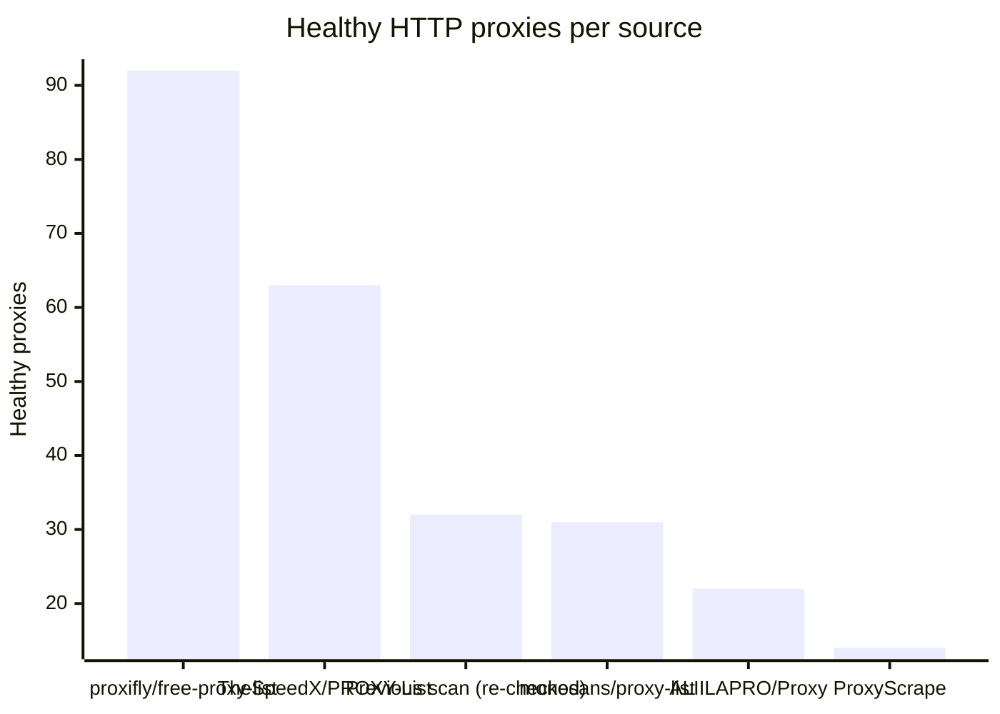
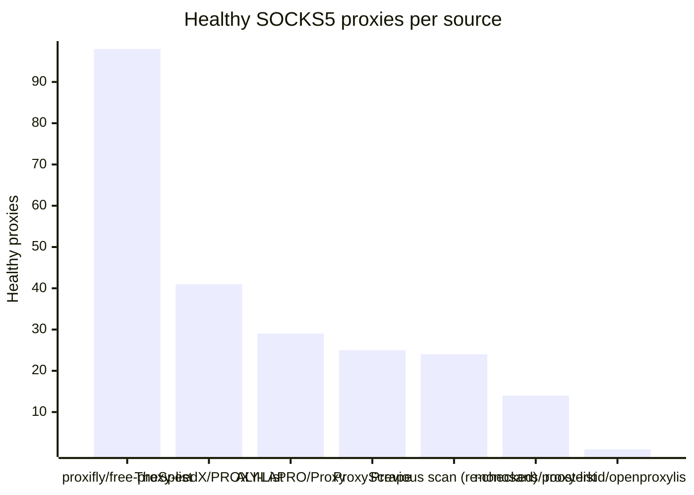

# Proxy Configs

<!-- dynamic timestamp placeholders for workflow sed script -->
channel_stats_chart.svg?v=1793059392
performance_report.html?v=1793059392

### Performance Chart

### Performance Report
[View Report](assets/performance_report.html?v=1793059392)

## HTTP

<!-- STATS:HTTP:START -->

_Last updated: 2026-10-26 18:22 UTC_

```mermaid
xychart-beta
    title "Healthy HTTP proxies per source"
    x-axis ["proxifly/free-proxy-list", "TheSpeedX/PROXY-List", "Previous scan (re-checked)", "monosans/proxy-list", "ALIILAPRO/Proxy", "ProxyScrape"]
    y-axis "Healthy proxies"
    bar [92, 63, 32, 31, 22, 14]
```

| Source | Healthy proxies |
|---|---|
| proxifly/free-proxy-list | 92 |
| TheSpeedX/PROXY-List | 63 |
| Previous scan (re-checked) | 32 |
| monosans/proxy-list | 31 |
| ALIILAPRO/Proxy | 22 |
| ProxyScrape | 14 |
| **Total unique** | **254** |

<!-- STATS:HTTP:END -->

## SOCKS5

<!-- STATS:SOCKS5:START -->

_Last updated: 2026-10-26 18:22 UTC_

```mermaid
xychart-beta
    title "Healthy SOCKS5 proxies per source"
    x-axis ["proxifly/free-proxy-list", "TheSpeedX/PROXY-List", "ALIILAPRO/Proxy", "ProxyScrape", "Previous scan (re-checked)", "monosans/proxy-list", "roosterkid/openproxylist"]
    y-axis "Healthy proxies"
    bar [98, 41, 29, 25, 24, 14, 1]
```

| Source | Healthy proxies |
|---|---|
| proxifly/free-proxy-list | 98 |
| TheSpeedX/PROXY-List | 41 |
| ALIILAPRO/Proxy | 29 |
| ProxyScrape | 25 |
| Previous scan (re-checked) | 24 |
| monosans/proxy-list | 14 |
| roosterkid/openproxylist | 1 |
| **Total unique** | **232** |

<!-- STATS:SOCKS5:END -->
