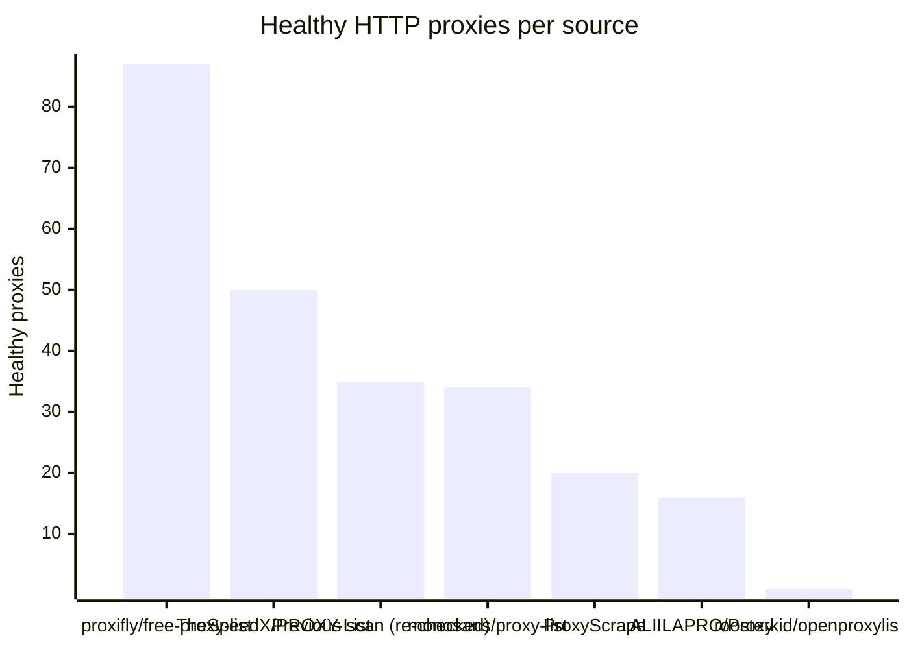
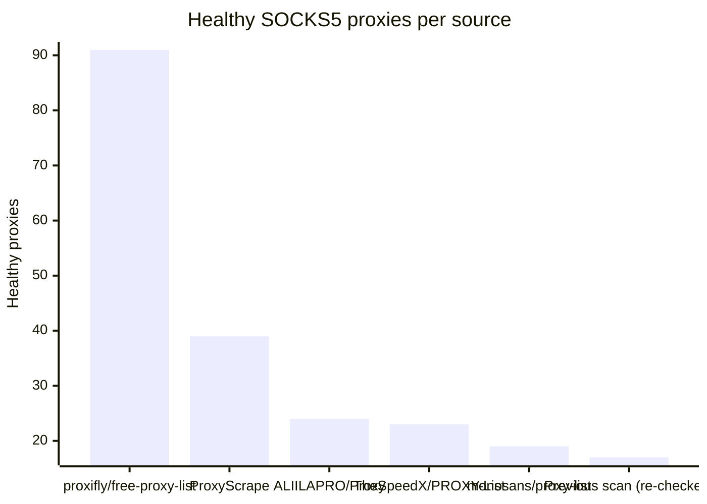

# Proxy Configs

<!-- dynamic timestamp placeholders for workflow sed script -->
channel_stats_chart.svg?v=1792087533
performance_report.html?v=1792087533

### Performance Chart

### Performance Report
[View Report](assets/performance_report.html?v=1792087533)

## HTTP

<!-- STATS:HTTP:START -->

_Last updated: 2026-10-15 12:24 UTC_

```mermaid
xychart-beta
    title "Healthy HTTP proxies per source"
    x-axis ["proxifly/free-proxy-list", "TheSpeedX/PROXY-List", "Previous scan (re-checked)", "monosans/proxy-list", "ProxyScrape", "ALIILAPRO/Proxy", "roosterkid/openproxylist"]
    y-axis "Healthy proxies"
    bar [87, 50, 35, 34, 20, 16, 1]
```

| Source | Healthy proxies |
|---|---|
| proxifly/free-proxy-list | 87 |
| TheSpeedX/PROXY-List | 50 |
| Previous scan (re-checked) | 35 |
| monosans/proxy-list | 34 |
| ProxyScrape | 20 |
| ALIILAPRO/Proxy | 16 |
| roosterkid/openproxylist | 1 |
| **Total unique** | **243** |

<!-- STATS:HTTP:END -->

## SOCKS5

<!-- STATS:SOCKS5:START -->

_Last updated: 2026-10-15 12:24 UTC_

```mermaid
xychart-beta
    title "Healthy SOCKS5 proxies per source"
    x-axis ["proxifly/free-proxy-list", "ProxyScrape", "ALIILAPRO/Proxy", "TheSpeedX/PROXY-List", "monosans/proxy-list", "Previous scan (re-checked)"]
    y-axis "Healthy proxies"
    bar [91, 39, 24, 23, 19, 17]
```

| Source | Healthy proxies |
|---|---|
| proxifly/free-proxy-list | 91 |
| ProxyScrape | 39 |
| ALIILAPRO/Proxy | 24 |
| TheSpeedX/PROXY-List | 23 |
| monosans/proxy-list | 19 |
| Previous scan (re-checked) | 17 |
| **Total unique** | **213** |

<!-- STATS:SOCKS5:END -->
