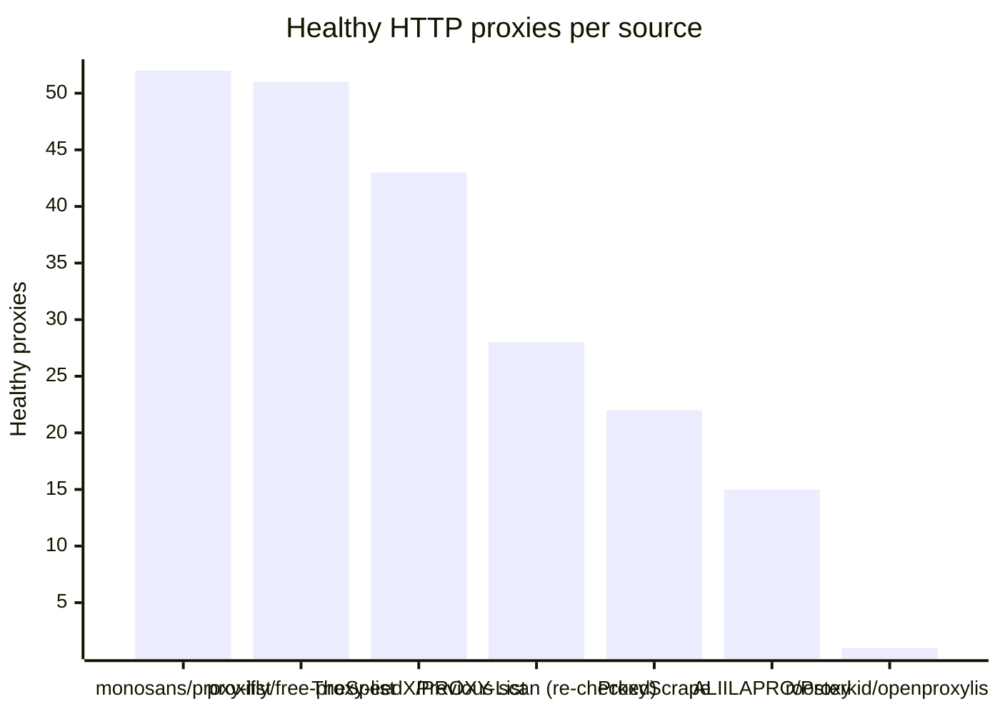
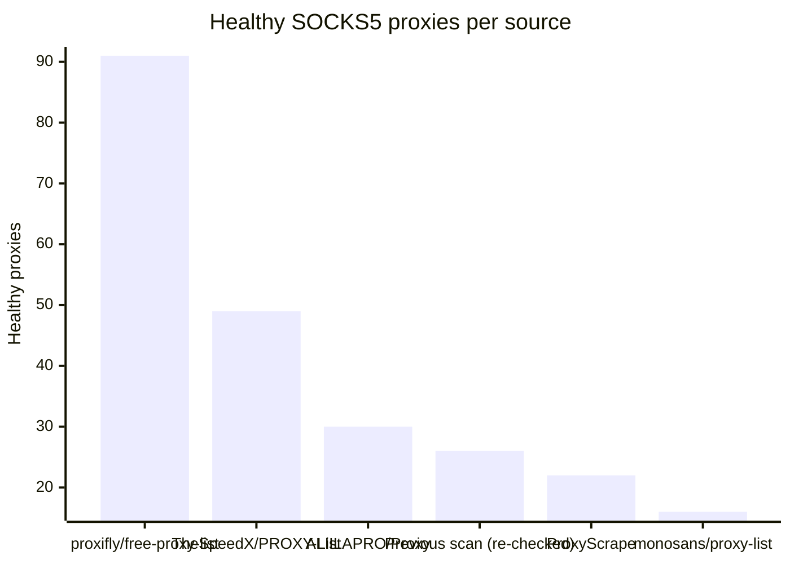

# Proxy Configs

<!-- dynamic timestamp placeholders for workflow sed script -->
channel_stats_chart.svg?v=1791309724
performance_report.html?v=1791309724

### Performance Chart

### Performance Report
[View Report](assets/performance_report.html?v=1791309724)

## HTTP

<!-- STATS:HTTP:START -->

_Last updated: 2026-10-24 00:23 UTC_

```mermaid
xychart-beta
    title "Healthy HTTP proxies per source"
    x-axis ["monosans/proxy-list", "proxifly/free-proxy-list", "TheSpeedX/PROXY-List", "Previous scan (re-checked)", "ProxyScrape", "ALIILAPRO/Proxy", "roosterkid/openproxylist"]
    y-axis "Healthy proxies"
    bar [52, 51, 43, 28, 22, 15, 1]
```

| Source | Healthy proxies |
|---|---|
| monosans/proxy-list | 52 |
| proxifly/free-proxy-list | 51 |
| TheSpeedX/PROXY-List | 43 |
| Previous scan (re-checked) | 28 |
| ProxyScrape | 22 |
| ALIILAPRO/Proxy | 15 |
| roosterkid/openproxylist | 1 |
| **Total unique** | **212** |

<!-- STATS:HTTP:END -->

## SOCKS5

<!-- STATS:SOCKS5:START -->

_Last updated: 2026-10-24 00:23 UTC_

```mermaid
xychart-beta
    title "Healthy SOCKS5 proxies per source"
    x-axis ["proxifly/free-proxy-list", "TheSpeedX/PROXY-List", "ALIILAPRO/Proxy", "Previous scan (re-checked)", "ProxyScrape", "monosans/proxy-list"]
    y-axis "Healthy proxies"
    bar [91, 49, 30, 26, 22, 16]
```

| Source | Healthy proxies |
|---|---|
| proxifly/free-proxy-list | 91 |
| TheSpeedX/PROXY-List | 49 |
| ALIILAPRO/Proxy | 30 |
| Previous scan (re-checked) | 26 |
| ProxyScrape | 22 |
| monosans/proxy-list | 16 |
| **Total unique** | **234** |

<!-- STATS:SOCKS5:END -->
