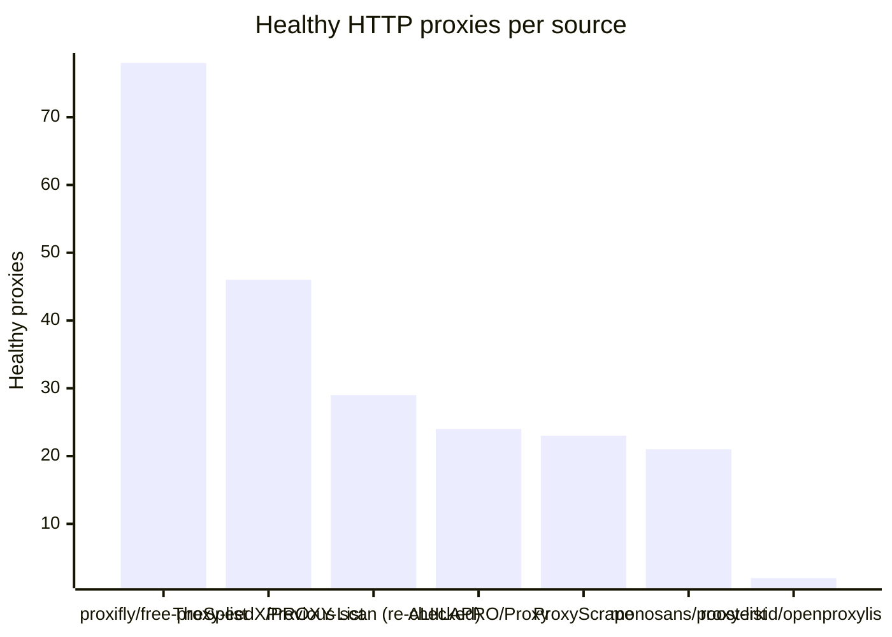
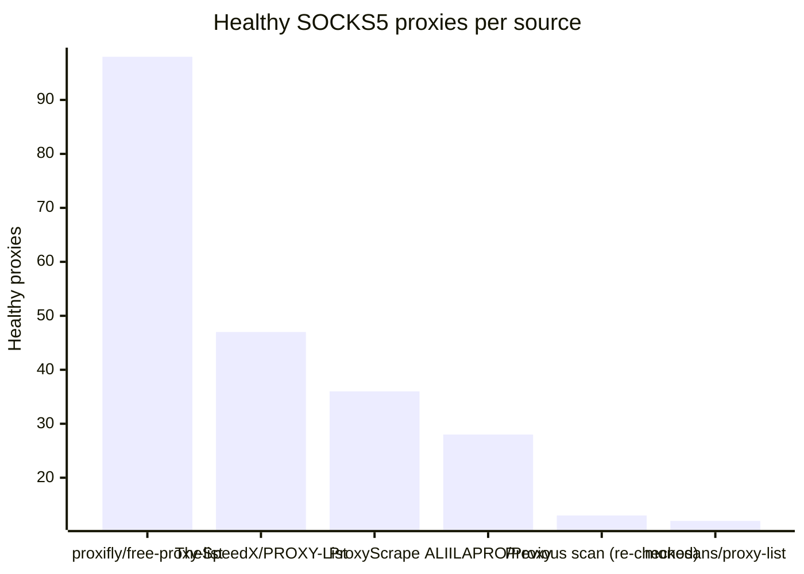

# Proxy Configs

<!-- dynamic timestamp placeholders for workflow sed script -->
channel_stats_chart.svg?v=1793318497
performance_report.html?v=1793318497

### Performance Chart

### Performance Report
[View Report](assets/performance_report.html?v=1793318497)

## HTTP

<!-- STATS:HTTP:START -->

_Last updated: 2026-10-29 18:22 UTC_

```mermaid
xychart-beta
    title "Healthy HTTP proxies per source"
    x-axis ["proxifly/free-proxy-list", "TheSpeedX/PROXY-List", "Previous scan (re-checked)", "ALIILAPRO/Proxy", "ProxyScrape", "monosans/proxy-list", "roosterkid/openproxylist"]
    y-axis "Healthy proxies"
    bar [78, 46, 29, 24, 23, 21, 2]
```

| Source | Healthy proxies |
|---|---|
| proxifly/free-proxy-list | 78 |
| TheSpeedX/PROXY-List | 46 |
| Previous scan (re-checked) | 29 |
| ALIILAPRO/Proxy | 24 |
| ProxyScrape | 23 |
| monosans/proxy-list | 21 |
| roosterkid/openproxylist | 2 |
| **Total unique** | **223** |

<!-- STATS:HTTP:END -->

## SOCKS5

<!-- STATS:SOCKS5:START -->

_Last updated: 2026-10-29 18:22 UTC_

```mermaid
xychart-beta
    title "Healthy SOCKS5 proxies per source"
    x-axis ["proxifly/free-proxy-list", "TheSpeedX/PROXY-List", "ProxyScrape", "ALIILAPRO/Proxy", "Previous scan (re-checked)", "monosans/proxy-list"]
    y-axis "Healthy proxies"
    bar [98, 47, 36, 28, 13, 12]
```

| Source | Healthy proxies |
|---|---|
| proxifly/free-proxy-list | 98 |
| TheSpeedX/PROXY-List | 47 |
| ProxyScrape | 36 |
| ALIILAPRO/Proxy | 28 |
| Previous scan (re-checked) | 13 |
| monosans/proxy-list | 12 |
| **Total unique** | **234** |

<!-- STATS:SOCKS5:END -->
