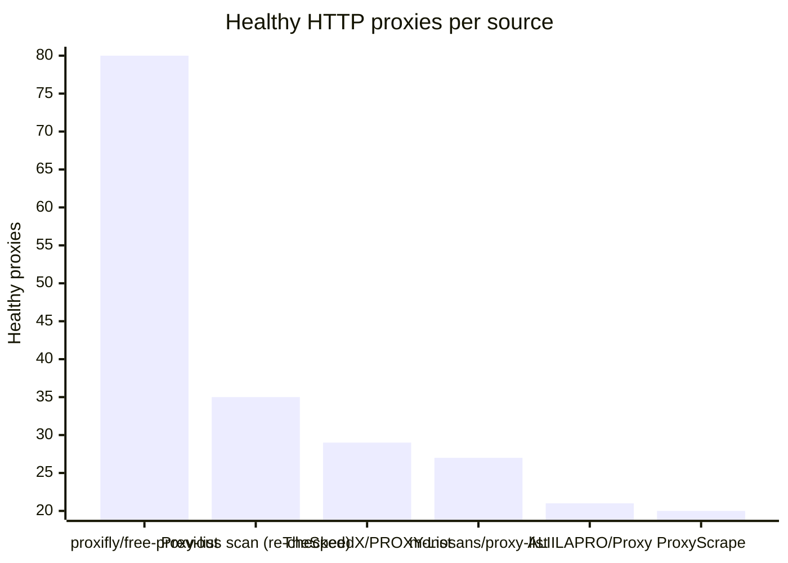
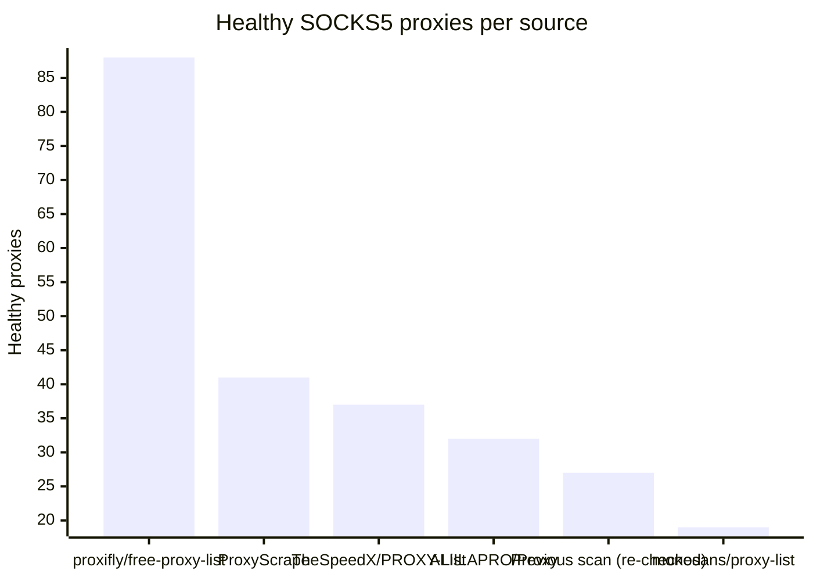

# Proxy Configs

<!-- dynamic timestamp placeholders for workflow sed script -->
channel_stats_chart.svg?v=1792627536
performance_report.html?v=1792627536

### Performance Chart

### Performance Report
[View Report](assets/performance_report.html?v=1792627536)

## HTTP

<!-- STATS:HTTP:START -->

_Last updated: 2026-10-21 18:21 UTC_

```mermaid
xychart-beta
    title "Healthy HTTP proxies per source"
    x-axis ["proxifly/free-proxy-list", "Previous scan (re-checked)", "TheSpeedX/PROXY-List", "monosans/proxy-list", "ALIILAPRO/Proxy", "ProxyScrape"]
    y-axis "Healthy proxies"
    bar [80, 35, 29, 27, 21, 20]
```

| Source | Healthy proxies |
|---|---|
| proxifly/free-proxy-list | 80 |
| Previous scan (re-checked) | 35 |
| TheSpeedX/PROXY-List | 29 |
| monosans/proxy-list | 27 |
| ALIILAPRO/Proxy | 21 |
| ProxyScrape | 20 |
| **Total unique** | **212** |

<!-- STATS:HTTP:END -->

## SOCKS5

<!-- STATS:SOCKS5:START -->

_Last updated: 2026-10-21 18:21 UTC_

```mermaid
xychart-beta
    title "Healthy SOCKS5 proxies per source"
    x-axis ["proxifly/free-proxy-list", "ProxyScrape", "TheSpeedX/PROXY-List", "ALIILAPRO/Proxy", "Previous scan (re-checked)", "monosans/proxy-list"]
    y-axis "Healthy proxies"
    bar [88, 41, 37, 32, 27, 19]
```

| Source | Healthy proxies |
|---|---|
| proxifly/free-proxy-list | 88 |
| ProxyScrape | 41 |
| TheSpeedX/PROXY-List | 37 |
| ALIILAPRO/Proxy | 32 |
| Previous scan (re-checked) | 27 |
| monosans/proxy-list | 19 |
| **Total unique** | **244** |

<!-- STATS:SOCKS5:END -->
