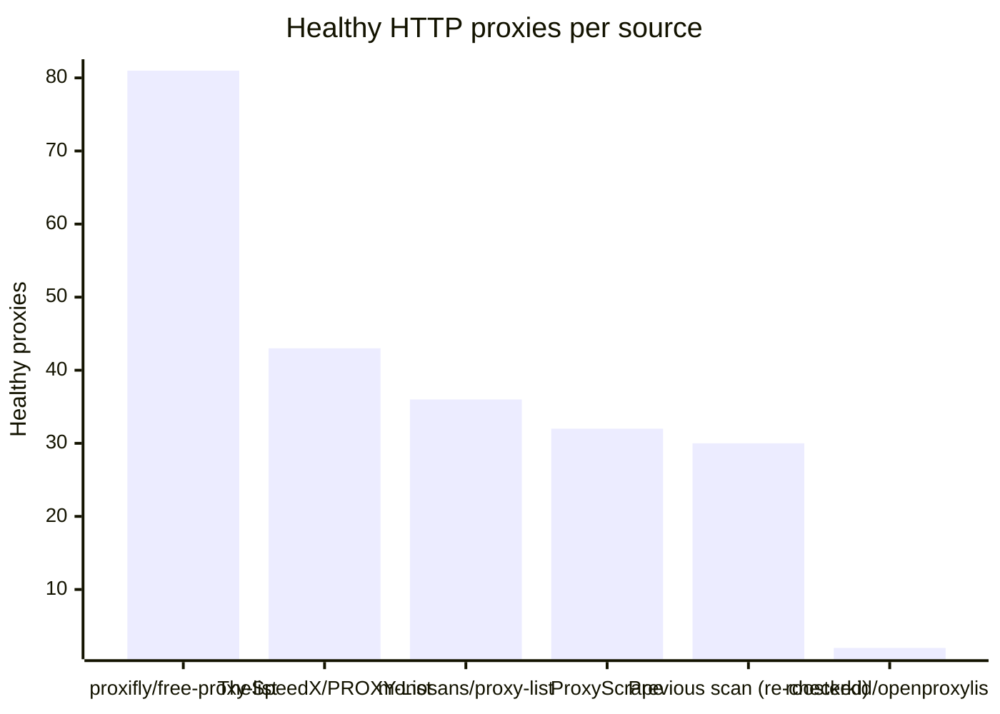
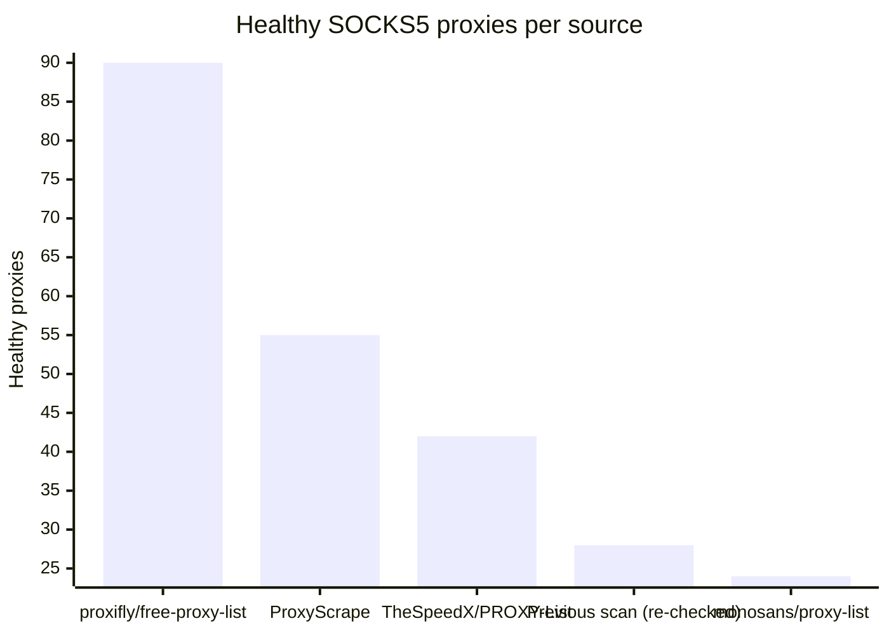

# Proxy Configs

<!-- dynamic timestamp placeholders for workflow sed script -->
channel_stats_chart.svg?v=1791309724
performance_report.html?v=1791309724

### Performance Chart

### Performance Report
[View Report](assets/performance_report.html?v=1791309724)

## HTTP

<!-- STATS:HTTP:START -->

_Last updated: 2026-10-19 06:22 UTC_

```mermaid
xychart-beta
    title "Healthy HTTP proxies per source"
    x-axis ["proxifly/free-proxy-list", "TheSpeedX/PROXY-List", "monosans/proxy-list", "ProxyScrape", "Previous scan (re-checked)", "roosterkid/openproxylist"]
    y-axis "Healthy proxies"
    bar [81, 43, 36, 32, 30, 2]
```

| Source | Healthy proxies |
|---|---|
| proxifly/free-proxy-list | 81 |
| TheSpeedX/PROXY-List | 43 |
| monosans/proxy-list | 36 |
| ProxyScrape | 32 |
| Previous scan (re-checked) | 30 |
| roosterkid/openproxylist | 2 |
| **Total unique** | **224** |

<!-- STATS:HTTP:END -->

## SOCKS5

<!-- STATS:SOCKS5:START -->

_Last updated: 2026-10-19 06:22 UTC_

```mermaid
xychart-beta
    title "Healthy SOCKS5 proxies per source"
    x-axis ["proxifly/free-proxy-list", "ProxyScrape", "TheSpeedX/PROXY-List", "Previous scan (re-checked)", "monosans/proxy-list"]
    y-axis "Healthy proxies"
    bar [90, 55, 42, 28, 24]
```

| Source | Healthy proxies |
|---|---|
| proxifly/free-proxy-list | 90 |
| ProxyScrape | 55 |
| TheSpeedX/PROXY-List | 42 |
| Previous scan (re-checked) | 28 |
| monosans/proxy-list | 24 |
| **Total unique** | **239** |

<!-- STATS:SOCKS5:END -->
